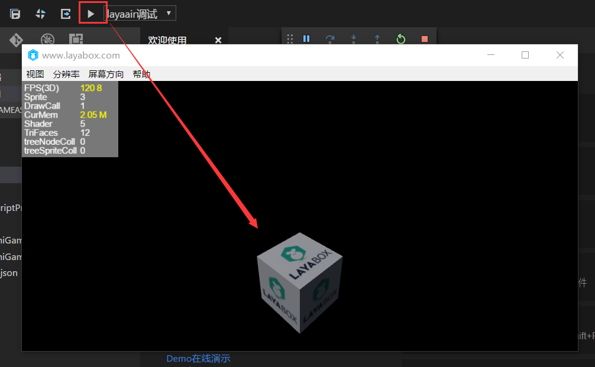

# 老项目适配百度小游戏详解

> author: charley

#### 由于有一些老项目存在小游戏适配的需求，本篇将详细介绍老项目的适配步骤与环节。

**Tips:** 文中以3D项目的创建为起始，并不代表本篇仅为3D项目的适配。文中适配方案对于2D与3D都是通用的，只是语言版本中稍有差异，已在文中进行了说明。

#### 必读提示：

> 1、阅读本文前，请先阅读《创建百度小游戏》，更多配置环境的基础内容本篇不再重复介绍。
>
> 2、新的小游戏项目，建议直接创建小游戏的示例项目。如果立项的时候创建的是普通项目，可以通过学习本篇中的小游戏适配流程，进行适配。


### 第一步：创建一个示例项目（已有旧项目可跳过本步骤）

先打开LayaAirIDE，进入新建项目界面。选择LayaAir 3D示例项目。

> Tips:本步骤是为了演示旧项目适配流程，才故意创建一个普通的3D示例项目。
>

 

输入项目名称，路径，选择好语言类型与引擎版本。

> （由于流程上基本一致，本篇面向各语言的开发者，但以TS项目流程进行截图，如果是其它语言版本，存在差异的会额外说明）

OK，继续。

点击创建，即完成了一个3D项目的创建。


### 第二步：适配百度小游戏

#### 1、小游戏适配的前提准备

引擎与IDE要使用当前最新beta版或稳定版，LayaAirIDE从1.8.0beta版本开始，才支持老项目一键发布，所以用旧版本IDE和引擎库没升级的，别忘了先升级。


#### 2、 引用小游戏适配库

##### TS与JS适配方法

从1.8.0beta开始，创建示例项目时，TS与JS项目会自动引入小游戏适配库JS`“libs/laya.wxmini.js”`，如下图所示。

 

图中的代码:

```html
<!--提供了百度小游戏的适配-->
<script type="text/javascript" src="libs/laya.bdmini.js"></script>
```

如果是1.8.0之前的TS或JS老项目，需要开发者在`bin/index.html`中手动加入图中红框内的这段代码，另外还要确认一下当前使用的是不是1.8.0之后的新版本引擎库，如果不是，要切换为新引擎库，否则在运行的时候会因为找不到laya.bdmini.js而报错。

##### AS3项目适配方法

AS3项目，在使用1.8.0之后的新版本引擎库后，仅需要开发者在入口类中手动加入这段代码，即完成小游戏适配库的引入。

```java
import laya.bd.mini.MiniAdapter;
```


#### 3、初始化小游戏适配库

老项目由于在建立的时候，并没有在项目入口对适配库进行初始化，所以，为了保障成功发布百度小游戏版本，我们必须要在游戏入口内进行适配库的初始化。

**Tips**:*初始化百度小游戏适配，需要在初始化引擎前。*

##### TS与JS项目适配方法如下图所示：

 

图中TS或JS项目的适配代码如下：

```typescript
//初始化小游戏适配库
Laya.BMiniAdapter.init();
```

##### AS3项目项目适配方法如下图所示：

 

图中AS3项目的适配代码如下：

```java
//百度小游戏适配
BMiniAdpter.init(); 
```


#### 4、编译适配代码

完成适配代码的添加，点击编译或运行调试按钮（F5），没有报错提示的话，可以看到一个三维的立方体。

 

> Tips:适配完一定要点编译或调试，否则适配代码不会生效。

关闭运行调试弹出的窗口后。就可以进入小游戏发布的环节了。

至此，小游戏的适配已经完成了。

简单总结一下，就是在使用新版引擎后，引用适配库，初始化适配库，这两个核心步骤。还是比较简单的。

其它的小游戏发布、调试等都是与新项目通用的。可以查看其它相关的文档。

如果对本篇文档有疑问，请前往官网社区提问，也可以将社区中的链接发到官方QQ群中 @ 管理员 charley

社区网址：https://ask.layabox.com/


## 本文赞赏

如果您觉得本文对您有帮助，欢迎扫码赞赏作者，您的激励是我们写出更多优质文档的动力。

