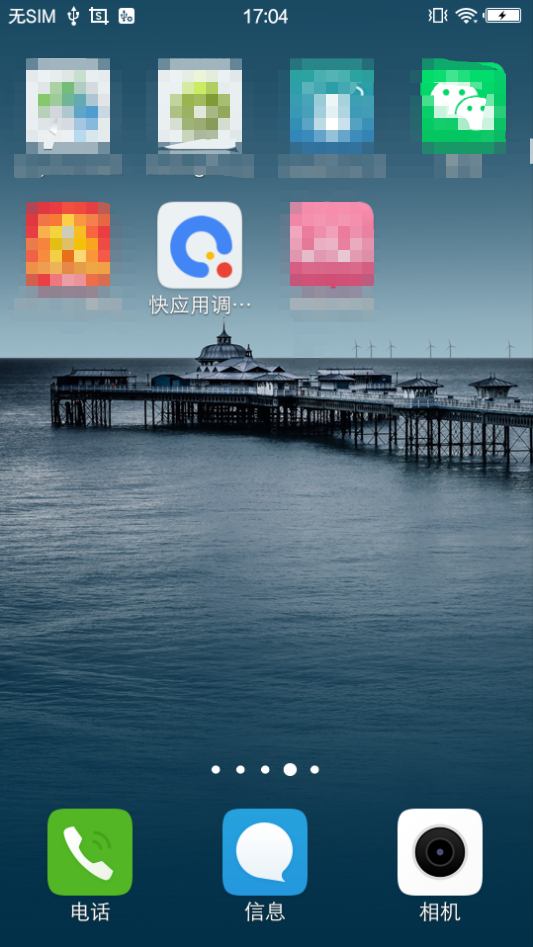

# vivo小游戏发布与调试指南

> update : 2019-07-01
>
> vivo小游戏的发布必须要使用LayaAirIDE，关于IDE的下载使用相关，请查看相关文档，不在本篇介绍范围内。

## 1、vivo小游戏发布、调试环境准备

1、vivo品牌的手机

2、下载安装vivo的调试APP，下载页面：[https://minigame.vivo.com.cn/documents/#/download/debugger](https://minigame.vivo.com.cn/documents/#/download/debugger)

进入页面后，点击 立即下载 ，即可下载安装。至于如何安装vivo调试APP，这里就不介绍了。

3、下载vivo小游戏引擎

当前**调试APP**内置的vivo引擎版本是1034，这个版本存在已知BUG，我们必须要前往vivo小游戏官网下载最新版本的小游戏引擎apk。

下载页面为：

https://minigame.vivo.com.cn/documents/#/download/engine

当前的推荐的版本是1041，下载安装后，我们可以看到vivo快应用调试器的平台版本号那里也是显示的1041。

4、PC电脑的chrome浏览器与手机数据连接线。

5、安装nodejs 环境 [node官网：[https://nodejs.org/en/](https://nodejs.org/en/)]

就是下载安装，比较简单，也不细介绍。能在命令行里调起npm命令就算是成功了。

6、LayaAirIDE集中开发环境，LayaAir IDE 1.8.4beta 或以上版本 [ 官网下载: [https://ldc.layabox.com/layadownload/?type=layaairide](https://ldc2.layabox.com/layadownload/?type=layaairide) ]

7、安装ADB 

ADB可以用于授权，以及发布推送等，可以前往ADB的官网下载并安装。

 [ ADB官网下载:  [http://adbshell.com/downloads](http://adbshell.com/downloads) ]

> 简单提示一下，下载 ADB Kits，下载后的压缩包，建议解压放到一个路径简单一些的目录（如: `D:\adb`）。要记得添加环境变量（不知如何添加环境变量的可自行百度）。
>

## 2、vivo小游戏发布与接入完整流程

### 1、发布vivo小游戏包(xx.rpk)

LayaAirIDE的发布功能，内置了vivo小游戏的发布功能，需要先将LayaAir引擎的项目，通过发布功能打成.rpk后缀的包。关于发布功能的使用。这里不重复介绍了。不会的可以前往官网文档查看。

发布前确保在引擎初始化之前加入适配代码ts,js为 Laya.VVMiniAdapter.init(); as为 VVMiniAdapter.init();

链接：[[https://ldc.layabox.com/doc/?nav=zh-ts-2-0-4](https://ldc.layabox.com/doc/?nav=zh-ts-2-0-4)](https://ldc2.layabox.com/doc/?nav=zh-ts-2-0-6)

### 2、保留发布二维码界面。

发布完成后会有一个二维码的界面，如图1所示。这个界面不要关，后面手机扫码需要用。

 

（图1）

### 3、启动chrome调试环境

####  3.1 安装并进入快应用调试器

要启动电脑PC的chrome调试环境，我们要先安装好vivo小游戏的调试APP（快应用调试器），如图3所示。然后点击进入。

 

（图3）

#### 3.2 在快应用调试器界面扫码安装vivo小游戏的rpk包

进入快应用调试器之后，我们可以看到如图4所示的APP操作界面。

  

(图4)

这时候我们点击图4中的扫码安装，扫一下LayaAir IDE中发布界面上的那个二维码（之前不让关，关了的要重新发布让二维码显示出来）。手机中就可以在真机环境中运行了。

> 这里要提示的是：手机网络要和PC在同一个局域网段里（用4G网扫局域网的码肯定是不行的）。

如果把发布目录下/dist目录内的rpk包传到手机里，通过点`本地安装`按钮来安装，也是可以的。但是建议扫码安装，因为扫码的步骤更方便快捷。

#### 3.3 保持物理线路连接以及授权

对于比较有相关经验的开发者，确保USB手机连接线物理线路是已连接状态，并且USB调试授权也没问题的，可以跳过本步骤。 

##### 相关操作如下：

1、先用手机连接线将手机与PC保持物理上的连接。

2、在之前打开的命令行下，输入adb shell，如图5-1所示。则是未获得USB调试模式授权。

 

（图5-1）

此时，我们要关注手机端，是否出现如图5-2所示的提示，如果有，则点 确定 允许USB调试。

 

（图5-2）

3、再次验证授权。

当USB调试模式授权成功之后，我们再次输入adb shell，应该如图5-3所示。

 

（图5-3）

总之，在这个环节里，我们要保障PC是有权限调试这个手机设备的。

#### 3.4 启动chrome调试环境

之前扫码安装后，会自动进入刚刚安装的游戏或者DEMO。

要启动调试，就要先退出来。

然后，如图6所示，点击**开始调试**，进入vivo小游戏的调试模式。

 

（图6）

真机进入调试模式后，我们再到PC上打开chrome浏览器。

这时候别忘了，要联接USB数据线，将手机设备与PC相联，权限的问题上面已经说过，不再重复。

我们要在手机端查找到手机的IP（不知道怎么查的自行百度）并记住他。一定要注意的是，手机网要和PC网始终保持在同一个局域网段。

在chrome浏览器的输入栏里输入：

```
chrome-devtools://devtools/bundled/inspector.html?v8only=true&ws={IP}:5086/00010002-0003-4004-8005-000600070008
```

将{IP}替换为手机IP地址即可，如图7所示。

(图7)


至此，vivo小游戏从发布到启动chrome调试的完整流程已介绍完。如果想了解关于更多vivo小游戏的接入流程与文档介绍，记住这个网址：

https://minigame.vivo.com.cn


## 本文赞赏

如果您觉得本文对您有帮助，欢迎扫码赞赏作者，您的激励是我们写出更多优质文档的动力。


