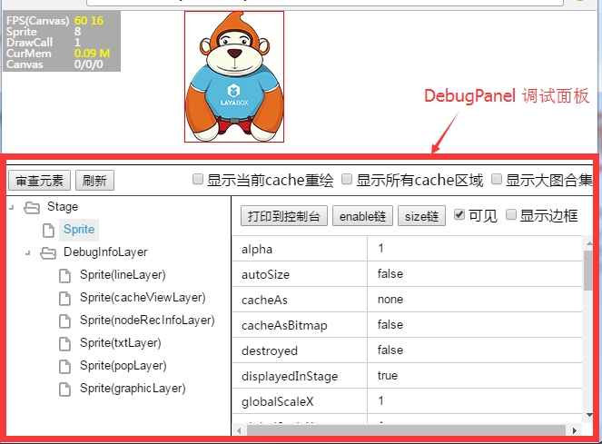
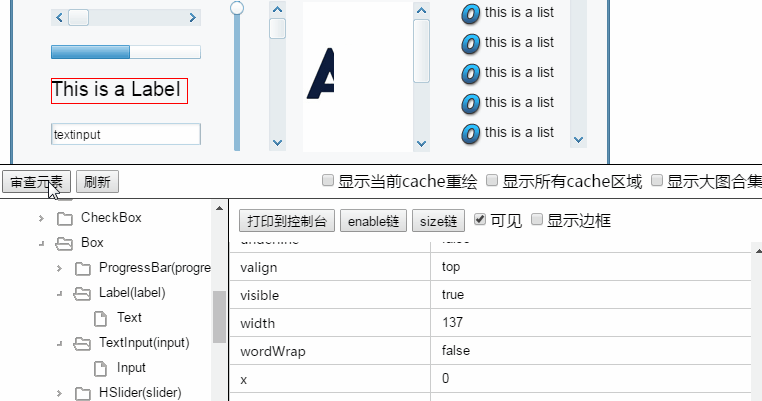

#LayaAir DebugPanelツール

###1、デバッグパネルを有効にする

DebugPanelデバッグパネルはDivによるデバッグウィンドウで、デバッグパネルを起動します。`DebugPanel.init()`メソッドは`laya.debug.DebugPanel`クラスでは、初期化ステージ方法で`Laya.init()`後の任意のコードに使用を追加します。例えば、下記のコードに示します。

入口類Main.as


```java

package
{
	import laya.debug.DebugPanel;
	import laya.display.Sprite;
	
	public class Main
	{
		public function Main()
		{
			//初始化舞台
			Laya.init(1334,750);    
			//调用DebugPanel调试面板
			DebugPanel.init();
			//设置舞台背景色
			Laya.stage.bgColor  = "#ffffff";
			
			var Img:Sprite = new Sprite(); 			 
			//添加到舞台
			Laya.stage.addChild(Img);   
			Img.loadImage("res/img/monkey1.png",200); 	
		}
	}
}
```


運転効果は図1に示します。


(図1)


###2、表示対象ノードツリーを更新する

デフォルトの状態では、オブジェクトノードツリーにのみ表示されます。`DebugInfoLayer`ノードは、このノードの開発者には管理されていません。製品ページの対象ノードは更新が必要です。クリックしてください。`调试面板`上の`刷新`ボタンを押すと、ページ上のすべてのノードツリー構造が表示されます。図2に示すように。


(図2)


###3、ノードオブジェクトの属性を表示する

ノードツリー上のノードをクリックすると、図3に示すように、選択されたノードオブジェクトの属性が右側に表示されます。


(図3)

**Tips**：デバッグパネルのノードオブジェクト属性値を確認または変更することで、問題の判断とデバッグを加速することができます。


###4、ページ要素を審査する

ノードツリーから属性を表示するには、ノードオブジェクトをクリックします。先にクリックします`审查元素`ボタンを押してから、画面の目標内容をクリックします。つまり、デバッグパネルの右側のエリアでノードのオブジェクト属性を直接確認することができます。効果は図4に示すようになります。


(図4)


###5、デバッグパネルのノードオブジェクトの属性を変更する

毎回のデバッグがコードの中で修正されることを避けるために、運転の複雑なデバッグプロセスを再度コンパイルします。直接DebugPanelデバッグパネルで属性値を変更できます。属性値入力ボックスを移動して変更効果を表示します。動作と効果は図5に示すようになります。


(図5)


###6、ノード可視制御

デバッグパネルでノードを選択すると、**キャンセル**ノードの`可见勾选状态`を選択します**ページでは表示されません**。もう一度クリックします`勾选`図6に示すように、効果が再表示されます。


(図6)


###7、ノード赤枠表示制御

デバッグパネルで`可见`コントロールの右側は`显示边框`チェックを入れると、そのノードはページ内で**赤い枠**のハイライトを表示します。効果は図7に示すとおりです。


(図7)

**Tips**:*ノードのcacheAs属性設定が有効になったら、境界チェックが表示されても赤い枠は表示されません。*


###8、ノードオブジェクトをコンソールに印刷する

デバッグパネルのをクリックします。`打印到控制台`ボタンをクリックして、選択したノードオブジェクトをブラウザのコンソール（＊Consolie*）に出力することができ、コンソールでさらに操作を調整することができます。効果は図8に示すとおりです。

 
 (图8)


###9、コンソールでenableチェーンとsizeチェーンを確認する

enableチェーンとsizeチェーンボタンにより、ノードオブジェクトのenableに関する属性またはsizeに関する属性をコンソールに出力することができます。図9に示すように。


(図9)


###10、大図集合の表示と切替

webglモードでは、最適化性能のために、以下`512*512`のリソースエンジンは自動的に大図セットに統合されます。LayaAirエンジンのデフォルトの上限は6つの大集合図であり、大集合の数と内容を確認することによって、対応性の最適化が可能である。

チェック`显示大图合集`その後、現在の大図集を見ることができます。左上解には赤い色が現れます。`图集当前数/图集总数`を選択します。チェックを外して選択してもいいです。`切换`次の大図に集合します。図10に示すように。


(図10)

**Tips**:

大図統合機能を表示するのはwebGLモードだけで、Canvasモードでは機能ボタンが機能しません。

一つの大きな図の合計の幅は、`2048*2048`。


###11、現在のcache再描画エリアと全てのcacheエリアを表示する

cacheを設定すると性能が最適化されますが、cacheの設定が不合理であり、性能も低下します。例えばcacheエリアで頻繁に再描画すると、性能が低下します。

通過する`显示当前cache重绘`を選択します`显示所有cache区域`cacheの状態を統計的に調べられます。

**緑色は現在のcacheエリアです。**を選択します。色枠は3秒止まります。効果は図11に示すようになります。


(図11)


**すべてのcacheエリアは紫色の枠です。**を選択します。領域色枠は表示されたらすぐに消えます。最後のcache領域に留まります。効果は図12に示すようになります。


(図12)


 

