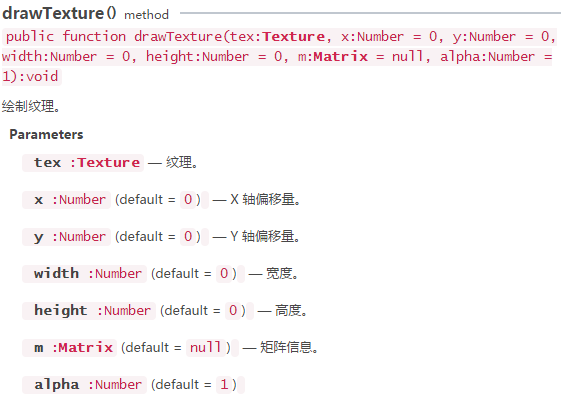

#画像の表示と切り替え

>画像の表示はゲーム開発の基礎であり、本編ではAPIから例に至るまで、それぞれSprite.loadImageとGraphics.drawTextureの2種類の画像を表示する方法を紹介します。

##1、loadImage方法で画像を表示し、切り替えする

###1.1 loadImage APIの概要

APIドキュメントでlaya.display.Spriteを検索すると、図1に示すように、loadImage（）の方法が見つけられます。まず、この方法のパラメータを熟知してみます。


(図1)

###1.2 loadImageで表示画像をロードする例

Main.asエントリクラスを作成し、デフォルトのアプリケーション（推奨FlashBuider）に設定し、コードを作成します。


```java

package
{
	import laya.display.Sprite;
	
	public class Main
	{
		public function Main()
		{
			//初始化舞台
			Laya.init(1334,750);                
			
			//设置舞台背景色
			Laya.stage.bgColor  = "#ffffff"
			
			var img:Sprite = new Sprite();                  
			//加载显示图片，坐标位于100,50
			img.loadImage("res/img/monkey1.png",100,50); 
			//添加到舞台
			Laya.stage.addChild(img);
		}
	}
}
```


サンプルコードには、「`100,50`」は、画像の表示座標情報です。コードの実行例の効果は図2-1に示す通りです。


(図2-1)

###1.3 loadImageで画像を切り替える例

画像の切り替えは、表示画像の上に空の描画を追加し、コードロジックを介して新たな画像リソースを取得して再描画します。具体的なコード説明は、コード注釈およびAPIを参照して、インスタンスに関連して体験を実行することができる。

下記のようにMain.asエントリクラスでコードを修正します。


```java

package
{
	import laya.display.Sprite;
	
	public class Main
	{
        //需要切换的图片资源路径
		private var monkey1:String = "res/img/monkey1.png";
		private var monkey2:String = "res/img/monkey2.png";
      	//切换状态
		private var flag:Boolean = false;
      
		private var img:Sprite;
		
		public function Main()
		{
			//初始化舞台
			Laya.init(1334,750);                
			//设置舞台背景色
			Laya.stage.bgColor = "#ffffff"                        
			
			img = new Sprite();                        
			
			//显示绘制的图片
			switchImg();
			
			//侦听switchImg中图片区域的点击事件，触发后执行switchImg切换图片
			img.on("click",this,switchImg);
			
			//将图片添加到舞台
			Laya.stage.addChild(img);                        
		}
		
		
		private function switchImg(e:*=null):void
		{                        
			//清空图片
			img.graphics.clear();
			
			//获得要切换的图片资源路径
			var imgUrl:String = (flag = !flag)? monkey1:monkey2;
			
			//加载显示图片，坐标位于100,50
			img.loadImage(imgUrl, 100, 50);
			
		}
	}
}
```


動作コードの効果は、図2-2に示すように、


(図2-2)


##2、DRawTexture方法で画像を表示し、切替する

###2.1 drawTexture APIの概要

APIドキュメントでlaya.display.Graphicsを検索すると、drawTexture（）方法が見つかるほか、laya.net.Loader Managerのロード（）方法とgetsRes（）方法、laya.utils.Handlerのcreate（方法）、各方法のパラメータ図3、図5、図6


(図3)


(図4)


(図5)


(図6)


###2.2 DRawTextureで表示画像をロードする例

loadImage（）方法は外部画像リソースを即時にロードしてもいいし、バッファから画像リソースを読み取ることもできます。drawTexture（）方法はまず画像をロードしてから舞台に追加する必要があります。したがって、コード例ではロードに使用する必要があります。`Laya.loader.load()`）とコールバック（`Handler.create()`）の方法は、以下の簡単な例示的なコードを通して画像をロードして表示します。コードの説明はコードの注釈部分と関連APIの説明を見てください。

Main.asエントリクラスを作成し、デフォルトのアプリケーション（推奨FlashBuider）に設定し、コードを作成します。


```java

package
{
	import laya.display.Sprite;
	import laya.utils.Handler;
	
	public class Main
	{
		private var monkey2:String = "res/img/monkey2.png";
		public function Main()
		{
			//初始化舞台
			Laya.init(1334,750);                
			//设置舞台背景色
			Laya.stage.bgColor = "#ffffff"                        
			
			//先加载图片资源，在图片资源加载成功后，通过回调方法绘制图片并添加到舞台
			Laya.loader.load(monkey2,Handler.create(this,graphicsImg));          
		}
		
		private function graphicsImg():void
		{
			var img:Sprite = new Sprite();
			//获取图片资源，绘制到画布
			img.graphics.drawTexture(Laya.loader.getRes(monkey2),100,50);
			
			//添加到舞台
			Laya.stage.addChild(img);
		}
		
	}
}
```


コード運転効果を図7-1に示します。


(図7-1)


###2.3 drawTextureで画像を切り替える例

画像の切り替えは、表示画像の上に空の描画を追加し、コードロジックを介して新たな画像リソースを取得して再描画します。具体的なコード説明は、コード注釈およびAPIを参照して、インスタンスに関連して体験を実行することができる。

下記のようにMain.asエントリクラスでコードを修正します。


```java

package
{
	import laya.display.Sprite;
	import laya.resource.Texture;
	import laya.utils.Handler;
	
	public class Main
	{
		private var monkey1:String = "res/img/monkey1.png";
		private var monkey2:String = "res/img/monkey2.png";
		private var flag:Boolean = false;
		private var img:Sprite;
		
		public function Main()
		{
			//初始化舞台
			Laya.init(1334,750);            
			//设置舞台背景色
			Laya.stage.bgColor        = "#ffffff"                        
			
			//加载多张图片，在图片资源加载成功后，通过回调方法绘制图片并添加到舞台
			Laya.loader.load([monkey1,monkey2],Handler.create(this,graphicsImg));                
		}
			
		
		private function graphicsImg(e:*=null):void
		{
          	//创建一个实例
			img = new Sprite();      
          	//添加到舞台
			Laya.stage.addChild(img);                  
			
			//显示初始化绘制的图片
			switchImg();			
          
			//侦听switchImg中图片区域的点击事件，触发后执行switchImg切换纹理绘制
			img.on("click",this,switchImg);			

			//设置图片坐标
			img.pos(100,50);
			
		}
		
		private function switchImg(e:*=null):void
		{                        
			//清空绘制
			img.graphics.clear();
			
			//获得要切换的图片资源路径
			var imgUrl:String = (flag = !flag)? monkey2:monkey1;
			//获取图片资源
			var texture:Texture = Laya.loader.getRes(imgUrl);
			//绘制纹理
			img.graphics.drawTexture(texture);                        
			//设置纹理宽高
			img.size(texture.width, texture.height);        
			
		}
	}
}
```


コード運転効果を図7-2に示します。


(図7-2)


