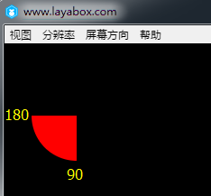
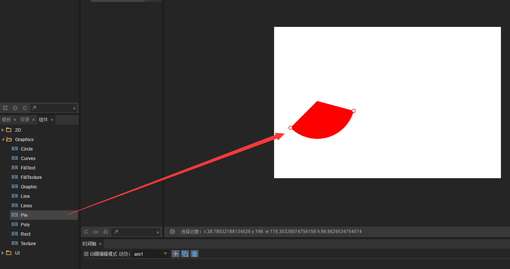

#円と扇形を描く


###一、丸を描く

円形の描画は比較的簡単で、円形の中心点座標と半径を通じて、LayaAirエンジンlaya.display.GraphicsというAPIの「drawCircule（）」という方法で実現できる。この方法の詳細は下図の通りです。

​<br/>
（図1）

次にLayaAirエンジンで円形を描きます。コード例は以下の通りです。


```javascript

package
{
    import laya.display.Sprite;
    import laya.display.Stage;
      
    public class Sprite_DrawShapes
    {
        private var sp:Sprite;
          
        public function Sprite_DrawShapes()
        {
            Laya.init(500, 300);
            drawSomething();
        }
  
        private function drawSomething():void
        {
            sp = new Sprite();
            Laya.stage.addChild(sp);
            //画圆
            sp.graphics.drawCircle(80,80,50,"#ff0000");
              
        }
    }
}
```


コード運転効果は下図のようになります。

​<br/>
（図2）

丸描画は比較的簡単で、「80,80」は丸中心点座標です。50は半径です#ff0000「丸塗りの色の値です。


###二、扇形を描く

続いて、円よりやや複雑な扇形の描画方法「drawPie()」を説明します。

​<br/>
（図3）

次にLayaAirエンジンで扇形を描きます。コードの例は以下の通りです。


```javascript

package
{
    import laya.display.Sprite;
    import laya.display.Stage;
      
    public class Sprite_DrawShapes
    {
        private var sp:Sprite;
          
        public function Sprite_DrawShapes()
        {
            Laya.init(500, 300);
            drawSomething();
        }
  
        private function drawSomething():void
        {
            sp = new Sprite();
            Laya.stage.addChild(sp);
            //画扇形
            sp.graphics.drawPie(80,80,50,90,180,"#ff0000");
              
        }
    }
}
```


コード運転効果は下図のようになります。

​<br/>
（図4）
扇形は円形と似ていますが、最初の3つのパラメータの使い方も同じです。よく理解するために、扇形の描画コードとパラメータは、円形コードの例を使用しています。メソッド名の変更以外に、90と180の角度パラメータを追加しました。皆さんはエンコーディング中にパラメータを調整して、深く理解してもいいです。


###三、LayaAirIDEでコントロールをドラッグして円を描く

**ステップ1**：LayaAirIDEを開いて、デザインモードをクリックして、Viewページを新規作成します。

​<br/>
（図5）

**ステップ2**：コンポーネントの中の曲線コンポーネントをViewページにドラッグすると、自動的にデフォルトの円形が生成されます。

​<br/>
（図6）

**ステップ3**：Curceコンポーネントの属性の値を変更（追加／減少）し、円形の大きさ、色、外枠などを変更します。

​<br/>
（図7）

​<br/>
（図8）


###四、LayaAirIDEでコントロールをドラッグして扇形を描く

**ステップ1**：LayaAirIDEを開いて、デザインモードをクリックして、Viewページを新規作成します。

​<br/>
（図9）

**ステップ2**：コンポーネント内の曲線コンポーネントをViewページにドラッグすると、自動的にデフォルトの扇形が生成されます。

​<br/>
（図10）

**ステップ3**：Pieコンポーネントの属性の値を変更（追加/減少）し、扇形の角度、サイズ、色などを変更します。

​<br/>
（図11）

​<br/>
（図12）

ここでLayaAirIDEのセットを通して丸と扇形を描きます。