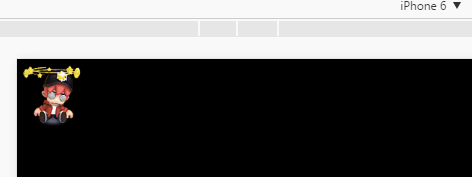

#アニメの運用

###1.図集アニメーションの概要

ゲーム開発においては、アニメの運用は基本的にどこにもありません。LayaAirエンジンは強力なアニメーションクラスを提供しています。

LayaAir IDEで時間軸アニメーションを作成することができます。`.ani`」のアニメーションリソースは、アニメフレームの画像を図セットでパッケージ化することもできます。拡張子を作成します。`.atlas`」の図集リソースをアニメーションに割り当てて使用します。

このページでは、図1に示すように、例として図セットアニメーションでよく使われる動作を説明します。

<br/>(図1)


###2.画集アニメーションを再生する

####2.1図集資源準備

アニメーションマップリソースは、いくつかの場合に注意してください。キャラクターアニメーションのようにフレーム数が多いため、キャラクターマップのリソースが一般的にセットされています。名前には動作名に従ってフレーム番号を付けて命名されます（図2）。

<br/>(図2)

**Tips**:

##-IDEのセット包装ツールは、各ディレクトリを図セットにパッケージ化します。詳細はドキュメント「図セット作成と使用詳細」を参照してください。特効アニメーションは各特効フレームの数が多くないので、複数の特効を組み合わせて1枚の画集リソースにすることができます。

IDEで梱包すると、「.atlas」「.json」「.png」の3つのファイルが生成されます。アニメーションクラスのAnimationでは、「.atlas」または「.json」ファイルを読み込むことで画像リソースを取得します。「.atlas」ファイル(*を使用する場合は、タイプ設定コード*を追加する必要はありません。)

<br/>(図3)


####2.2アニメーションコレクションのリソースをロードする

通過する`laya.display.Animation`クラス`loadAtlas()`この方法は、図4に示すように、キャラクターのセットアニメーションリソースをロードする。

<br/>(図4)

#####サンプルコード:

エントリドキュメントクラスのAtlas AniDemo.asを作成し、コードを作成します。


```java

package
{
	import laya.display.Animation;
	import laya.utils.Handler;
	import laya.webgl.WebGL;

	public class AtlasAniDemo
	{
		private var roleAni:Animation; 
		public function AtlasAniDemo()
		{
			//初始化舞台
			Laya.init(1334, 750, WebGL);
			
			//创建动画实例
			roleAni = new Animation();
			// 加载动画图集,加载成功后执行回调方法
			roleAni.loadAtlas("res/atlas/role.atlas",Handler.create(this,onLoaded));	
		}
		
		private function onLoaded():void
		{
			//添加到舞台
			Laya.stage.addChild(roleAni);
		}
	}
}
```


実行コードは、図5に示します。アニメーションはすでに舞台にロードされていますが、デフォルトは未放送です。

 


（図5）

####2.3図集アニメーションを再生する

図集アニメーションはloadAtlas（）メソッドを使ってロードした後、プレイ（）方法を使って再生できます。プレイ（）方法のAPIパラメータは、図6に示すように説明されている。

<br/>(図6)

これまでの例を踏襲して、onLoadedメソッドにプレイ（）を追加します。

one Loadedメソッドのコードは以下の通りです。


```java

private function onLoaded():void
{
  //添加到舞台
  Laya.stage.addChild(roleAni);
  //播放动画
  roleAni.play();	
}
```


動作完全コードは図7に示す通りです。

 


（図7）

####2.4 createFraamesでアニメーションテンプレートを作成し、図集中指定の動画を再生する。

図集中が独立したシーケンスフレームアニメーションであれば、直接にプレイ（）方法を使って再生することができます。しかし、複数のアニメーションを一つの画集にパッケージし、指定されたアニメーションを再生するには、アニメーションテンプレートを作成することで実現する必要があります。アニメーションテンプレートの方法は`Animation.createFrames()`を選択します。

<br/>(図8)

#####アニメーションテンプレートを作成する役割

振り返ってみます`play()`方法の第三パラメータ`name`。図セットのアニメーションリソースのセットをアニメーションテンプレートとして作成し、テンプレートに名前を付けた後、`play()`メソッドのnameパラメータは、アニメーションテンプレートの名前を使用して、アニメーションテンプレートの名前を指定することによって指定されたアニメーションの再生を実現することができます。

これまでの例を踏襲して、動画テンプレートを作成することで、図セットのみのめまい効果を実現します。

コードの作成は以下の通りです。


```java

package
{
	import laya.display.Animation;
	import laya.utils.Handler;
	import laya.webgl.WebGL;

	public class AtlasAniDemo
	{
		private var roleAni:Animation; 
		public function AtlasAniDemo()
		{
			//初始化舞台
			Laya.init(1334, 750, WebGL);
			
			//创建动画实例
			roleAni = new Animation();
			// 加载动画图集,加载成功后执行回调方法
			roleAni.loadAtlas("res/atlas/role.atlas",Handler.create(this,onLoaded));	

		}
		
		private function onLoaded():void
		{
			//添加到舞台
			Laya.stage.addChild(roleAni);
			
			//创建动画模板dizziness
			Animation.createFrames(aniUrls("die",6),"dizziness");
			//循环播放动画
			roleAni.play(0,true,"dizziness");	
		}
		
		
		/**
		 * 创建一组动画的url数组（美术资源地址数组）
		 * @param aniName  动作的名称，用于生成url
		 * @param length   动画最后一帧的索引值，
		 */		
		private function aniUrls(aniName:String,length:int):Array
		{
			var urls:Array=[];
			for(var i:int=0;i<length;i++)
			{
				//动画资源路径要和动画图集打包前的资源命名对应起来
				urls.push("role/" + aniName + i + ".png")
			}
			return urls;
		}
	}
}
```


コード運転効果は図9に示すように、アニメーションテンプレートが設定された動作のみが再生されます。

 


（図9を参照）

Tips：各動作を単独でセットにしても、直接に再生できます。しかし、動作が少ないアニメーションリソースに対しては単独で図集を作成し、リソースローディング量を増加させ、ゲーム性能の消耗を増加させます。フレーム数が少ない複数のアニメーションを一つのセットにまとめて包んで、それぞれ呼び出しするのがおすすめです。


####2.5 loadImagesで直接図集で指定されたアニメーションを再生する

静的な方法で`createFrames()`アニメーションテンプレートを作成する以外に、マップセットで指定された眩暈アニメーション効果をloadImages（）方法で実現することもできます。まず見てみます`loadImages()`の方法パラメータを説明します。

 


（図10）

loadImages（）はアニメーションテンプレートを作成するので、urlsは画像アドレスの集合を受信します。だから、Laya.loader.load（）を使って図面ファイルを先に読み込む必要があります。私たちは直接にサンプルコードとコメントを見ます。


```java

package
{
	import laya.display.Animation;
	import laya.utils.Handler;
	import laya.webgl.WebGL;


	public class AtlasAniDemo
	{
		private var roleAni:Animation; 
		public function AtlasAniDemo()
		{
			//初始化舞台
			Laya.init(1334, 750, WebGL);		
			//加载完动画的图集后执行回调方法onLoaded
			Laya.loader.load("res/atlas/role.atlas", Handler.create(this,onLoaded));

		}
		
		private function onLoaded():void
		{		
            //创建动画实例	
			roleAni = new Animation();
			//添加到舞台
			Laya.stage.addChild(roleAni);
			
			//通过数组加载动画资源，然后用play方法直接播放。由于loadImages方法返回的是Animation对象本身，可以直接使用“loadImages(...).play(...);”语法。
			roleAni.loadImages(aniUrls("move",6)).play();
		}
		
		
		/**
		 * 创建一组动画的url数组（美术资源地址数组）
		 * @param aniName  动作的名称，用于生成url
		 * @param length   动画最后一帧的索引值，
		 */		
		private function aniUrls(aniName:String,length:int):Array
		{
			var urls:Array=[];
			for(var i:int=0;i<length;i++)
			{
				//动画资源路径要和动画图集打包前的资源命名对应起来
				urls.push("role/" + aniName + i + ".png")
			}
			return urls;
		}
	}
}
```


コード運転効果は図11に示すようになります。

 


（図11）

**Tips**:

##-loadImage方法は、動画テンプレートを作成することもできます。例えば、上のロードと再生を書き換えることもできます。`roleAni.loadImages(aniUrls("move",6),"walk").play();`二番目のパラメータの値「walk」はアニメーションテンプレートの名前です。複数回使用される場合、アニメーションテンプレートを使用するとCPUのオーバーヘッドが節約されますが、たまにまたは一回だけ使用する場合は、アニメーションテンプレートを使用しないでください。


###3、その他の説明

####3.1 API

アニメーションの一般的なAPI本編はここに紹介されています。他のアニメーション属性についてはAPIドキュメントを見ることができます。

アニメーションのベースクラス:

[https://layaair.ldc.layabox.com/api/?category=Core&class=laya.display.AnimationPlayerBase](https://layaair.ldc.layabox.com/api/?category=Core&class=laya.display.AnimationPlayerBase)

アニメーションクラス:

[https://layaair.ldc.layabox.com/api/?category=Core&class=laya.display.Animation](https://layaair.ldc.layabox.com/api/?category=Core&class=laya.display.Animation)


####3.2 IDE制作図集アニメーション

アニメについては、IDEがUIを設計する時に、直接Animationコンポーネントを使って制作することができます。これにより、見える部分がより直感的になります。アニメのIDE製作部分については、ご覧いただけます。`Animation组件属性详解`および`用LayaAirIDE制作图集动画`この二つの文書。