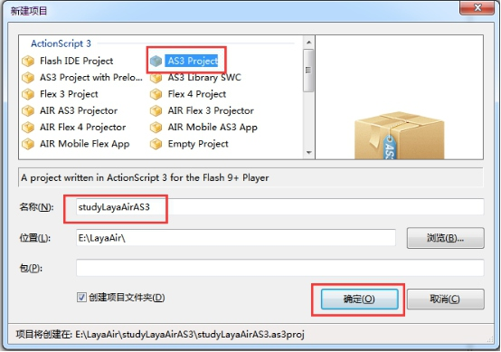
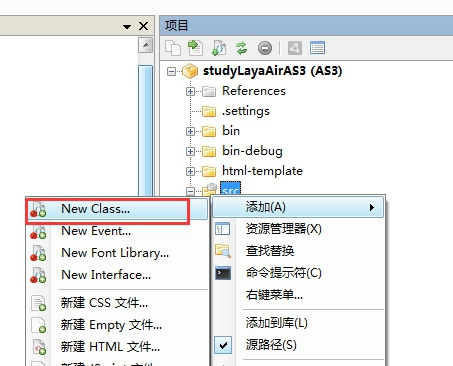

#FlashDevelopの最初のプログラム「Hello Layabox」

>###本編ではAS 3言語を採用し、Flash Develop環境においてテキストHello Layaboxを表示します。
>本編を終了するとLayaAirエンジンを完成するための最初のプログラムです。本編を学ぶ前に必ず先に読んでください。**Flash Develop開発環境構成**
>
>AS 3プロジェクトをLayaAirIDEで作成し、ディレクトリ構造を詳しく解説して読んで、プロジェクトを作成した場合は、第一歩をスキップすることができます。LayaAirIDEを採用したプロジェクトを提案します。
>


##第一歩Flash Developを通じて新規プロジェクトを作成します。

​**ステップ1**：Flash Developを開き、メニューバーで「項目」を見つけたら、「新規プロジェクト」をクリックします。

​<br/>
図(1)

​**ステップ2**：「AS 3 Project」タイプを選択し、プロジェクト名を入力し、プロジェクトの保存場所を選択し、「確定」をクリックして新規プロジェクトの操作を完了します。

​<br/>
図(2)


  


##第二段階配置項目

###2.1参照エンジンライブラリ

**ステップ1**：プロジェクトパネルで「項目の属性」ボタンをクリックし、項目属性設定ウィンドウを開きます。

​<br/>
図(3)

​**ステップ2**：「クラス追加経路」をクリックしてLayaAirエンジンの所在リストを選択し、「確定」をクリックしてLayaAirエンジンライブラリの参照を完了します。

<br/>
図(4)


 


###2.2 swcをライブラリに追加する

エンジンをダウンロードする時、エンジンパックを解凍した後、ルートディレクトリの「player global.swc」とLayaAirFlashディレクトリの「LayaAirFlash.swc」、サブディレクトリの「glsl 2 agal.swc」の3つのswcファイルを見ることができます。player global.swcは開発過程でLayaAirエンジンAPIを使用するためのヒントです。もう2つのswcファイルはFlashバージョンをリリースするのに使います。Flashバージョンのリリースを考慮しないなら、「LayaAirFlash.swc」、「glsl 2 agal.swc」もライブラリに追加しなくてもいいです。

​**ステップ1**：新規作成したプロジェクトstudyLayaAirAS 3にlibsフォルダを追加します。

​<br/>
図(5)

​**ステップ2**：ダウンロードして解凍したLayaAirエンジンのルートディレクトリの下にある「playrglobal.swc」をマウスポイントでドラッグして、作成したばかりのlibsフォルダの下にドラッグします。またはコピーして貼り付け、libsフォルダの下に貼り付けます。右クリックでswcファイルをクリックし、左クリックで「ライブラリに追加」をクリックし、それぞれライブラリに追加します。

​<br/>
図（6）


 


##ステップ3で「ハローLayabox」という文字を表示します。

###3.1新規作成類ファイルハローLayabox

​**ステップ1**：右ボタン「srcディレクトリ」に新しいクラスを追加します。（ヒント：追加されたクラスファイルはsrcディレクトリでなければなりません。または「クラス追加経路」で参照してください。そうでないとコンパイルできません。）

​<br/>
図（7）

​**ステップ2**：クラス名をハローLayaboxに設定します。

​<br/>
図（8）

###3.2 H 5ページに「ハローLayabox」を表示する

​**ステップ1**：ハローLayabox.asを文書類に設定します。

​<br/>
図(9)

​**ステップ2**：「ハローLayabox」のテキストをステージに追加します。コードは以下の通りです。


```java

package {
 import laya.display.Text;
  
 /** @author Charley */
  
 public class HelloLayabox {
  public function HelloLayabox() {
   //创建舞台，默认背景色是黑色的
   Laya.init(600, 300);
   var txt:Text = new Text();
    
   //设置文本内容
   txt.text = "Hello Layabox";
    
   //设置文本颜色为白色，默认颜色为黑色
   txt.color = '#ffffff';
    
   //将文本内容添加到舞台 
   Laya.stage.addChild(txt);
  }
 }
}
```


​**ステップ3**：コード作成が完了したら、以前に定義されたコンパイルショートカット（Alt+F 5）を使って、AS 3コードをHTML 5にコンパイルします。

​<br/>
図（10）

コンパイラが完了すると、コンパイラが自動的に起動します。

​<br/>
図（11）

​**ステップ4**：上の図のように、「ハローLayabox」はすでに表示されていますが、簡単です。次に「ハローLayabox」をよりよく見てみましょう。コードは以下の通りです。


```java

package {
 import laya.display.Text;
  
 /**
  * @author Charley
  */
 public class HelloLayabox {
  public function HelloLayabox() {
   //创建舞台
   Laya.init(600, 300);//舞台默认背景色是黑色的
   var txt:Text = new Text();
   txt.text = "Hello Layabox";
    
   //设置文本颜色
   txt.color = '#FF0000';
   //设置文本字体大小，单位是像素
   txt.fontSize = 66;
    
   //设置字体描边
   txt.stroke = 5;  //描边为5像素
   txt.strokeColor = '#FFFFFF';
    
   //设置为粗体
   txt.bold = true;
    
   //设置文本的显示起点位置X,Y
   txt.pos(60, 100);
    
   //设置舞台背景色
   Laya.stage.bgColor = '#23238E';
    
   //将文本内容添加到舞台
   Laya.stage.addChild(txt);
   
  }
 }
}
```


運転結果は下図のようになります。

​<br/>
図（12）


**ここで、もしこの入門教程に従って、上図の表示を完成したら、ご入門の成功をおめでとうございます。AS 3言語で開発されたHTML 5プログラムはすでに完成しました。LayaAirの開発環境構成にも間違いがないと説明しました。LayaAirエンジンが開発したAPIの使い方は、オンラインAPIとオンラインDEMOを公式サイトLayabox開発者センターに確認してください。**
