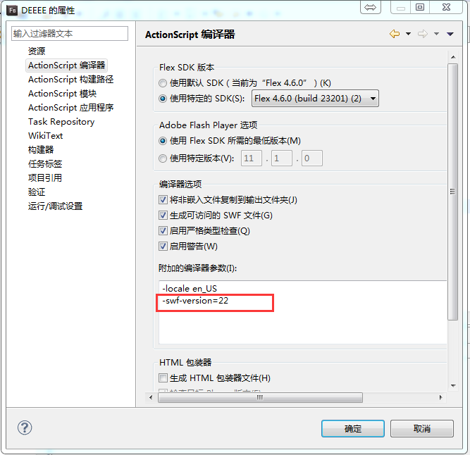

#LayaAirプロジェクトはFlashバージョンをリリースします。


###一、環境準備

1.LayaAirIDE最新の安定バージョンをダウンロードします。

公式サイトのアドレス:[http://ldc.layabox.com/index.php?m=content&c=index&a=lists&catid=27](http://ldc.layabox.com/index.php?m=content&c=index&a=lists&catid=27) 

2.最新のAdobe Flex Sdkをダウンロードします。

ダウンロード先:[https://www.adobe.com/devnet/flex/flex-sdk-download.html](https://www.adobe.com/devnet/flex/flex-sdk-download.html)

3.デバッグに必要なflash debug playerをダウンロードします。

ダウンロード先:[https://fpdownload.macromedia.com/pub/flashplayer/updaters/22/flashplayer_22_sa_debug.exe](https://fpdownload.macromedia.com/pub/flashplayer/updaters/22/flashplayer_22_sa_debug.exe)


 


###二、コンパイルリリース設定

####2.1エンジンパックとFlashライブラリのソースコードを導入する

　　**プロジェクトにLayaAirのアクションScript 3.0バージョンのエンジンバッグとFlashライブラリのソースコードを導入します。**

LayaAirのAS 3バージョンのソースコードの住所：[http://ldc.layabox.com/index.php?m=content&c=index&a=lists&catid=28](https://github.com/layabox/layaair/tree/master/bin/as/libs/src)

Flashライブラリのソースアドレス:[https://github.com/layabox/layaair/tree/master/bin/as/LayaAirFlash/flash/src](https://github.com/layabox/layaair/tree/master/bin/as/LayaAirFlash/flash/src)

　　*注意：ここでバッグのパスを導入するには、LayaAirのasバージョンのエンジンパックを導入し、Flashバージョンのフラッシュソースパッケージを導入する必要があります。*

####2.2 glsl 2 agal.swcをプロジェクトに追加する

flashを見つけてカバンのカタログを紹介して、カタログの下のライブラリglsl 2 agal.swcをプロジェクトに追加します。
住所:[https://github.com/layabox/layaair/blob/master/bin/as/LayaAirFlash/flash/glsl2agal.swc](https://github.com/layabox/layaair/blob/master/bin/as/LayaAirFlash/flash/glsl2agal.swc)

####2.3 debug起動関連のflash debug playerバージョンを設定する

現時点ではflash debug playerバージョンが最低11.9以上であることが要求されています。

Flash Develop設定は、図1に示すように、

​<br/>
図(1)

FlashBuider設定は、図2に示すように、

​<br/>
図(2)

####2.4 plyerglobal.swcファイルを追加する（FB環境のみ）

プロジェクトのコンパイルには多くのStage 3 D関連のクラスが使われています。11.9以上のクラスが必要です。`playerglobal.swc`ファイルは、この手順はFlash Builder環境のみの設定が必要です。FlashBuiderのインストールディレクトリの下にあるplyerglobal.swcパスを見つけました。ここでは「D:\Program Files\Adobe Flash Buider 4.7(64 Bit)\sdks\4.6\frame ews\player\12.0」を参考にしてください。

​<br/>
図(3)


###三、Flashバージョンを発表する。

LayaAirから提供されたsamplesの例を新たに作成したプロジェクトにコピーして、新しい文書起動クラスを作成します。ここではMain.asを例にします。

Main.asのソースコードの例：


```java

package
{
 import flash.display.Sprite;
 import laya.flash.Window;
 public class Main extends Sprite
 {
  public function Main(){
   //通过 Window.start 方法将测试例子Animation_Altas发布为Flash
   Window.start(this,Animation_Altas);
  }
 }
}
```


**注意:**このプロジェクトをH 5バージョンとしてリリースする場合、Mainクラスのトップに追加する必要があります。`/*[IF-FLASH]*/`コンパイルマクロは、H 5バージョンのリリース時にこのようなコンパイルを無視することを意図しています。

H 5バージョンをリリースする必要があります。ソースの修正は以下の通りです。


```java

/*[IF-FLASH]*/package
{
 import flash.display.Sprite;
 import laya.flash.Window;
 public class Main extends Sprite
 {
  public function Main(){
  //通过 Window.start 方法将测试例子Animation_Altas发布为Flash
   Window.start(this,Animation_Altas);
  }
 }
}
```


###四、注意事項とよくあるエラー：

4.1プロジェクト内にJSライブラリが導入されている場合、現在のプロジェクトはFlashバージョンに出力できません。

4.2リリースされたFlashバージョンは11.9以上でなければなりません。出現する可能性があります。`Error: Definition flash.display3D:Context3D could not be found.`新聞をまちがえる

4.3プロジェクトを実行する過程で、プロジェクト内の関数呼び出しパラメータの数が実際のパラメータの数と一致しない場合がたまにあります。例えば:


```javascript

[Fault] exception, information=ArgumentError: Error #1063: Animation_Altas/createAnimation() 的参数数量不匹配。应该有 0 个，当前为 1 个。
```


これはFlashがJSより関数の呼び出しに対して厳しい制限を持っているためで、e:*=nullのようなパラメータを多パラメータのところに入れることができます。

関数のプロトタイプパラメータよりも少ない場合、修正関数のプロトタイプパラメータは標準パラメータ、例えばp=nullです。

4.4（高級機能）プロジェクト内にカスタムのLayaAir GSL Shaderがあれば、自分で決めたGSLSファイルEmbedをFlashMainファイル内に登録し、Window.startの前にこれらのShaderを初期化する必要があります。以下のコードと同じです。


```javascript

public class FlashMain extends Sprite {
 [Embed(source = "./display/MutiAni/shader/aniShader.vs", mimeType = "application/octet-stream")]
 public static var anishader_vs:Class;
 [Embed(source = "./display/MutiAni/shader/aniShader.ps", mimeType = "application/octet-stream")]
 public static var anishader_ps:Class;
  
 public function FlashMain() {
  // 加入项目依赖的shader ，第一个字符串参数与 __INCLUDESTR__ 的参数一致，使用扩展Shader必须使用。
  FlashIncludeStr.addExtraShader("shader/aniShader.vs", new anishader_vs);
  FlashIncludeStr.addExtraShader("shader/aniShader.ps", new anishader_ps);
   
  // 项目代码入口
  Window.start(this, Main);
 }
}
```


4.5 LayaAirのlaya.net.Socket類を使用してWebSocketを使用する場合、対応するメッセージ処理コールバック関数内のパラメータタイプは*号タイプに設定しなければならない。


```javascript

private function onMessage(e:Event=null):void {}
```


変更する必要があります


```javascript

private function onMessage(e:*=null):void {}
```


運転中にタイプ変換エラーが表示されます。

