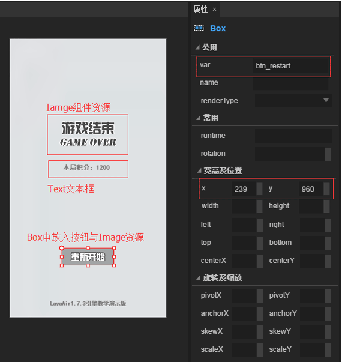

#二、エディタの可視化資源の作成

###ゲームの可視化リソースの概要

前の授業では、開発の考え方を分析し、美術素材資源の準備、分類を行いました。この授業では、まずコードを急がないでください。UIインタフェースと動画を作ってから論理的に処理します。LayaAirIDEは強力な可視化編集ツールであり、ゲームで見られる部分はすべてIDEで実現できます。

これらの可視化の要素は、様々なコンポーネント、アイコン、UIページ、アニメーション、地図、粒子などを含む。IDEコンポーネントについては、学生がそんなに詳しくないなら、詳細な教程は「技術文書—LayaAir IDE編」を見ることができます。これから、私たちは一歩ずつ「飛行機大戦」の可視化資源を作ります。

###ゲームページを作成

本例では、プロジェクトマネージャにおいて、スタートページ、ゲーム実行中ページ、ゲーム終了ページ、ゲーム地図ページを順次作成します。（図1、図2）。

公衆電話の画面に合わせるために、画面解像度を720×1280に設定します。ゲーム進行中、ゲーム地図ページは標準のビュータイプのページを選択します。Dialogタイプはポップアップ効果があるので、「開始」と「終了」ページはこのタイプを採用します。

 (図1)

 (図2)

新規ページ対応説明は下表を参照してください。

|本ゲームIDE可視化ファイルの説明
|-----------------------------|
|GameBg.ui 124;ゲームのスクロールマップ、Viewページのタイプ
ゲーム終了ページ、Dialogページタイプ
|GamePlay𞓜游戏进行中页，Viewページタイプ|
ゲーム開始インターフェース、Dialogページタイプ

####ゲームフローページ作成

GameStart.ui開始ページを作成し、開いた後、リソースまたはコンポーネントマネージャからそれぞれのコンポーネントまたはリソースにドラッグし、IDEツールを通じて位置調整、組み合わせを行い、IDE階層インターフェースで要素階層とネスト関係（photo Shopレイヤーのような）を調整する。右側の属性欄でも要素の幅の高い位置、回転スケーリングを操作して、最終的に美術効果図に達する必要があります（図3）。

ページレイアウトが調整されたら、プログラムの変更が必要な要素に変数名（var属性）を追加します。例えば、プログレスローディングテキストボックスTextコンポーネントvarはtxt＿ouadと名付けられ、ボタンを押すBoxコンポーネントvarはbtnus tartと名づけられた。

GamePlay、GameOverページとGameStartページの制作方式は基本的に同じである（図4）（図5）、これ以上説明しない。

 (図3)

 (図4)

 (図5)

####ゲームマップの背景

GameBg.uiページを作成し、開きます。私たちは資源マネージャからbackground.pngを二つのシーンエディタに引っ張り出して背景として使っています。上下二方は連続して配置して、地図の繰り返しのために使用します。2枚の図の変数名（var属性）をbg 1、bg 2として設定します。bg 2のy座標は-1280です。

もちろん、長い二方連続図だけでもいいです。背景に二階、一階の遠景（スロースクロール）、一階の近景（クイックスクロール）を設置するゲームがあります。

 (図6)

これでゲームページの作成が完了し、保存後にリリースされます。コードモードではプロジェクト、\srcディレクトリでuiフォルダが生成され、フォルダ内でIDEが生成した4つのUIクラスが表示されます。プログラムで実装すればステージにロードして表示されます。

###ゲームページのボタンアニメーション

インタフェースの効果を良くするために、いくつかのボタンやインターフェース要素にアニメーション効果を加えることができます。たとえば、ページの中の「ボタンを再起動し、クリックしたら上へジャンプします。これを例にして、作り方を学びましょう。

1.シーンエディタで選択します。そして、時間軸画面の「アニメーション編集モード」にチェックを入れると、再生制御ボタンと時間軸が表示されます（図7）。

 (図7)

2.第8フレームの左右の位置を選択して、ボタンを10ピクセルぐらい上に移動します。時間軸には対応するオブジェクト名と2つのキーフレームが現れます。オブジェクト名の左の小さな三角形をクリックすると、下の方にy属性が現れます。同じように2つのキーフレームがあります。これは、オブジェクトy軸の属性を変えたからです。もちろん、x、アルファ、scaleXなどの他の属性を変えたら、オブジェクト名の下にも現れます。

対象名の上にコントロールボタンを押すと、動画が見られます。動画が速すぎたり、遅すぎたりすると、キーフレームを左右に動かして適切な位置に移動できます。

 (図8)

3.より豊富なアニメーション効果を達成するために、y軸上の第一フレームを選択すると、右側の「フレーム属性」画面に「緩動するかどうか」の選択があります（図8）、チェックした後、緩動タイプをelasticOutとして選択すると、ボタンには素早く弾き戻す効果があります。学生たちは他の緩動を選んで試してみてもいいです。

最後に私達はこのアニメーションのために名前を変更しました。プログラムを起動するのに便利です。

注：アニメーションエディタは多くのクールなアニメーション効果を作ることができます。詳細は「技術文書ーLayaAir IDE編―IDEを使って作成」をご覧ください。

###ゲームキャラクター

プロジェクトマネージャでは、右クリックでGameRole.aniキャラクターアニメーション（ショートカットキーCtrl+N）を新規作成し、ゲームに必要な各種アニメーションリソースを作成します。

キャラクターのアニメーションタイプはデフォルトのGraphic Animation（図9）を選択して、アニメーションのページサイズはゲームの中で無効ですので、好みによって設定すればいいです。私達の飛行機の役割は白黒ですので、参考色は黒ではないです。

 (図9)

アニメーションファイルを作成したら、リソースマネージャの中のキャラクターリソースフォルダgameRoleを点けてください。中にはアニメーションを作るべきリソースがあります。リソースはキャラクターのタイプとアニメーション状態に対応しています。需要によって、私達のキャラクターのタイプは全部で4種類に分けられています。主人公のHERO、敵のenemiy 1-3、道具ufo 1-2、及び銃弾のbulle t 1-2。動画の状態は飛行flyで、hit、死亡down。

資源名は「ヒーローの死の状態を表す第一コマアニメーション」です。ここでは一つの表を使ってはっきり説明できます。

コンディション\キャラクタータイプ124;主人公（英雄）124敵2体の敵
|------------------------------------------------------------------------124;----124;---------------124;-------124;
𞓜飛行𞓜herofly 1-2𞓜enem1ゲenem 2クenemiy 2グenem 1|enemy 3|fly 1-2|bullet t 1-2|
| 受伤      | 无             | 无              | enemy2_hit1    | enemy3_hit1    |      |           |
𞓜死𞓜ヘルオ1-4|enemen1-4|enemy 2_down1-4|enemen

キャラクターアニメーションの作成方法と手順

1.アニメーションエディタ画面の「アニメーション編集モード」にチェックを付けると、再生制御ボタンと時間軸が表示されます（図10）。

 (図10)

2.リソースマネージャで1枚または複数の動画リソースの画像を選択し、時間軸にドラッグしてアニメーションを生成します（図11）。

例えば、主人公の飛行アニメーションを作成します。hero fly 1、hero fly 2の図を時間軸にドラッグして、主人公の飛行動画を生成して、循環ボタンを開けて、またクリックして再生します。動画が速すぎたり遅くなったりすると、フレームレートや2フレームの間隔を調節できます。

 (図11)

3.シーンエディタでアニメーションの原点に位置する位置を調整します。プロジェクトプログラムでは、キャラクター衝突はキャラクターの中心半径で計算されますので、キャラクターアニメーションの中心を原点にして、コードを少なく書くことができます（図10）。

フレームレートはアニメーションファイル自体の再生周波数であり、ゲームプログラムの主周波数フレームレートは影響を及ぼさず、本例ではすべてのアニメーションはフレームの時間間隔を調整せず、フレームレートだけを12フレームに設定すれば良い。

注：ローディング後の再生状態は、動画をそのままUIに配置するだけで有効であり、プログラムはアニメーションを必要とするプレイ方法をロードして再生する（図10）。

 (図10)

4.実効名を変更します。IDEでは、アクション名はデフォルトではアニュー0で、ゲームプログラムで使用するのに不便です。グループ名に変更して、キャラクタータイプとアニメーション状態を区別します。

アニメーションの切り替えはプレイ（）でアニメーションを切り替えます。例えば、下の図の名称はhero ufly、hero udie、hero.Play（0、true、「hero ufly」）で主人公の飛行アニメが放映されます。hero.Play（0，true，「hero udie」）を呼び出した時に、主人公の死亡アニメが放送されます。

この例では、アニメはあまり資源がないので、私達はすべてのキャラクターアニメーションをGameRole.uiの中に預けて、主役、敵、弾と道具を含みます。「追加」ボタンをクリックすると、新しい空時間軸が現れ、上記の4つのステップを繰り返すだけで、すべてのキャラクターのアニメーション効果が完成します。追加された動画は、アクティブドロップリストに表示され、その中のいずれかを選択して再編集が可能です（図11）。

 (図11)

以上のように、今回の授業ではゲームの可視化素材をすべて作成し、ゲームの後序開発に基礎を作った。プロジェクト開発の過程で、UIインターフェースの変更が多く、美術職の同僚にIDEページとアニメの制作を勉強させて、仕事の効率を高めることができます。美術が終わったらプログラムを簡単に調整して発表してUIの論理処理をします。