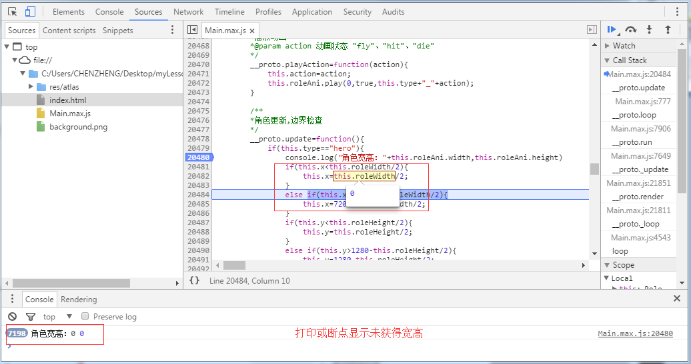

#五、ゲームの主人公とコントロール

###キャラクターの概要

前回の授業ではIDEでUIを作成し、ゲームの流れ管理とUIの論理機能を実現しました。しかし、最も重要なキャラクターはまだ加入していません。コンダクタンスによって、ゲームのキャラクターこそがゲームの真の核心ロジックです。今回の授業では、ゲームの主人公の機能の一部を実現して、主人公にコントロールできるようにします。

<br/>(図1)

この授業の制作構想は：

1.基本的なキャラクタークラスを確立し、初期化方法でキャラクターを分類し、キャラクタータイプによって異なるアニメーションを再生することができます。
2.メインクラスでは主人公を実例化し、主人公のコントロール方法を実現して、主人公を移動させます。
3.主人公の更新方法を確立し、境界検査を行い、主人公がスクリーンの外を移動できないようにする。


###ゲームの基礎となるキャラクター類の建立

srcディレクトリの下にキャラクタークラスのRole.asを新たに作成し、表示類Spriteを継承します。

キャラクターの中で私達は主に論理を実現します。

1.キャラクターの基本属性：キャラクタータイプタイプタイプタイプタイプタイプタイプタイプタイプ、血液量hp、速度speed。

2.キャラクターアニメーションオブジェクトのroleAni：Animationは、IDE編集のキャラクターアニメーションを再生します。
注：キャラクターマップの読み込みは開始ページ論理で完了していますので、IDE編集のアニメーションリソースgameRole.aniをロードすればいいです。

3.キャラクター初期化公共方法init（）は、キャラクターのタイプ、血液量、速度を初期化して、キャラクターを分類します。

4.キャラクターアニメーションの再生方法playAction（action：String）は、キャラクタータイプと動画状態を切り替えることができます。

具体的なコードは以下の通りです。


```

package
{
	import laya.display.Animation;
	import laya.display.Sprite;
	import laya.events.Event;
	import laya.maths.Rectangle;
	
	/**
	 * @author CHENZHENG
	 * 角色类，飞机、敌人、子弹、道具
	 */	
	public class Role extends Sprite
	{
		/***角色的类型   “hero”:玩家飞机，“enemy”：敌人飞机、“bulle”：子弹、"ufo":道具****/
		public var type:String;
		/***角色的血量***/
		public var hp:Number=0; 
		/***角色的速度***/
		private var speed:Number=0;		
		
		/***角色的动画***/
		private var roleAni:Animation;
		/***当前动画动作***/
		private var action:String;
		
		public function Role()
		{
			//实例化动画
			roleAni=new Animation();
			//加载IDE编辑的动画文件
			roleAni.loadAnimation("GameRole.ani");
		}
		
		/**
		 * 角色初始化
		 * @param type  角色类型：“hero”:玩家飞机，“enemy1-3”：敌人飞机、“bulle:1-2”：子弹、"ufo1-2":道具
		 * @param hp   血量
		 * @param speed  速度
		 */		
		public function init(type:String,hp:Number,speed:Number):void
		{
			//初始化角色属性
			this.type=type;
			this.hp=hp;
			this.speed=speed;
			//加载动画对象
			this.addChild(roleAni)
			//播放默认飞行动画
			playAction("fly");
		}
		
		/**
		 * 播放动画 
		 * @param action 动画状态："fly"、"hit"、"die"
		 */	
		public function playAction(action:String):void
		{
			this.action=action;
			//播放角色动画,name=角色类型_动画状态，如：hero_fly
			roleAni.play(0,true,this.type+"_"+action);
		} 
		
}
```


私たちがキャラクタークラスを作ったら、メインクラスで主人公飛行機を作ることができます。私たちはメインクラスに以下のロジックを入れる必要があります。

1.単独のキャラクター層容器のroleLayerを追加し、すべてのキャラクターをその中にロードし、ポストの役割管理、例えばキャラクター衝突ロジックなどを簡単に実現する。もちろん、ゲーム終了時にはゲームオーバーでキャラ層をクリアして、次のゲームに備えます。

2.主人公グローバル変数heroを作成し、ゲームgameInit（）の方法で主人公を実写化し、キャラクター層に表示します。

3.ゲームハーネス方法gameOver()で、キャラクター層を除去します。再実装時には全てのキャラクターが削除され、次のゲームに備えられます。

コードの参考は以下の通りです。


```

		......
		/**角色层容器***/
		private var roleLayer:Sprite;
		/**玩家主角***/
		private var hero:Role;
		......

		/**
		 游戏中，游戏初始化
		 */
		private function gameInit():void
		{
			......
			//实例化角色层并加载到舞台(如果已实例化，不需要重新new)
			roleLayer||=new Sprite();
			Laya.stage.addChild(roleLayer)
				
			//实例化游戏中UI页面(如果已实例化，不需要重新new)
			play||=new GamePlay();			
			//加载到舞台
			Laya.stage.addChild(play);
						
			//实例化主角(如果已实例化，不需要重新new)
			hero||=new Role()
			//初始化角色类型、血量，注：速度speed为0，因为主角是通过操控改变位置
			hero.init("hero",10,0);
			//主角位置修改
			hero.pos(360,800);
			//角色加载到角色层中
			roleLayer.addChild(hero);
			......
		}
		
        /**
		 游戏结束
		 */
		private function gameOver():void
		{
			......
			//清空角色层子对象
			roleLayer.removeChildren(0,roleLayer.numChildren-1);
			//移除角色层
			roleLayer.removeSelf();
			......
		}
		
```


上記の論理コードを完成した後、主人公飛行機がすでにスクリーンに搭載されていることを発見し、飛行動画を再生しました。


###ゲームの主人公の操作

先の「飛行機大戦」のゲーム教程では、指をスライドさせ、主人公が指を合わせて自動的に移動します。このような操作は明らかに足りないところがあります。プレイヤーが指が大きいと飛行機がブロックされて観察に不利です。指が離れて他の位置に触れると、飛行機はまた瞬間的に移動します。常識に合わないです。

したがって、私たちはこの授業で、入力を操作して指の移動に変えます。飛行機は指の下に瞬く間に移動しません。移動方向と速度によって、自分の座標を変えます。

注：LayaAirエンジンはFlashのようにタッチイベント（TouchEvent）を独立させていません。直接マウスイベントでモニターすることができます。多点タッチの属性も含まれています。

キャラクターが死亡していないため、操作時間を長くするために、メインゲームInit（）の方法では、シミュレーションを3秒遅らせて終了を30秒遅らせます。


```

		//模拟游戏结束，30秒时间
		Laya.timer.once(30000,this,gameOver);
```


他のコードロジックの考え方は以下の通りです。

1.2つの属性moveXを追加し、各指が動いた後、前のフレームのタッチ位置を記録するために使用します。

2.gameInit（）方法では、舞台マウスの押下、マウスの移動、マウスの移動などを追加して、モニターイベントを起動します。また、ボタンを押すとマウスの移動をモニターし、持ち上げた時に移動モニタを削除します。もちろん、ゲーム終了時には、ステージモニターを全て取り除く必要があります。

3.マウスの移動方法onMouse Move()で主人公の位置を更新し、移動位置は現在のタッチ位置から前フレームのタッチ位置を減算します。

4.キャラクターに更新方法を追加しました。この方法では主人公の境界チェックだけを入れて、スクリーンの外に移動できなくなります。今後はキャラクターの血液量検査、敵機の境界超過処理などの他のロジックも追加されます。

Mainで参照コードを変更します。


```

		......
        /**鼠标上一帧x座标** */		
		private var moveX:Number;
		/**鼠标上一帧y座标** */	
		private var moveY:Number;
		
		......
		/**
		 游戏中，游戏初始化
		 */
		private function gameInit():void
		{
			......
			//角色加载到角色层中
			roleLayer.addChild(hero);
			
			//鼠标按下监听
			Laya.stage.on(Event.MOUSE_DOWN,this,onMouseDown);
			//鼠标抬起监听
			Laya.stage.on(Event.MOUSE_UP,this,onMouseUp);
			......			
		}
		
		/**
		 按下后开始触发移动
		 */	
		private function onMouseDown():void
		{
			//鼠标按下时的位置，用于计算手指移动量
			moveX=Laya.stage.mouseX;
			moveY=Laya.stage.mouseY;
			//开始移动监听
			Laya.stage.on(Event.MOUSE_MOVE,this,onMouseMove);
		}
		
		/**
		 主角跟随鼠标移动
		 */	
		private function onMouseMove():void
		{
			//计算角色移动量(上一帧的位置—当前移动到的位置)
			var xx:Number=moveX-Laya.stage.mouseX;
			var yy:Number=moveY-Laya.stage.mouseY;
			//更新移动位置
			hero.x-=xx;
			hero.y-=yy;
			//更新前一帧位置的座标
			moveX=Laya.stage.mouseX;
			moveY=Laya.stage.mouseY;
		}
		/**
		 鼠标抬起、关闭移动监听
		 */		
		private function onMouseUp():void
		{
			Laya.stage.off(Event.MOUSE_MOVE,this,onMouseMove) ;
		}
		
		/**
		 游戏结束
		 */
		private function gameOver():void
		{
			//移除所有舞台事件，鼠标操控
			Laya.stage.offAll();
			......
		}
```


###主人公の境界チェックの更新

コンパイル運転で、指がスクリーン上を移動しているのを発見した時、飛行機も移動しました。しかし、新たな問題も出てきました。主人公の飛行機は指に無理に同調していないので、移動が多すぎると、飛行機がスクリーンの外に飛び出してしまいます。

キャラクターに境界チェック機能を追加し、udate（）方法を追加しました。具体的なコードは以下の通りです。


```

		......
		
		/**
		 * 角色更新,边界检查
		 */		
		public function update():void
		{
        	//主角边界检查
			if(this.type=="hero")
			{
				//需减去角色宽或高的一半，因为在IDE中制作动画时，我们把角色的中心做为了角色对象的原点
				//判断是否左右超出
				if(this.x<roleAni.width/2)
				{
					this.x=roleAni.width/2;
				}
				else if(this.x>720-roleAni.width/2)
				{
					this.x=720-roleAni.width/2;
				}
				//判断是否上下超出
				if(this.y<roleAni.height/2)
				{
					this.y=roleAni.height/2;
				}
				else if(this.y>1280-roleAni.height/2)
				{
					this.y=1280-roleAni.height/2;
				}
			}
		}
		......
```


キャラクターに更新方法が追加された後、メインクラスのMainメインループloop（）で主人公udate（）を実行する方法を呼び出し、各フレームでアウトかどうか判断します。


```

		......
		/**
		 游戏主循环
		 */
		private function loop():void
		{
			//地图滚动更新
			map.updateMap()
			//本局游戏数据更新
			play.update(hp,level,score)
				
			//调用主角更新，边界检查等
			hero.update();
		}

		......
```


ここでコンパイル運転後、必要な効果は達成されましたか？注意深い学友はそれとも達成していないことを発見して、役が境界に移動する時、アニメーションの中心の以外の部分はまだスクリーンの外を超えて、それではこれはどんな原因がもたらしたのですか？私達は明らかに境界検査の時にキャラクターのアニメーションの半分の幅あるいは高さを差し引いて、しかし運行し始めるのは無効です。

境界チェックにtrace(「キャラの幅」+roleAni.width，roleAni.height)コードを入れて運転した後、F 12のショートカットキーを押してデバッグモードを開き、コンソールの出力が「キャラクターの幅の高さ：0」となるのを見ることができます。

<br/>(図2)

7000フレーム後も0,0となると、なぜですか？

これは、動画の読み込み後に、実際にアニメーションを完成させるだけで、動画オブジェクトの矩形境界を取得する方法によって、高い属性が得られるからです。キャラクター初期化init()メソッドに、キャラクターの「動画再生完了」の傍受イベントを追加し、リフレクト方法を確立して、アスペクトを獲得します。コードの参考は以下の通りです。


```

			......
			
			//加载动画对象
			this.addChild(roleAni)
						
			//监听动画播放完成事件
			roleAni.on(Event.COMPLETE,this,onComplete)
			//播放默认飞行动画
			playAction("fly");

		}
		
		/***动画完成后回调方法***/
		private function onComplete():void
		{
			//如果角色还未有宽，获得角色宽高	
			if(roleAni.width==0)
			{
				//获得动画矩形边界
				var bounds:Rectangle=roleAni.getBounds();
				//角色宽高赋值
				roleAni.size(bounds.width,bounds.height)
			}
		}
		
		......	
```


以上のコードを入れてコンパイルして実行して、ゲームの主役は完璧なコントロールを得て、二度と境界を超えませんでした！

<br/>(図1)


このセクションの修正後のコードは以下の通りです。

###メインクラスMain.asのすべてのコード


```

package {
	
	import laya.display.Sprite;
	import laya.display.Stage;
	import laya.events.Event;
	import laya.net.Loader;
	import laya.utils.Handler;
	import laya.webgl.WebGL;
	
	
	public class Main
	{
		/**开始页面***/
		private var start:GameStart
		/**地图页面***/
		private var map:GameMap
		/**游戏中界面***/
		private var play:GamePlay
		/**游戏结束页面***/
		private var over:GameOver
		
		/**主角血量***/
		private var hp:int=10;
		/**游戏关卡数***/
		private var level:int=1;
		/**玩家得分***/
		private var score:int=0;
		
		/**角色层容器***/
		private var roleLayer:Sprite;
		/**玩家主角***/
		private var hero:Role;
		
		
		/**鼠标上一帧x座标** */		
		private var moveX:Number;
		/**鼠标上一帧y座标** */	
		private var moveY:Number;
		
		public function Main()
		{
			//初始化引擎，建议增加WebGl模式
			Laya.init(720, 1280,WebGL);
			//全屏不等比缩放模式
			Laya.stage.scaleMode = Stage.SCALE_EXACTFIT;
			//加载游戏页面资源(如果界面资源太多太大[超过50k],建议开始页面单独建立文件夹打包)
			Laya.loader.load("res/atlas/gameUI.atlas",Handler.create(this,this.gameStart));
				
		}
		
		/**
		 资源加载完成后，加载游戏开始界面
		 */
		private function gameStart():void
		{
			//实例化开始页面
			start=new GameStart();
			//以弹出方式打开，有缓动效果。IDE中页面为Dialog才可用
			start.popup();
			//监听开始游戏开始按钮事件,点击后进入游戏中
			start.btn_start.on(Event.MOUSE_UP,this,gameInit);
		}
		
		/**
		 游戏中，游戏初始化
		 */
		private function gameInit():void
		{
			//缓动动画关闭效果。IDE中页面为Dialog才可用
			start.close();
			
			//实例化地图背景页面(如果已实例化，不需要重新new)
			map||=new GameMap();
			//加载到舞台
			Laya.stage.addChild(map);
			
			//实例化角色层并加载到舞台(如果已实例化，不需要重新new)
			roleLayer||=new Sprite();
			Laya.stage.addChild(roleLayer);
				
			//实例化游戏中UI页面(如果已实例化，不需要重新new)
			play||=new GamePlay();			
			//加载到舞台
			Laya.stage.addChild(play);
						
			//实例化主角(如果已实例化，不需要重新new)
			hero||=new Role();
			//初始化角色类型、血量，注：速度speed为0，因为主角是通过操控改变位置
			hero.init("hero",10,0);
			//主角位置修改
			hero.pos(360,800);
			//角色加载到角色层中
			roleLayer.addChild(hero);
			
			//鼠标按下监听
			Laya.stage.on(Event.MOUSE_DOWN,this,onMouseDown);
			//鼠标抬起监听
			Laya.stage.on(Event.MOUSE_UP,this,onMouseUp);
			
			
			//模拟游戏结束，15秒时间
			Laya.timer.once(15000,this,gameOver);
			//游戏主循环
			Laya.timer.frameLoop(1,this,loop);
		}
		
		/**
		  按下后开始触发移动
		 */	
		private function onMouseDown():void
		{
			//记录鼠标按下时的位置，用于计算鼠标移动量
			moveX=Laya.stage.mouseX;
			moveY=Laya.stage.mouseY;
			//
			Laya.stage.on(Event.MOUSE_MOVE,this,onMouseMove);
		}
		
		/**
		 主角跟随鼠标移动
		 */	
		private function onMouseMove():void
		{
			//计算角色移动量
			var xx:Number=moveX-Laya.stage.mouseX;
			var yy:Number=moveY-Laya.stage.mouseY;
			//更新移动位置
			hero.x-=xx;
			hero.y-=yy;
			//更新本帧的移动座标
			moveX=Laya.stage.mouseX;
			moveY=Laya.stage.mouseY;
		}
		/**
		 鼠标抬起、关闭移动监听
		 */		
		private function onMouseUp():void
		{
			Laya.stage.off(Event.MOUSE_MOVE,this,onMouseMove) ;
		}
		
		
		/**
		 游戏主循环
		 */
		private function loop():void
		{
			//地图滚动更新
			map.updateMap();
			//本局游戏数据更新
			play.update(hp,level,score);
				
			//如果主角未死亡，调用主角更新，边界检查
			if(hero.hp>0)
			{
				hero.update();
			}
		}

		/**
		 游戏结束
		 */
		private function gameOver():void
		{
			//移除所有舞台事件，鼠标操控
			Laya.stage.offAll();
			
			//移除地图背景
			map.removeSelf();
			//移除游戏中UI
			play.removeSelf();
			
			//清空角色层子对象
			roleLayer.removeChildren(0,roleLayer.numChildren-1);
			//移除角色层
			roleLayer.removeSelf();
			
			//去除游戏主循环
			Laya.timer.clear(this,loop);
			
			//实例化游戏结束页面
			over||=new GameOver();
			//游戏积分显示
			over.txt_score.text=score.toString();
			//以弹出方式打开，有缓动效果。IDE中页面为Dialog才可用
			over.popup();
			//重新开始事件监听,点击后进入游戏中
			over.on("reStart",this,gameInit);
		}
	}
}
```


###ロールクラス全コード


```

package
{
	import laya.display.Animation;
	import laya.display.Sprite;
	import laya.events.Event;
	import laya.maths.Rectangle;
	import laya.utils.Handler;
	
	/**
	 * @author CHENZHENG
	 * 角色类，飞机、敌人、子弹、道具
	 */	
	public class Role extends Sprite
	{
		/***飞机的类型   “hero”:玩家飞机，“enemy”：敌人飞机、“bulle”：子弹、"ufo":道具****/
		public var type:String;
		/***飞机的血量***/
		public var hp:Number=0; 
		/***飞机的速度***/
		private var speed:Number=0;		
		
		/***角色的动画资源***/
		private var roleAni:Animation;
		/***当前动画动作***/
		private var action:String;
		
		public function Role()
		{
			//实例化动画
			roleAni=new Animation();
			//加载IDE编辑的动画文件
			roleAni.loadAnimation("GameRole.ani");
		}
		
		/**
		 * 角色初始化
		 * @param type  角色类型：“hero”:玩家飞机，“enemy1-3”：敌人飞机、“bulle:1-2”：子弹、"ufo1-2":道具
		 * @param hp   血量
		 * @param speed  速度
		 */		
		public function init(type:String,hp:Number,speed:Number):void
		{
			this.type=type;
			this.hp=hp;
			this.speed=speed;
			//加载动画对象
			this.addChild(roleAni)
			
			//监听动画完成事件
			roleAni.on(Event.COMPLETE,this,onComplete)
			//播放默认飞行动画
			playAction("fly");

		}
		
		/***动画完成后回调方法***/
		private function onComplete():void
		{
			//如果角色还未有宽，获得角色宽高	
			if(roleAni.width==0)
			{
				//获得动画矩形边界
				var bounds:Rectangle=roleAni.getBounds();
				//角色宽高赋值
				roleAni.size(bounds.width,bounds.height)
			}
		}
		
		/**
		 * 播放动画 
		 * @param action 动画状态   "fly"、"hit"、"die"
		 */	
		public function playAction(action:String):void
		{
			this.action=action;
			//播放角色动画,name=角色类型_动画状态，如：hero_fly
			roleAni.play(0,true,this.type+"_"+action);
		} 
		
		/**
		 * 角色更新,边界检查
		 */		
		public function update():void
		{
			//主角边界检查
			if(this.type=="hero")
			{
				//需减去角色宽或高的一半，因为在IDE中制作动画时，我们把角色的中心做为了角色对象的原点
				//判断是否左右超出
				if(this.x<roleAni.width/2)
				{
					this.x=roleAni.width/2;
				}
				else if(this.x>720-roleAni.width/2)
				{
					this.x=720-roleAni.width/2;
				}
				//判断是否上下超出
				if(this.y<roleAni.height/2)
				{
					this.y=roleAni.height/2;
				}
				else if(this.y>1280-roleAni.height/2)
				{
					this.y=1280-roleAni.height/2;
				}
			}
		}
	}
}
```
