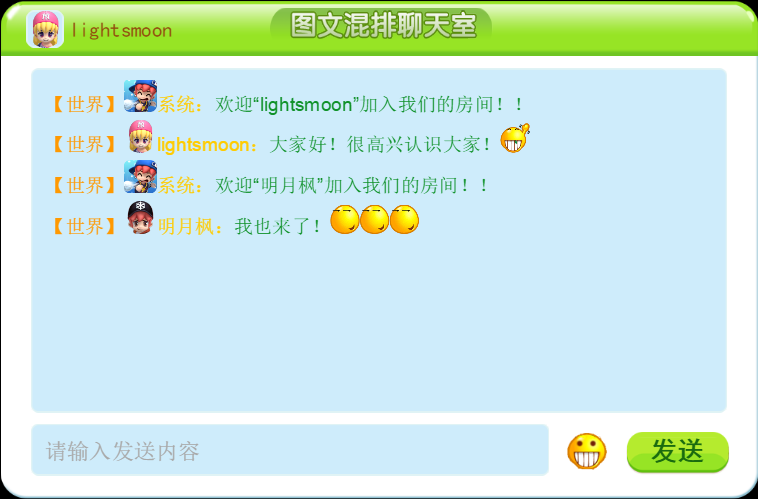
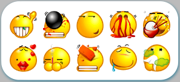
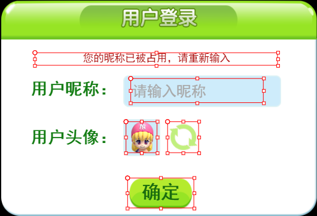
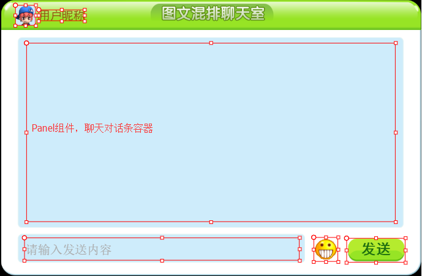

#図文混列チャットルームのクライアント（上）

###クライアントの簡単な需要分析

前回はAS 3でwebSocketチャットサーバーを開発するコースについて説明しましたが、この時間はクライアント部分の研究を開始します。まず需要を整理して、考えを整理します。（図1）

<br/>(図1)

クライアントの内容は、思考ガイドの分析によれば、メインクラス（socket接続とフロー管理）、ログインインターフェース、チャットインターフェース、表情インターフェース、チャットバーを含み、一部のコンテンツはUIインターフェースの作成とプログラム論理の実現を含む。参考図とロジックは以下の通りです。

ログイン画面
ユーザーのニックネームを入力し、サーバーから送信されたユーザーリストに基づいて名前を確認し、更新ボタンをクリックしてカスタマイズ画像を表示し、決定ボタンをクリックしてチャット画面にログインし、ログイン情報をサーバに送信します。


 <br/>(図2)

チャットメインインターフェース
ユーザは送信内容を入力して、コンテンツは選択された表情識別を含むことができます。送信ボタンをクリックして、クライアントはサーバにデータを送信します。クライアントはサーバからブロードキャストされたチャットメッセージを受信して、図と文の混成されたチャットバーを生成してチャットボックスに表示します。

<br/>(図3)

表情選択画面
選択した表情をクリックして、チャット画面の入力ボックスに顔の識別を生成します。ここで声明します。使用した資源はすべて元の開発者のために所有しています。この例は研究のためだけに使われています。ソースと資源は商用で使用しないでください。

<br/>(図4)


###プロジェクトを作成し、Webソケットサーバに接続します。

LayaAir IDEを開けて、空いている項目を新たに作って、選択タイプはアクションScript 3.0項目で、プロジェクト名はChat Clientです。そしてFlash Buiderを通してプロジェクトを導入します。新しいChat Client.asクラスは、layaエンジンのSpriteクラスに引き継がれ、デフォルトのアプリケーションに設定されます。

<br/>(図5)

クラスではまずエンジン初期化を行い、かつsocketInit（）方法を確立し、前の課に置いていたサーバーとIPを通じてポート番号と接続します。

LayaAirエンジンのsocketはブラウザwebSocketのパッケージです。Flash版のSocketを使わないように注意してください。

socketの実装後、三つのイベントを傍受しました。

Event.OPENは、サーバーに接続するかどうかをモニターし、接続後にイベントをトリガします。

Event.MESSAGEは、メッセージが受信されたかどうかを傍受し、メッセージデータを受信した後にトリガし、データに基づいてさらに論理的に処理することができる。

サーバーの架設授業では、チャットルームは主に3つのメッセージを使っています。登録メッセージ、会話メッセージとユーザーのニックネームリストメッセージについて述べました。ログインメッセージはサービスで受信しますので、クライアントがメッセージを受信するイベントでは、「対話メッセージ」と「ユーザニックネームリストメッセージ」だけを識別すればいいです。

Event.ERRORは、接続エラーを傍受し、エラーが発生したら接続が切断されます。ネットワーク切断のヒントができます。

具体的なコードは以下の通りです


```

package
{
	
	import laya.display.Sprite;
	import laya.display.Stage;
	import laya.events.Event;
	import laya.net.Socket;
	import laya.webgl.WebGL;
	
	/**
	 *聊天系统客户端 
	 * @author CHENZHENG
	 * 
	 */	
	public class ChatClient extends Sprite
	{

		/***客户端webSocket****/
		public static var socket:Socket;
		
		/***是否连接上webSocket服务器****/
		public static var isConnect:Boolean=false;
		
		public function ChatClient()
		{
			//初始化引擎
			Laya.init(1280, 768,WebGL);
			//最小比例缩放
			Laya.stage.scaleMode = Stage.SCALE_SHOWALL;
			//自动横屏
			Laya.stage.screenMode = Stage.SCREEN_HORIZONTAL;
			
			//连接服务器
			socketInit();
		}
		
		/**初始化webSocket,连接服务器*/
		private function socketInit():void
		{
			//实例化客户端socket
			socket = new Socket();
			//监听是否连接服务器
			socket.on(Event.OPEN,this,socketOpen);
			//监听服务器发送的消息
			socket.on(Event.MESSAGE,this,socketMessage);
			//监听连错误
			socket.on(Event.ERROR,this,socketError);
			
			//连接服务器
			socket.connect("10.10.20.51",8999);
			//方法2：socket.connectByUrl("ws://10.10.20.51:8999");
		}
		
		/**webSocket错误,服务器断开*/
		private function socketError():void 
		{
			//服务器连接中断
			isConnect=false;
		}
		
		/**收到webSocket消息*/
		private function socketMessage(msg:String):void
		{
			//接收消息分为两类：用户昵称列表消息，对话消息
			trace("收到消息："+msg);
			//把JSON字符串转化成object
			var obj:Object=JSON.parse(msg);
			//是否用户列表类型
			if(obj.hasOwnProperty("clients"))
			{
				trace("用户昵称列表-----"+obj.clientNames);
			}//是否聊天信息
			else if(obj.hasOwnProperty("name"))
			{
				trace("用户消息-----"+obj.name+obj.head+obj.data);
			}
		}
		
		/**webSocket已连接**/
		private function socketOpen():void
		{
			trace("服务端连接成功！")
			//服务器已连接
			isConnect=true;
		}
	}
}
```


cmdの中でnodeはサーバーを運行して、それから私達はクライアントに対してコンパイルして実行して、私達はサーバーcmdコントロールで出力を表示することができます：“プレーヤーがオンラインしました！”

クライアントが実行しているGoogleブラウザのページでF 12を押してデバッグツールを開くと、他のユーザーがログインしていないため、ユーザーリストが空になっていることが確認できます。

<br/>(図6)


###可視化画面を作成

サーバーは接続に成功した後、私達はチャットクライアントUIインターフェースを作り始めました。ログイン、チャット、表情選択インターフェースを含みます。

まずLayaAir IDEに資源を導入して、良い種類の美術資源をコピーします。3つのフォルダを含むことができます。chatにはUIリソースが保存されています。faceにはチャットの表情があります。

注：顔と顔写真は図文の混成に使いますので、図集に包装することはできません。フォルダ上で右クリックし、デフォルトの属性設定をオンにし、ポップアップされた「ディレクトリ属性設定」画面で「パッキングしない」を選択します。

<br/>(図7)

インタフェースの制作はここで簡単に紹介します。細かい指導はしません。詳細は「技術文書ーLayaAir IDE編」をご覧ください。

プロジェクトマネージャにLogin.uiを新規作成します。タイプはDialogダイアログです。chatから対応するコンポーネントをドラッグして、リソースを組み合わせて、下図のような効果になります（図8）。選択したコントロールに対して変数名をつけます。var変数名は、それぞれtxtwarning、txt_name、iconghead、btnuhead、btnuokとなります。それらはリリース後にグローバル公共変数を生成します。

<br/>(図8)


プロジェクトマネージャにChat.uiを新規作成します。タイプはViewページです。chatから対応するコンポーネントをドラッグして、リソースを組み合わせて、下図のような効果になります（図9）。var変数名は順に、iconhard、txtuname、chatPanel、chatInfo、btnuface、btnufaceです。

<br/>(図9)


プロジェクトマネージャでは、chat Face.uiを新規に作成し、chatから表情画像をドラッグして、最終的にListコンポーネントに変換して、下図のような効果を達成します（図10）。var変数名はfaceListです。

<br/>(図10)


ショートカットキーF 12がリリースされ、「コードモード」でアイテムを調べて、プロジェクトの中でuiフォルダが生成されました。中には三つのUI表示クラスがあります。これらの3つのクラスの中で、私達はきっと直接的に論理コードを追加しないでください。彼らの派生クラスの中で論理を実現できます。IDEの中でインターフェースを修正すれば、再発行時に元のクラスをカバーします。前に書いた論理コードは全部消えます。


###ログイン画面機能

ログイン画面の主な機能は、クライアントの名前と顔写真を選択し、「ログインメッセージ」をサーバーに送信します。サーバーが受信したら、ユーザーリストとニックネームリストを更新します。新築LoginView.asはLoginnUIに引き継がれます。
具体的なロジックは以下の通りです。

1.名前の確認方法

まず、サーバーからオンラインのニックネームリストを取得して、入力したニックネームで判断します。

注：クライアントとサーバが接続されたばかりの場合、サーバー内のクライアントはニックネームがなく、「ログインメッセージ」があると、その割り当てを解析し、ニックネームリストを更新してすべてのユーザに送信します。そのため、最初のユーザが接続した後、サーバーから送られてきたニックネームのリストが空です。

重名検出：ニックネーム入力ボックスに焦点を合わせて判断することにより、フォーカスがある場合は入力中であり、重名検出は実行されません。フォーカスが失われた場合は説明入力が完了し、重名チェックが実行され、警告情報が表示されます。

2.顔写真を交換する機能は比較的簡単で、顔写真を順番に選択することに相当し、顔写真情報はクライアントに保存され、チャットメッセージが送信されるたびにこの情報を持つ。

3.ログインメッセージを送信します。メッセージの形式は「「"login":""，"name":Chat Client.clientName"」です。名前は空または重名です。またはsocket接続がないとログインできません。警告メッセージを表示します。

コードは以下の通りです


```

package view
{
	import laya.events.Event;	
	import ui.LoginUI;

	/**
	 * 登录界面及功能
	 * @author CHENZHENG
	 * 
	 */	
	public class LoginView extends LoginUI
	{
		/**是否重名*/
		private var isSameName:Boolean=false;
		
		public function LoginView()
		{
			//警告暂时隐藏
			this.txt_warning.visible=false;
			//限制字符输入
//			this.txt_name.restrict="a-zA-Z\u4e00-\u9fa5";
			//监听文本输入
			this.txt_name.on(Event.INPUT,this,onInput)
			//监听输入文本框是否焦点是否离开
			this.txt_name.on(Event.BLUR,this,onIsName)
			//确定按钮监听
			this.btn_ok.on(Event.MOUSE_DOWN,this,onLogin)
			//头像刷新按钮监听	
			this.btn_head.on(Event.MOUSE_DOWN,this,onChangeHead)
		}
		
		/**修改用户头像*/
		private function onChangeHead():void
		{
			//头像编号增加
			ChatClient.headIndex++;
			//最多到编号15，否则重新开始
			if(ChatClient.headIndex>15) ChatClient.headIndex=0
			//改变玩家头像
			this.icon_head.skin="icon_head/head"+ChatClient.headIndex+".png"
		}
		
		/**正在输入文本*/
		private function onInput():void
		{
			//输入文本时警告不显示
			this.txt_warning.visible=false;
			//初始化警告文本
			this.txt_warning.text="您的昵称已被占用，请重新输入"
			//无重名
			this.isSameName=false;
		}
		
		/**检查是否重名*/
		private function onIsName():void
		{
			//名字输入框中文本
			var txt:String=txt_name.text;
			//检测是否重名
			if(ChatClient.clientNames.indexOf(txt)!=-1)
			{
				//有重名时显示警告
				this.txt_warning.visible=true;
				this.isSameName=true;
			}else
			{
				//无重名时用户取名成功
				ChatClient.clientName=txt;
			}
		}
		
		/**登录*/
		private function onLogin():void
		{
			//注：登录时如焦点从文本输入框移动直接点击按钮，引擎会先激发失去焦点事件，然后才激发鼠标事件！
			//如果有重名且未连接服务器，不允许登录
			if(isSameName||!ChatClient.isConnect) return;
			
			//如果没有用户昵称
			if(ChatClient.clientName=="")
			{
				//修改警告信息
				this.txt_warning.text="登录前必须输入用户昵称！"
				//显示警告
				this.txt_warning.visible=true;
				//退出登录 
				return;
			}
			
			//用户登录信息数据
			var  msgLogin:Object ={"login":"","name":ChatClient.clientName};
			//发送用户登录信息给服务器
			ChatClient.socket.send(JSON.stringify(msgLogin));
			//发送可以登录事件
			this.event("loginOK");
		}
	}
}
```


メインクラスのChat Cliennt.asを修正して、ユーザーニックネームリスト、ユーザーニックネーム、顔写真番号、ログイン画面のインスタンスなどの属性を追加します。リソースを読み込み、ログイン画面を実例化します。注：まず例を挙げて画面を表示してから、socket接続を行います。そうしないと、メッセージが受信された後の部分論理はエラーとなり、オブジェクトは空となります。

修正後のマスターコードは以下の通りです。


```

package
{
	import laya.display.Sprite;
	import laya.display.Stage;
	import laya.events.Event;
	import laya.net.Loader;
	import laya.net.Socket;
	import laya.utils.Handler;
	import laya.webgl.WebGL;

	import view.LoginView;
	
	/**
	 *聊天系统客户端 
	 * @author CHENZHENG
	 * 
	 */	
	public class ChatClient extends Sprite
	{
		/***登录界面****/
		private var login:LoginView;
		
		/***游戏所需资源数组****/
		private var assetArr:Array=[{url: "res/atlas/chat.atlas"}];
		/***客户端webSocket****/
		public static var socket:Socket;
		/***是否连接上webSocket服务器****/
		public static var isConnect:Boolean=false;
		
		/***用户昵称（用户昵称）****/
		public static var clientName:String="";
		/***用户昵称列表****/
		public static var clientNames:Array=[];
		/**用户头像编号*/
		public static var headIndex:int=0;
		
		public function ChatClient()
		{
			//初始化引擎
			Laya.init(1280, 768,WebGL);
			//最小比例缩放
			Laya.stage.scaleMode = Stage.SCALE_SHOWALL;
			//自动横屏
			Laya.stage.screenMode = Stage.SCREEN_HORIZONTAL;
			
			//加载引擎需要的资源
			Laya.loader.load(assetArr, Handler.create(this, onLogin));
			
		}
		/**加载完资源，实例化登录UI*/		
		private function onLogin():void 
		{
			//实例化登录界面
			login=new LoginView();
			//弹出登录界面
			login.popup();
			//监听登录成功事件
			login.on("loginOK",this,onChatUI);
			//位置居中
			login.pos(Laya.stage.width - login.width>>1,Laya.stage.height - login.height>>1);
			
			//连接服务器
			socketInit();
		}
		
		/**登录设置成功后，打开聊天界面*/
		private function onChatUI():void
		{		
        	//关闭登录界面
			login.close();
		}
		
		/**初始化webSocket,连接服务器*/
		private function socketInit():void
		{
			//实例化客户端socket
			socket = new Socket();
			//监听是否连接服务器
			socket.on(Event.OPEN,this,socketOpen);
			//监听服务器发送的消息
			socket.on(Event.MESSAGE,this,socketMessage);
			//监听连错误
			socket.on(Event.ERROR,this,socketError);
			
			//连接服务器
			socket.connect("10.10.20.51",8999);
			//socket.connectByUrl("ws://10.10.20.51:8999");
		}
		
		/**webSocket错误,可能接服务器断开*/
		private function socketError():void 
		{
			//服务器连接中断
			isConnect=false;
			//错误提示
			login.txt_warning.text="服务器断开，无法登录！！"
			//显示提示
			login.txt_warning.visible=true;
		}
		
		/**收到webSocket消息*/
		private function socketMessage(msg:String):void
		{
			//接收消息分为两类：用户昵称列表消息，对话消息
			trace(msg)
			//把JSON字符串转化成object
			var obj:Object=JSON.parse(msg);
			//是否是用户列表类型
			if(obj.hasOwnProperty("clients"))
			{
				//更新用户昵称列表
				clientNames=obj.clients;
				trace("用户昵称列表-----"+ChatClient.clientNames);
			}//是否是聊天信息
			else if(obj.hasOwnProperty("name"))
			{
				trace("用户消息-----"+obj.name+obj.head+obj.data);
			}
		}
		
		/**webSocket已连接**/
		private function socketOpen():void
		{
			//服务器已连接
			isConnect=true;
			//警告信息不显示
			login.txt_warning.visible=false;
		}
	}
}
			
```


コンパイルはカスタマーサービスの端末コードを実行しています。登録画面が表示されています。名前とアイコンの切り替えが正常です。ニックネームを取ったら、ログインボタンをクリックします。名前がないので、メッセージを提出しました。GoogleブラウザでF 12でデバッグツールを開くと、コンソール上で「ログイン情報」が発行されていることを確認し、サーバからの返信を受けました。新しいユーザニックネームリストと歓迎メッセージ（図11）。


<br/>(図11)


