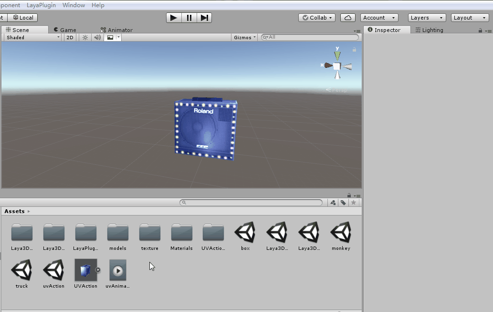

##LayaAir 3 Dのアニメ2

前の章では骨格アニメーションのunity処理と導出使用について理解しましたが、今回は材質アニメーションと剛体アニメーションの制作と使用を引き続き紹介します。

###素材アニメーション

骨格のアニメーションは主に模型の頂点を変える方式でアニメーションを生むので、材質のアニメーションは材質の色とポスターの方式を変えてアニメーションを行うのです。

3次元ソフトウェアでは、例えば3 ds maxでは、材質関連動画を作成することができますが、FBX形式にエクスポートした場合、unityは認識できず、LayaAir 3 Dエンジンで識別された材質アニメーションとして導出することができません。したがって、ゲームモデルの材質アニメーションはunityで作られなければなりません。いくつかの設定を行ってエクスポートしたらLayaAir 3 Dエンジンに使用できます。

次に、ネオン素材の動画（図1）の効果を用いて、ユニティでアニメーションを作成し、その使い方を説明します。手順は以下の通りです。

<br/>(図1)

####モデルを導入し、材質の種類を変更します。

3 ds maxで作ったエアコンケースやネオンバンドをFBXに導き、untiyに導入します。

ドラッグして入場するシーンでは、制作するアニメーションモデルを選択し、右側の画面でその材質を修正します。Shaderタイプは粒子カラーバリエーションPartices/Additiveです。

<br/>(図2)


####材質アニメーションの作成

1、材質のタイプを修正したら、同じくアニメーションを作るモデルを選択し、メニューバーのwindowをクリックしてアニメーション編集画面を開き、ショートカットキーCtrl+6をクリックします。

2、createボタンをクリックしてアニメーションを作成し、名前を付けます。この例ではuvAnimationと名づけて、保存後、リソースマネージャにアニメーションファイルuvAnimationを作成します。

3、時間軸上時間を選択して、材質のUV属性OffsetのX方向を修正し、0.05秒ごとにUV位置0.25を調整します。（スタンプを左に25%の幅を移動したのに相当します。）ネオンモデルの材質が変化しているのが見えます。時間ごとに順次調整して、アニメーションループを形成します。

4、アニメーションフレームの曲線の変化を変更して、デフォルトは線型スライド動画で、私達のアニメーションの需要に合わないで、恒量変化に修正して、再生して見て、材質アニメーションは需要に応じて全部完成します。もちろん、流れを作ったり、浮雲を飛ばしたりするアニメーションを作るなら、線型の変化方法があります。

**tips：standar標準Shaderタイプを使って、材質アニメーションを作ってもいいですが、アニメーション編集インターフェースの左の枠にLayaAirがサポートしていない属性が現れたら、例えば材質Emissionの属性は、リソースがエクスポートされる時にエラーが発生します。右ボタンを削除すれば、正常にエクスポートできます。**

このような制作アニメーション方式は3 ds maxの制作プロセスとほぼ同じで、美術デザイナーが直接unityで編集することができる（図3）。

<br/>(図3)


####アニメーションコントローラを作成

前のアニメーションコントローラと同じように、リソースマネージャで右クリックしてアニメーションコントローラを作成し、uvActionと名づけ、ダブルクリックして開くと、前のステップで作成したアニメーションファイルuvAnimationをアニメーションコントローラにドラッグします。

モデルを選択して、アニメーションコントローラをモデルのアニメーションコンポーネントにドラッグして、unityをクリックして実行します。アニメーションは私たちの需要に応じて再生されます。

<br/>(図4)


####アニメーションリソースをエクスポートして使用します。

unityでアニメーションを編集し、LayaAirプラグインでSprite 3 Dタイプをエクスポートします。lhリソースは、エクスポート時にエラーがない場合は、プロジェクトのh 5ディレクトリにリソースをコピーすると、プロジェクトの中で直接Sprite 3 D.load（）方法でロードまたはプリロードできます。

以下のコードを参照して、動画の読み込みが完了してから2000ミリ秒後にアニメーションが停止します（図1）。


```java

......
//创建加载材质动画模型
box=Sprite3D.load("LayaScene_uvAction/uvAction.lh");
//模型与材质、动画加载完成后回调
box.on(Event.HIERARCHY_LOADED,this,onLoadComplete);
scene.addChild(box);
/** 模型与材质加载完成后回调***/		
private function onLoadComplete():void
{
  //获取模型上的动画组件
  ani = box.getChildAt(0).getComponentByType(Animator) as Animator;
  //动画2000毫秒后停止
  Laya.timer.once(2000,this,onLoop);
}
private function onLoop():void
{
  ani.stop();
}
```


###剛体アニメーション（変換アニメーション）

剛体アニメーションとは、モデルの頂点、材質を変えずに、モデルだけを回転、スケーリング、シフトさせるアニメーションのことです。このようなアニメはゲームでもよく使われています。例えば、足の裏のリング、ナイフの光などです。もちろん硬体アニメと素材アニメもよく合わせて使います。

剛体アニメーションと材質アニメーションは製作上の違いがあります。材質アニメーションはunityで作らなければ識別できないです。また、剛体アニメーションは3 Dソフトで作成してunityに導入することができます。識別できます。

untiyの中でアニメーションを編集することを提案して、剛体のアニメーションと材質のアニメーションは結び付けて使って、粒子の特効のアニメーションを配合して、効果は更に良くて、3次元のソフトウェアは基本的な模型だけを提供して導入します！

以下は、作成された剛体アニメーションの効果（図5）で、4つのモデルのそれぞれに異なる材質を使用して、モデルを回転し、スケーリングしてアニメーションを作成します。

<br/>(図5)


###動画リスト

LayaAirカメラはまだエクスポートできません。将来のバージョンでは、カメラはエンジンにエクスポートして使用することができます。そのため、unityでカメラアニメーションを作成すれば、エクスポート後にゲームでもコントロールできます。

unityでのアニメーション制作方法は、剛体アニメーションと一致しており、その属性をアニメーションに変更することができます。ロード方式を使っても同じです。

