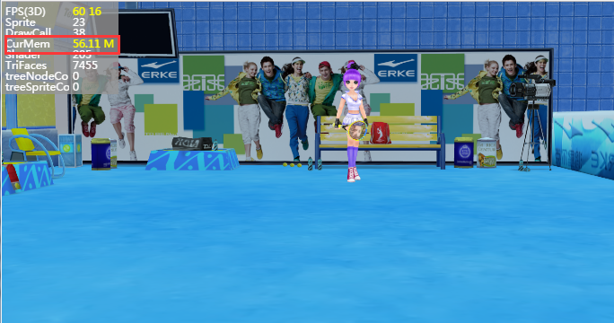

##LayaAir 3 Dの資源放出


###なぜ資源を解放しますか？

LayaAir 3 Dゲームの開発において、資源の放出は非常に重要です。3 Dリソースは、モデル、スタンプ、材質、アニメーションなどを含み、良い画面効果を達成するために、ファイルは2 Dよりも大きくなります。3 Dエンジンは基本的にすべてのリソースをGPUに入れて計算してレンダリングしますので、多くの現存を占めています。ゲームのレベルがどんどん読み込まれて、ゲームがどんどん深くなって、現存中の資源がだんだん多くなります。資源を解放しないと、ゲームは最終的に崩壊します。

現存はメモリと違って、メモリはゴミ回収の仕組みがあります。現存は違っています。手動で釈放しなければならないので、現存する資源の放出は重視されなければなりません。

図1、図2の統計ツールにおける現存サイズを観察する。

図1は、ゲーム起動後にロードされる最初のシーンで、表示量は30527で、85.2 Mを占有する。

<br/>(図1)

図2はゲームにロードされた第2のシーンで、面数は7455しかないが、ロード後の現存リソースは118.91 Mである。これはどういう理由ですか？顔の数が少なくて、シーンが小さくて、スタンプも図1のシーンより少ないです。光のスタンプも小さいです。しかし、現存資源はもっと大きいです。

これは第1の関所のシーンが解放されていないためで、その資源はまだ現存中で、そのため現存占用は大きくなりました。手動でクリアしないと、ゲームは引き続き他のシーンを切り替えます。一定量に達したら、携帯のディスプレイは消耗されます。ゲームカードが死んで、フラッシュバック、発熱などの現象が頻繁に現れます。

<br/>(図2)


###資源をロードする時の処理原則

上の図の例を通して、LayaAir 3 Dエンジンの処理資源と現存の関係を見ることができます。ゲームの性能最適化の目的を達成するために、資源をロードする時も原則を注意しなければなりません。

1、資源をロードする時は、すべての資源を一度に全部ロードしないでください。必要な資源だけをロードします。3 Dリソースのロードが完了すると、リソースの拡張子の名前に基づいて直接3 D表示オブジェクトを作成します。例えば.lsはScheneを作成します。lhはSprite 3 Dオブジェクトを作成します。作成した対象リソースはステージに置いていなくても直接に現存に入れるので、資源が多すぎると大量に現存します。

2、合理的に現存を管理し、頻繁に繰り返し使用する資源は現存において釈放する必要がなく、繰り返し使用した資源は使用後直ちに釈放して、性能オーバーヘッドを節約する。例えば主役の資源、3 Dの道具の資源、プレーヤーはいつも使って、ずっと現存の中で保管することができて、スピードを抽出するのは速いです。


###現存資源の放出方法

現存リソースの解放には、オブジェクトを通じて現存リソースを解放する方法がありますが、リソースオブジェクトを遍歴するのは面倒くさいので、ここでは紹介しません。もう一つはリソースアドレスを通じて現存リソースを解放し、資源管理の観点から、リソースアドレス法を通じてより活性化し、JSONデータテーブルを構成して管理することができます。

####切り替えシーンとリリースリソースの遷移画面

リソースをロードしてシーンを切り替える時、図3のような遷移のための進捗表示画面をIDEで作成します。

<br/>(図3)

IDEリリース後、制御クラスを作成し、論理コードは下記を参照してください。


```java

package view
{
	import ui.ProgressBarUI;
	
	public class AssetLoadView extends ProgressBarUI
	{
		/**资源加载进度***/
		private var progress:int=0;
		
		public function AssetLoadView()
		{
		}
		/**
		 * 初始化，进度计时
		 */	
		public function init():void
		{
			progress=0;
			//进度增加的帧循环
			Laya.timer.loop(20,this,onLoop);
		}
		/**
		 * 资源加载进度模拟（假进度）
		 */		
		private function onLoop():void
		{
			//进度增加
			progress++;
			//最高100%进度
			if(progress>100)
			{
				progress=100;
				this.tips.text="游戏加载完毕，即将进入游戏..."
				Laya.timer.clearAll();
				this.removeSelf();				
			}else
			{
				this.pro.value=progress/100;
				this.tips.text="游戏正在加载中，当前进度为："+progress+"%!"
			}
		}
	}
}
```


####リソースアドレステーブルを通じて現存リソースを解放する。

メインクラスでは、マウスで舞台をダブルクリックして場面を切り替え、リソースアドレスを使って現存リソースを解放する方法を使って、新しいシーンをロードします。

リソースパスのリスト方法が柔軟で、テーブルを構成することによって、テーブル内の削除リソースを増やすことができます。例えば美術はシーンをエクスポートする時、JSON表を新たに作って、このシーンの中で切り替えた後に必要でない資源のルートをすべてJ表の中に置いて、役に立つ資源は表に入れないで、資源は釈放しないで、たとえばいくつかの公共のNPC、道具、特効などのゲームの元素の資源。

Tips：リソースは、シーン光のスタンプlightmap、材質、lmat、モデル、lm、様々なタイプのスタンプ、pngまたは.jpg、動画、lani、骨格、lavなどの資源を含みます。

ここでは、リソース表の方法を紹介します。まず、エクスポートされたリソースファイルディレクトリにjsonファイルを作成し、リリースするパスリソースを編集し、Json配列を形成します。名前はlsファイルと一致しています。図5、6のように。

<br/>(図5)

<br/>(図6)

Json編集が完了したら、チェックツールでフォーマットが正しいかどうかを確認できます。次にメインクラスのコードを作成します。


```java

package
{
	import laya.d3.core.Camera;
	import laya.d3.core.Sprite3D;
	import laya.d3.core.scene.Scene;
	import laya.d3.math.Vector3;
	import laya.display.Stage;
	import laya.events.Event;
	import laya.net.Loader;
	import laya.resource.Resource;
	import laya.utils.Handler;
	import laya.utils.Stat;
	
	import view.AssetLoadView;

	/**
	 * 资源释放示例
	 */	
	public class LayaAir3D_AssetsDespose
	{
		/***3D场景****/
		private var scene:Scene;
		/***3D摄像机****/
		private var camera:Camera;
		/***3D角色****/
		private var role:Sprite3D;
		/***2D加载进度界面（假）****/
		private	var progress:AssetLoadView
		
		public function LayaAir3D_AssetsDespose()
		{
			//初始化引擎
			Laya3D.init(1334, 750 ,true);
			//画布垂直居中对齐
			Laya.stage.alignV = Stage.ALIGN_MIDDLE;
			//画布水平居中对齐
			Laya.stage.alignH = Stage.ALIGN_CENTER;
			//等比缩放
			Laya.stage.scaleMode = Stage.SCALE_FIXED_AUTO;
			//自动横屏，游戏的水平方向始终与浏览器屏幕较短边保持垂直
			Laya.stage.screenMode = "horizontal";
			//开启统计信息
			Stat.show();
			
			//加载2D资源
			Laya.loader.load("res/atlas/comp.atlas",Handler.create(this,on2DComplete));
		}
		
		/**
		 * 加载2D资源完成回调
		 */	
		private function on2DComplete():void
		{
			//实例化加载进度页面
			progress=new AssetLoadView();
			progress.init();
			progress.loadTitle.text="资源加载与释放示例";
			Laya.stage.addChild(progress);
			
			//加载第一关场景角色3D资源(不能全部加载，否则太占显存)
			Laya.loader.create([{url:"LayaScene_loveScene/loveScene.ls"},
								{url:"LayaScene_girl/girl.lh"}],Handler.create(this,on3DComplete));
		}
		
		/**
		 * 加载3D资源完成回调 
		 */		
		private function on3DComplete():void
		{
			//实例化场景
			scene=Laya.loader.getRes("LayaScene_loveScene/loveScene.ls");
			Laya.stage.addChild(scene);
			Laya.stage.setChildIndex(scene,0);
			
			//实例化摄像机
			camera=new Camera();
			//移动摄像机位置
			camera.transform.translate(new Vector3(-1, 2, 15));
			//设置摄像机视野范围（角度） 
			camera.fieldOfView=25;	
			camera.transform.lookAt(new Vector3(-1,0,0),new Vector3(0,0,0));
			scene.addChild(camera);

			//实例化角色添加到场景
			role=Laya.loader.getRes("LayaScene_girl/girl.lh");
			scene.addChild(role);

			//双击游戏画面切换场景
			Laya.stage.on(Event.DOUBLE_CLICK,this,onChangeScene);
		}
		
		/**
		 * 加载第二关场景资源，切换场景 
		 */	
		private function onChangeScene():void
		{
			//去除双击事件监听
			Laya.stage.off(Event.DOUBLE_CLICK,this,onChangeScene);
			
			//切换场景加载界面
			progress.init();
			progress.loadTitle.text="正在切换场景，请稍后"
			Laya.stage.addChild(progress);
			
			//移除摄像机与角色
			scene.removeChild(camera);
			scene.removeChild(role);
			
			//列表释放显存资源方法（释放的资源配置表）
			assetsDispose("LayaScene_loveScene/loveScene.json");
			
			//销毁之前场景
			scene.destroy();
			
			//加载第二关场景资源到游戏中
			scene=Scene.load("LayaScene_scene02/scene02.ls");
			Laya.stage.addChild(scene);
			
			//摄像机的位置与对准目标
			camera.transform.position=new Vector3(-1, 1, 8);
			camera.transform.lookAt(new Vector3(-1.5,0.5,0),new Vector3(0,0,0));
			
			//添加摄像机与角色到新场景
			scene.addChild(camera);
			scene.addChild(role);
			role.transform.position=new Vector3(-1, 0, -3.5);
			
			//设置场景层级在最下层
			Laya.stage.setChildIndex(scene,0);
			
			//现有显存中的资源
			trace("现有显存中的资源:",Loader.loadedMap)
		}

		/**
		 * 列表释放显存资源方法(利用资源表方式，每个场景配置资源路径表)
		 * @param target3D 需要释放资源的对象资源表assetsUrl:String
		 */		
		private function assetsDispose(assetsUrl:String):void
		{
			//加载盘释放的资源配置表
			Laya.loader.load([{url:assetsUrl,type:Loader.JSON}],
                             Handler.create(this,onAssetsOK,[assetsUrl]));
		}
		
		/**加载资源释放表完成后**/		
		private function onAssetsOK(assetsUrl:String):void
		{
			//获取加载的数据（Json数组转化成数组）
			var arr:Array=Laya.loader.getRes(assetsUrl);
			for(var i:int=arr.length-1;i>-1;i--)
			{
				//根据资源路径获取资源（Resource为材质、贴图、网格等的基类）
				var resource:Resource=Laya.loader.getRes(arr[i].url);
				//资源释放
				resource.dispose();
			}
		}
	}
}
```


上述のコードassites Displaseを観察して、配置表をロードした後、Laya.loader.getsRes（arr[i].url）方法で直接に資源発生の対象を取得します。（作成時はurlの拡張子によって異なるタイプのオブジェクトが発生します。getsRes方法は直接に読みます。）これらはすべてResourceのオブジェクトです。ソース

リソースをリリースした後、Loader.loadeMap属性によってキャッシュ中のリソースを確認することもできます。

上記のコードをコンパイルして実行すると、図4の効果が見られます。リリースが完了し、新しいフィールドシーンをロードすると、グラフィック占有率は前よりずっと小さくなります。これまでリリースされていなかったリソースは118.91 mで、リリース後現存は56.11 Mのみを占めています。

<br/>(図4)