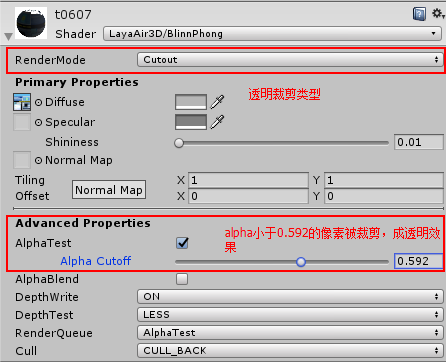

##LayaAir 3 DのBlinnPhong素材

###BlinnPhong素材の概要

従来のLayaAir 3 Dエンジンバージョン（1.7.12バージョン前）では、モデル材質は従来のStandardMaterial標準材質のみをサポートしており、Unityではモデル材質はどのタイプのShaderを使ってもプラグインから導き出されるのは標準材質（粒子材質は除く）です。

Unityでは標準とその他の材質がLayaAir標準の材質と異なるため、開発者が導出した3 D資源を使うと、美術効果はUnityとは違っています。コードの中で各種の材質属性パラメータを修正したり、照明を調整してから必要な効果が得られます。開発者たちに不便をもたらします。

LayaAirエンジンにおける動作効果をUnityで調整された美術効果と一致させるために、LayaAir公式はUnityでプラグインを導出し、エンジンにBlinnPhonigMaterialの材質を追加し、開発者たちが見たとおりに、コード修正の美術効果の時間を短縮し、稼働率を向上させることができます。今後の開発には、この素材をできるだけ使うことを提案します。


###BlinnPhongの材質を作成します。

コード作成BlinnPhongの材質は標準の材質と一致しており、直接にその例を作成することができます。またはBlinnPhong Material.load（）の方法で関連の材質資源をロードして作成し、モデルに使用します。その光の色の属性は変更して、賦の方式も標準の材質と同じで、ただ材質のタイプは異なっています。


```java

//创建盒子模型
var box:MeshSprite3D=new MeshSprite3D(new BoxMesh());
scene.addChild(box);

//创建BlinnPhong材质
var mat:BlinnPhongMaterial=new BlinnPhongMaterial();
mat.albedoColor=new Vector4(0.5,0.3,0.3,1);
mat.albedoTexture=Texture2D.load("res/layabox.png");

//加载材质资源方法创建
//var mat:BlinnPhongMaterial=BlinnPhongMaterial.load("truck/Assets/Materials/t0200.lmat");

//为模型赋材质
box.meshRender.material=mat;
```


###ユニティにはBlinnPhong素材を使用しています。

LayaAirエンジンは1.7.12版、Unitiy導出プラグインは1.7.0版からBlinnPhong材質の作成をサポートしていますので、開発者たちは新しい機能を体験したいです。新しいエンジンとプラグインをダウンロードする必要があります。プロジェクトに1.7.0プラグインをインストールするステップは、以前のバージョンと同じです。

####シーンをワンタッチでBlinnPhong素材に変換します。

新しいプラグインをインストールした後、Unity LayaAir 3 Dメニューにワンタッチでシーンの材質をBlinnPhong材質に変換する機能を追加しました。メニューLaya Air Tool-->Switch Shader to LayaBlinnPhongオプションをクリックすると、リソースインターフェースのモデルが紫色になり、シーンの効果も変化します。

<br/>(図1)

マウス選択シーンの任意のモデルは、右側のInspectorパネルに新しい材質のShaderタイプが出現しているのを見ることができます。材質の属性はユニティのStandard標準の材質とは違っています。たくさん簡略化されています。LayaAirがサポートしていない属性がいくつか削除されました。これらの特性を修正することでモデルの表示を変更することができます。

<br/>(図2)


####手でBlinnPhongの材質に修正します。

一般的にはメニューのキーを使ってBlinnPhongの材質に変換することをおすすめします。このようなシーンの材質は全部修正されます。材質が見つけられない、見落としられないため、修正されていないことがあります。

もちろん、新素材を作成する際にデフォルトで生成されるのは標準素材です。開発者が手で材質を修正する必要があるShaderタイプはBlinnPhongです。プラグインをインストールしたら、材質パネルのShaderタイプにLayaAir 3 Dオプションが現れます。修正して使ってください。（図3）

<br/>(図3)


###BlinnPhong素材レンダリングモード

材質のレンダリングモードRenderModeは主に材質の効果表現に使われています。例えば、透明な半透明効果など、StandardMaterialには十種類以上の種類があります。

エクスポートプラグインは、BlinnPhongの材質変更画面を提供し、ダイレクトにレンダリングモードを修正し、BlinnPhongの材質の中で減少し、一般的に使用されるいくつかのタイプをまとめました。その修正によって、開発者たちが素材の効果を簡単に調整することができます。

異なるタイプを選ぶと、BlinnPhongのパネルの中のAdvancd Proptiesオプションも違います。

タイプの説明は以下の通りです。

**Opaque材質が不透明です。**。いかなる透明効果もなく、スタンプに半透明があっても、モデルに半透明効果は発生しません。

**Cut材質透明裁断**。 透明画素のalpha値に基づいて透明裁断を行い、透明alpha値はUtniyにおいても、一定のアルファ値より小さい部分が透明であるように調整することができる（図4）。

Tips：このような透明性は、エッジに画素鋸歯がありますが、高機能です。鋸歯効果を除去するなら、Transparentタイプを選択してください。性能はやや低いです。

<br/>(図4)

**Transparentの材質は半透明です。**。パッチの画素alpha値に基づいて半透明レンダリングを行い、透明効果は画素のalpha透明度効果と一致し、ギザギザ除去効果がより良い。

**A ddtive材質が透明で色が混ざっています。**。 主に透明で明るい色の材質に使われていますが、スタンプピクセルの明るさに応じて色を加えて混ぜます。モデルの正面と背面のスタンプの色、重ね合わせのモデルのスタンプの色は互いに重畳して、明るい半透明効果を形成します。

<br/>(図5)


**Custom材質のカスタム効果**。 上記の4つのレンダリングモードは基本的にゲーム開発の効果の大部分を含んでいます。開発者たちの美術的なニーズを満たすことができないなら、Customカスタムレンダリングモードの設定も可能です。

上記の4つのタイプのモードでは、Advanced Proptiesオプションは基本的に固定されていて、変更できません。Customのカスタムでは、開発者たちが手動でパラメータ値を変更することができます。より効果的で、設定変更を繰り返しながら開発者たちが必要とする美術効果があります。

<br/>(図6)


###BlinnPhong素材の光沢スタンプのプロパティ

BlinnPhong材質の光色スタンプの属性は基本的に標準の材質と一致しています。ユニティで材質パネルは以下の属性を調整できます。

**diffuse拡散反射色とスタンプ**。

**specularのハイライトカラーとスタンプです。**高光域の調整スライダーを追加しました。ハイライトを使わなくても高光域の調整ができます。

**ノルマ線スタンプ**

以上のカラースタンプはUnitiyで設定した後、直接にロードをエクスポートしたり、ガイドプラグインでLayaAir Runボタンを押してアナログ運転したりできます。ブラウザ内の美術効果はユニティ内のカメラビューの効果と一致することが分かった。

じゃ、BlinnPhongの材質は反射スタンプと反射色に対応しますか？もちろんできます。これらの実装はStandardMaterialと一致しています。コードを使って修正しなければなりません。コードは以下の通りです。


```java

//创建盒子模型
var box:MeshSprite3D=new MeshSprite3D(new BoxMesh());
scene.addChild(box);
//创建BlinnPhong材质
var mat:BlinnPhongMaterial=new BlinnPhongMaterial();
//增加反射贴图（与StandardMaterial一致）
mat.reflectTexture = TextureCube.load("skyBox/skyCube.ltc");
mat.reflectColor=new Vector3(1,1,1);
//为模型赋材质
box.meshRender.material=mat;
```

