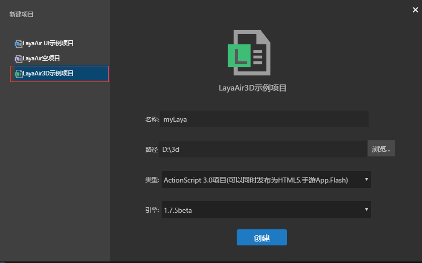
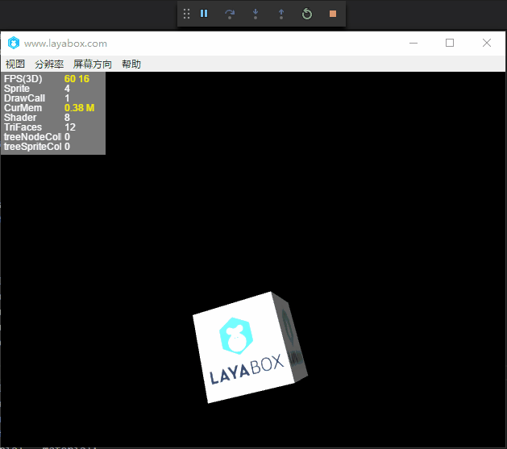

##早く3 Dプロジェクトを開始します。

次はLayaAirエンジンを使って、3 Dプロジェクトを素早く開始します。AS言語を教程として、エンジンコードを使って基本的な3 D応用を簡単に実証します。

###IDE作成3 Dサンプル項目

LayaAirIDEをダウンロードし、新規プロジェクト選択3 dプロジェクトを起動します。

<br/>(図1)

ここではアクション3.0言語を選択します。作成が完了しました。ideは私たちのために3 dのテンプレートを作成しました。プロジェクトの構造についての紹介開発者は2 Dの初心者教程を参考にすることができます。ここでは詳しく述べない。

直接F 5（macシステムのユーザーはcmd+F 5が必要かもしれません。）または運転ボタンをクリックして、デバッグウィンドウが四角体を作成するのを見ることができます。

<br/>(図2)

LayaAir 3 D.asというスタートクラスは私達のために3 Dの世界を作り上げてくれました。そして、簡単な3 D世界に必要ないくつかの要素（シーン、カメラ、光源、3 Dモデル、材質）を追加しました。これらの概念知識についての後続教程を詳しく紹介します。

この簡単な点のデモに対して、私達はこの立方体が静的で、私達に3 Dのあのような見るところ即ち得る立体の視覚感を持ってくることができないことを発見しました。まずスタートクラスのLayaAir 3 D.asを見つけて、次のように修正します。開発者は直接自分のプロジェクトに貼り付けることができます。


```java

package {
	import laya.d3.core.Camera;
	import laya.d3.core.MeshSprite3D;
	import laya.d3.core.Sprite3D;
	import laya.d3.core.material.StandardMaterial;
	import laya.d3.core.light.DirectionLight;
	import laya.d3.core.scene.Scene;
	import laya.d3.math.Vector3;
	import laya.d3.math.Vector4;
	import laya.d3.resource.models.BoxMesh;
	import laya.display.Stage;
	import laya.utils.Stat;
	import laya.d3.resource.Texture2D;
	public class LayaAir3D {
		
		public function LayaAir3D() {

			//初始化引擎
			Laya3D.init(0, 0,true);
			
			//适配模式
			Laya.stage.scaleMode = Stage.SCALE_FULL;
			Laya.stage.screenMode = Stage.SCREEN_NONE;

			//开启统计信息
			Stat.show();
			
			//添加3D场景---------------------------------
			var scene:Scene = Laya.stage.addChild(new Scene()) as Scene;
			
			//添加摄像机---------------------------------
			var camera:Camera = (scene.addChild(new Camera( 0, 0.1, 100))) as Camera;
            //移动摄像机位置
			camera.transform.translate(new Vector3(0, 3, 3));
          	//旋转摄像机方向（角度）
			camera.transform.rotate(new Vector3( -30, 0, 0), true, false);
          	//设置背景颜色
			camera.clearColor = null;

			//添加平行光----------------------------------
			var directionLight:DirectionLight = scene.addChild(new DirectionLight()) as DirectionLight;
          	//灯光的漫反射颜色
			directionLight.color = new Vector3(1.6, 1.6, 1.6);
          	//灯光的方向(弧度)
			directionLight.direction = new Vector3(1, -1, 0);

			//添加自定义模型------------------------------
			var box:MeshSprite3D = scene.addChild(new MeshSprite3D(new BoxMesh(1,1,1))) as MeshSprite3D;
          	//模型旋转方向
			box.transform.rotate(new Vector3(0,45,0),false,false);
          	//创建模型的材质
			var material:StandardMaterial = new StandardMaterial();
          	//材质的漫反射贴图
			material.diffuseTexture = Texture2D.load("res/layabox.png");
          	//为模型赋上材质
			box.meshRender.material = material;
          
            //这里我们添加转动的逻辑---------------------------------------
          	//旋转方向与角度设置
			var vect:Vector3 = new Vector3(1,1,0);
          	//每10毫秒旋转一次
			Laya.timer.loop(10,null,function():void{
				box.transform.rotate(vect,true,false)
			})
		}
	}
}
```


<br/>(図3)

ここではタイマーを使いました。10 msごとにこの本体を回転させます。具体的な説明は開発者に関連の教程とapiを読んでください。ここでは簡単なデモです。簡単なコードは以下の通りです。


```java

            var vect:Vector3 = new Vector3(1,1,0);
			Laya.timer.loop(10,null,function():void{
				box.transform.rotate(vect,true,false)
			})	
```


ここで簡単な例を通してこの方体を回転させることができます（図3）。


###LayaAir 3 D世界の基本構成

上のコードの例を通して、基本的な3 D世界が誕生したのを見ることができます。もちろん、上のコードは比較的に簡単で、多彩なゲームの世界を作り出すには、エンジンのより多くの機能を知る必要があります。

【図4】LayaAir 3 D世界可視要素図である。3 Dシーン、カメラ、照明、模型の他、動画も表示可能な要素の一つです。後期の授業は私達は徐々に皆さんに紹介します。

（図4）


###3 D世界変換とベクトルの簡単な運用

上記の例では、表示に関するいくつかの要素モジュールが作成されていますが、カメラ、照明、モデル上でベクトルVector 3やVector 4などを用いて、それらをオブジェクトの位置、方向、色などに割り当てているのも見られます。

####座標系と位置、回転の変更

2 Dエンジンではx、y座標を直接調整して表示オブジェクトの位置と回転方向を制御します。3 Dエンジンでは表示オブジェクトが複雑で、z軸座標を追加していますので、Vector 3の3次元ベクトルを使って、その値でそれぞれx、y、zを表しています。

しかし、各種の3 Dエンジンと3 Dモデルのアニメーション制作ソフトは座標の方向の定義に対して異なっています。

LayaAir 3 Dエンジン座標は専門用語で属します。**`右手坐标系`**（図5）は、簡単に言えば、画面右側は正X軸方向、上側は正Y軸方向、画面方向は正Z軸方向（スクリーン後方向は負Z軸方向）となります。ある3 Dエンジンは左手の座標系に属しています。ここでは紹介しません。興味のある初心者は百度で分かります。

<br/>(図5)右手座標系


エンジンには世界座標系と局所座標系があり、世界座標系は3 Dシーンの座標であり、三軸方向は永遠に変わらない（図5）。局部座標はモデル自身の座標であり、モデル方向の回転によって変化することができますが、右手の座標系ジェスチャーで座標方向を識別することができます（図6）。下図の手のモデルはy軸に沿って-90度回転した後の3 Dモデルの右手の座標系の局部座標であり、大親指は常に局所座標の正X軸方向です。

<br/>(図6)

上記の座標系を理解すれば、3 D変換によってこれらを変えることができます。例コードでは、transformは3 D変換対象（Trans form 3 D）であり、3 D世界では非常に重要であり、表示対象の多くの変化論理制御に関するコードが使用されます。

コードには3 D変換におけるtranslate移動とrotate回転方法を用い、3次元ベクトルでx、y、zの値を表します。同時に、二つの方法はいずれもパラメータの中に局所空間移動、回転を設定できます。初心者たちはプログラムの中に設置して、移動と回転の違いを観察できます。


```java

            //移动摄像机位置
			camera.transform.translate(new Vector3(0, 3, 3));
          	//旋转摄像机方向（角度）
			camera.transform.rotate(new Vector3( -30, 0, 0), true, false);
```


<br/>(図7)

以上はTransform 3 DのAPIにおける移動、回転方法の説明であり、もちろん、変換対象にはまだ多くの属性と方法があり、今後の例で順次説明します。


####ベクトルの使用

ベクトルはLayaAir 3 Dエンジンで非常に頻繁に使用されており、二次元ベクトルから四次元ベクトルまで至るところにその姿が見られます。基本的な使い方は、この例では、値付けのために用いられます。

コード中の3 Dオブジェクトの移動、回転、スケーリングなどの変換は、そのx、y、z軸座標の値として3次元ベクトルを使用します。

照明の各色属性の値には、3次元ベクトルの値がR、G、Bの3色を表しています。それぞれ赤、緑、青、LayaAirの3 Dエンジンのうち、3色の最大値は1で、百分率で設定されています。全体の値が大きいほど、色が明るいほど、色が暗いです。値が1を超えると、露出効果があります。

赤、緑、青はどのような色に組み合わせることができますか？初心者たちはゲーム美術デザイナーに相談して学習することができます。例えば、赤と緑は黄色、赤と青は紫などです。プロジェクト開発の過程で、プログラマーは色の値を調整して良い効果を試す必要があります。

例では、以下のコードが使用されています。ベクトルは色の割り当てとして使用されます。


```java

          	//灯光的漫反射颜色
			directionLight.color = new Vector3(1.6, 1.6, 1.6);
          	//灯光的方向(弧度)
			directionLight.direction = new Vector3(1, -1, 0);
```


プロジェクトの中で、まだ多くの複雑な使い方があります。ベクトルを使って数学演算を行う必要があります。このコースは入門コースとして、ここではあまり紹介しません。

