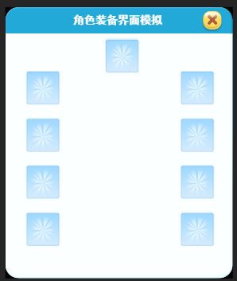

##3 Dマルチシーン運用例

###多場面の運用

3 Dシーンは2 Dと混合して使用できるだけでなく、ステージ上にも複数の3 Dシーンがあり、さらに2 Dに3 Dシーンを埋め込み、シーン中のカメラビューを介してシーン画面の大きさや位置を制御することができる。

ゲームの中ではよくこのようにしています。例えば、キャラクターの属性インタフェースや、画面に3 Dキャラクターのモデルや動画が表示されます。装備バーで装備アイコンを変更すると、キャラクターのモデルが変更されます。

次の例では装備属性インターフェースを簡単にシミュレーションし（図1）、機能は画面をダブルクリックして装備インターフェースを開き、3 Dキャラクター待機動画と手元装備展示を表示し、画面のタイトルを押しながらドラッグできるインターフェースをクリックして、内部の3 Dシーン、キャラクターもフォローして移動します。

<br/>(図1)


###開発の考え方とコード

1、背景は3 Dメインシーンで、ゲームシーンの地図をロードする。

2、IDEで簡単なDialogタイプUIを作成し（Dialogはドラッグを設定することができる）、リリースする（図2）。RolePropViewクラスを確立してUIに継承し、単一の例モードに設定する（ほとんどのUIは単一の例である）。インタフェースの中にもう一つの3 Dシーンを作成して、キャラクターを表示するために、カメラのシャッターを2 Dインターフェースの大きさと一致させます。

<br/>(図2)

3、インターフェイス追加後、マウスが画面上で押したり移動したりする時、メインシーンのカメラスクリプトが無効になり、インターフェイスの除去やマウスが画面上で押されないと有効です。スクリプトコンポーネントのenable属性で設定できます。

4、インターフェイスドラッグイベントの傍受を追加し、インターフェースをドラッグすると、インターフェースシーンでカメラのビューポイントが一緒に移動します。3 Dシーンのキャラクターは最初の位置にいます。

主なクラスLayaAir 3 DCG参考コードは以下の通りです。


```java

package
{
	import laya.d3.core.Camera;
	import laya.d3.core.Sprite3D;
	import laya.d3.core.scene.Scene;
	import laya.d3.math.Vector3;
	import laya.d3.math.Viewport;
	import laya.display.Stage;
	import laya.events.Event;
	import laya.utils.Handler;
	import laya.utils.Stat;
	
	import view.RolePropView;

	/**多场景实例主类***/
	public class LayaAir3D_MultiScene
	{
		/**游戏主摄像机***/
		private var camera:Camera;	
		/**角色装备展示界面***/
		private var roleProp:RolePropView;
		/**主摄像机控制脚本***/
		private var cameraScript:CameraMoveScript;
		
		public function LayaAir3D_MultiScene()
		{
			//初始化引擎
			Laya3D.init(1280, 720,true);
			//适配模式
			Laya.stage.scaleMode = Stage.SCALE_EXACTFIT;
			Laya.stage.screenMode = Stage.SCREEN_NONE;
			//开启统计信息
//			Stat.show();
			//加载3D资源
			Laya.loader.create([{url:"LayaScene_loveScene/loveScene.ls"},
								{url:"LayaScene_girl/girl.lh"}],Handler.create(this,on3DComplete));
		}
		
		private function on3DComplete():void
		{
			//创建场景
			var scene:Scene=Scene.load("LayaScene_loveScene/loveScene.ls");
			Laya.stage.addChild(scene);
			//创建摄像机添加到场景
			camera=new Camera();
			scene.addChild(camera);
			//修改摄像机位置与方向
			camera.transform.translate(new Vector3(0,2,8),true);
			camera.transform.rotate(new Vector3(-23,0,0),true,false);
			//添加摄像机脚本并获取
			cameraScript=camera.addComponent(CameraMoveScript) as CameraMoveScript;		
			
			//加载2D界面资源
			Laya.loader.load("res/atlas/comp.atlas",Handler.create(this,on2DComplete));
		}
		
		private function on2DComplete():void
		{
			//双击舞台创建角色属性UI
			Laya.stage.on(Event.DOUBLE_CLICK,this,createRoleUI);
		}
		
		private function createRoleUI():void
		{
			//创建角色属性UI（单例模型，预防打开多个）
			roleProp = RolePropView.getInstance();
			Laya.stage.addChild(roleProp);
			//界面拖动事件监听
			roleProp.on(Event.DRAG_MOVE,this,onDragMove);
			//鼠标在界面上按下时摄像机控制脚本失效
			roleProp.on(Event.MOUSE_DOWN,this,onScriptFalse);
			
			//界面移除或鼠标抬起后摄像机脚本启用
			roleProp.on(Event.REMOVED,this,onScriptTrue);	
			Laya.stage.on(Event.MOUSE_UP,this,onScriptTrue);
		}
		
		/**界面拖动回调****/		
		private function onDragMove():void
		{
			//摄像机控制脚本失效
			onScriptFalse();
			//界面中摄像机视口跟随移动
			roleProp.camera.viewport=new 	
              Viewport(roleProp.x,roleProp.y,roleProp.width,roleProp.height);
		}
		
		/**摄像机控制脚本启用****/	
		private function onScriptTrue():void
		{
			//摄像机控制脚本启用
			cameraScript.enable=true; 
		}
		/**摄像机控制脚本失效****/	
		private function onScriptFalse():void
		{
			//摄像机控制脚本失效
			cameraScript.enable=false;
		}
	}
}
```


インターフェースクラスのRolePropViewは、内部で3 Dシーン、キャラクター、カメラを作成し、参考コードは以下の通りです。


```java

package view
{
	import laya.d3.core.Camera;
	import laya.d3.core.Sprite3D;
	import laya.d3.core.scene.Scene;
	import laya.d3.math.Vector3;
	import laya.d3.math.Viewport;
	import laya.events.Event;
	
	import ui.RolePropUI;
	
	/**
	 * 角色装备UI界面（包括3D场景与角色）
	 */	
	public class RolePropView extends RolePropUI
	{
		/**界面实例***/		
		private static var instance:RolePropView;
		/**界面中的3D场景***/
		private var UIScene:Scene;
		/**界面中的摄像机***/
		public var camera:Camera
		/**界面中的3D角色***/
		private var role:Sprite3D;
		
		/**界面中在舞台水平居中位置***/
		private var xx:Number=0;
		/**界面中在舞台垂直居中位置***/
		private var yy:Number=0;
		
		/**
		 * 角色装备UI界面单例方法
		 */
		public static function getInstance():RolePropView
		{
			if(instance==null) 	instance=new RolePropView();
			return instance;
		}
		
		public function RolePropView()
		{
			//设置UI位置为居中显示
			xx=(1280-this.width)/2; 
			yy=(720-this.height)/2;
			this.pos(xx,yy);
			
			//与UI搭配的3D场景
			UIScene=new Scene();
			this.addChild(UIScene);
			
			//在对话框中，鼠标可点击触发拖动的区域
			this.dragArea="0,0,520,80";
			
			//创建角色
			role=Laya.loader.getRes("LayaScene_girl/girl.lh");
			UIScene.addChild(role);
			//修改角色位置（超出摄像机视口后将不会显示）
			role.transform.translate(new Vector3(0,0,0),false)
			
			//创建摄像机
			camera=new Camera();
			UIScene.addChild(camera);
			//设置摄像机视口大小与UI一致
			camera.viewport=new Viewport(xx,yy,this.width,this.height);
			//摄像机位置
			camera.transform.translate(new Vector3(0,1.2,3),false);
			//关闭按钮事件监听
			this.btn_close.on(Event.MOUSE_DOWN,this,onClose);
			
		}
		
		/**关闭按钮事件回调***/		
		private function onClose():void
		{
			//移除UI界面
			Laya.stage.removeChild(this);
			//恢复UI位置为居中显示
			this.pos(xx,yy);			
			//恢复摄像机视口大小与位置
			camera.viewport=new Viewport(xx,yy,this.width,this.height);
		}
	}
}
```


上記のコードをコンパイルして実行します。効果は図1のようです。

