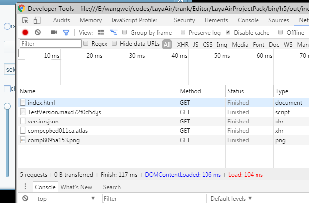

##バージョン管理の機能紹介

1.7.15ベータからリリースインターフェースを開き、最後の項目は管理です。**バージョン管理を有効にするかどうか**の機能です。

 


バージョン管理を有効にすると、hash付きファイル名が生成され、version.jsonのファイル名マッピングファイルが生成されます。プロジェクトではResource Version類を使用してバージョン制御ができます。バージョン制御を使用すると、ロード時に自動的にhash付きファイル名がロードされます。

未包装の項目:
 

包装後の項目:
 


コードはResource Version類で管理リソースバージョンをロードします。

具体的な使用コード例は以下の通りです。


```java

package {
	import laya.net.Loader;
	import laya.net.ResourceVersion;
	import laya.utils.Handler;
	import view.TestView;
	
	public class LayaUISample {
		
		public function LayaUISample() {
			//初始化引擎
			Laya.init(600, 400);
			
			//设置版本控制类型为使用文件名映射的方式
			ResourceVersion.type = ResourceVersion.FILENAME_VERSION;
			//加载版本信息文件
			ResourceVersion.enable("version.json", Handler.create(this, beginLoad));		
		}
		
		private function beginLoad():void
		{
			//加载引擎需要的资源
			Laya.loader.load([{url: "res/atlas/comp.atlas", type: Loader.ATLAS}], Handler.create(this, onLoaded));
		}
		
		private function onLoaded():void {
			//实例UI界面
			var testView:TestView = new TestView();
			Laya.stage.addChild(testView);
		}
	}
}
```


プログラム実行の実際のロード図:
 