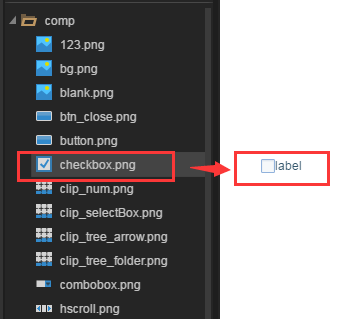
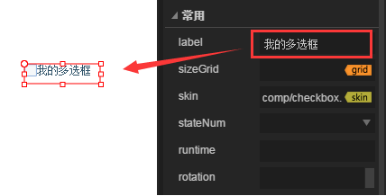
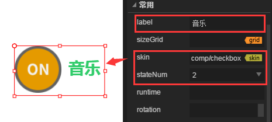

#CheckBoxコンポーネントの詳細

>多くのコンポーネント属性が共通であるため、一般的で一般的なコンポーネント属性は`属性设置器`文書で紹介しました。本編を読む前に、「プロパティ設定器」のドキュメントを読んでください。

##1、CheckBoxコンポーネントを作成する

CheckBox(複数選択ボックス)コンポーネントは、2つの部分から構成され、ステータスボックスおよびコンテンツ説明ラベルlabelを選択する。ここで選択した状態枠は、画像リソースであり、ラベルはテキストである必要があります。CheckBoxコンポーネントを使用する場合は、選択状態ボックスのみを使用しても良いし、ラベルの一つだけを設定しても良いです。

###1.1準備リソース

CheckBoxコンポーネントの選択ブロック画像は、CheckBoxコンポーネントの肌（skin）であり、画像リソースの名前は通常、`check`を選択します`checkbox`または`check_`プレフィックスとして、図1に示すように。CheckBoxコンポーネントリソースは、通常、三状態または二状態のskinピクチャコンポーネントによって構成される。

<br/>(図1)

*Tips：コンポーネント皮膚skin及びマルチカットstateNumについては、「プロパティ設定器」ドキュメントを参照してください。*

###1.2エンジンで直接CheckBoxコンポーネントを作成する


LayaAirエンジンを使ってCheckBoxコンポーネントを作成するのは簡単です。通常はいくつかのステップだけが必要です。`laya.ui.CheckBox`パケットパス、ローディングリソース、CheckBoxのインスタンスを作成し、CheckBoxをステージに追加し、CheckBoxコンポーネントの属性を設定する。具体的には下記のコードとコメントを参照してください。

**エントリクラスのComponentDemo.asを作成し、下記のコードを作成します。**


```java

package
{
	import laya.ui.CheckBox;
	import laya.utils.Handler;
	import laya.webgl.WebGL;	
	import ui.ComponentDemoUI;

	public class ComponentDemo
	{
      	//资源路径
		private var skin1:String="res/component/check.png";
		private var skin2:String ="res/component/check_2.png";
		
		public function ComponentDemo()
		{
          	//初始化引擎，设置宽高并开启WebGL渲染模式
			Laya.init(1334,750, WebGL);
			
			//设置舞台背景色
			Laya.stage.bgColor = "#ffffff";
			//加载图集成功后，执行onLoad回调方法
			Laya.loader.load([skin1,skin2], Handler.create(this, onLoaded));

		}
		
		private function onLoaded():void {
			
			//创建一个CheckBox实例cb1
			var cb1:CheckBox = new CheckBox(skin1);
			//添加到舞台上显示
			Laya.stage.addChild(cb1);			
			//设置checkbox的坐标位置
			cb1.pos(300,200);			
			//文本标签内容
			cb1.label="我是多选框1";
			//label文本字体大小
			cb1.labelSize = 20;
            //设置为默认选中状态
			cb1.selected = true; 

			//再创建一个CheckBox实例cb2
			var cb2:CheckBox = new CheckBox(skin2);
			//添加到舞台上显示
			Laya.stage.addChild(cb2);			
			//设置checkbox的坐标位置
			cb2.pos(300,300);			
			//文本标签内容
			cb2.label="我是多选框2";
			//label文本字体大小
			cb2.labelSize = 20;
	
		}
	}
}
```


コード実行効果は、図2に示すように、

<br/>(図2)


そのスクリプトインターフェースを参照してください。

**Tips:**CheckBoxコンポーネントのプロパティインターフェース紹介を参照してください。[CheckBox API](http://layaair.ldc.layabox.com/api/index.html?category=UI&class=laya.ui.CheckBox)。


##二、LayaAirIDEでCheckBoxコンポーネントを作成する

###2.1 CheckBoxの作成

uiのDEMOページを作成します。選択をクリックしてください。`资源管理器`のCheckBoxコンポーネントのリソースは、図3-1に示すように、シーンエディタにドラッグして、CheckBoxコンポーネントをページに追加することに成功しました。

<br/>(図3-1)


###2.2 CheckBoxの一般的な属性を設定する

コンポーネントを作成したら、属性設定器によって、コンポーネントの属性を設定できます。例えば、CheckBoxコンポーネントのデフォルトテキストは「label」です。標準テキストを「私の複数選択ボックス」に変更して、labelラベルの色、状態、フォント、サイズなどを設定します。図3-2、3-3に示すように。

<br/>(図3-2)
<br/>(図3-3)


####2.2.1 labelに関するその他の属性

𞓜**属性名**𞓜**機能説明**𞓜
|----------------------------------------|
|labelAlignラベル配置モードは、デフォルトでは中央揃えです。注：CheckBoxで無効になります。
ラベルの各状態のテキスト色を表す。フォーマット：「up Color、overColor、downColor、disable Color」。デフォルトは「青、緑」です。𞓜
|label Bold|はラベルのテキストラベルが太字であるかどうかを表しています。𞓜
|Label Font|はテキストラベルのフォント名を表し、文字列で表します。IDEで選択可能です。𞓜
|labelPadding|はテキストラベルの余白を表します。書式：「上余白、右余白、下余白、左余白」。𞓜
|LabelSize 124;はテキストラベルのフォントサイズを表します。𞓜
|label Stroke|文字のエッジ幅（ピクセル単位）。デフォルトの値は0で、トレースしないことを表します。𞓜
|label StrokeColorの文字の端の色を文字列で表現します。標準値は「#000000″（黒）;|
|strook Color|は、それぞれの状態におけるエッジの色を表します。フォーマット：「up Color、overColor、downColor、disable Color」。𞓜


####2.2.2多選択枠の大きさと九宮格について

特に、九宮格はCheckBoxコンポーネントで無効です。**選択ボックス**の大きさは美術資源を作る時に設定します。


####2.2.3 skinとstateNumは皮膚資源を交換する。


 **skin:**ボックスの画像リソースを選択します。ボタンと同様に、二状態または三状態の美術リソースがあります。IDEやプログラムでも修正できます。

**stateNum：**選択ボックスの状態を示します。多選ボックスのコンポーネントはデフォルトでは3つの状態です。多選枠の美術リソースが2つの状態に変更された場合、図4に示すように、状態値を2に設定したいです。通常の場合、複数選択ボックスは少なくとも2つの状態が必要です。

<br/>(図4)二種美術資源図
*Tips：特殊な場合には、一重項を用いることもできる。例えば、LabelテキストのみからなるCheckBoxコンポーネント。*

**2つの状態のCheckBox調整例：**

上記の多選択枠を他の二状態の「音楽スイッチ」の多選択枠に変えます。リソースマネージャからskin属性に二つのリソースをドラッグし、stateNumを2に設定し、labelテキストを音楽に変更し、labelラベルのフォントサイズと余白を調整します。図5-1、5-2に示すように。


<br/>(図5-1)

<br/>(図5-2)


####2.2.4デフォルトでselectedをチェックする

ブール値は、多選択枠が選択されているかどうかを示し、プログラム起動またはIDE設定により、CheckBoxのselected属性の値がtrueに設定された後、表示効果は図6に示すようになります。

<br/>(図6)

####2.2.5設定できない属性toggle

toggaleは、押下時にコンポーネントの表示状態を切り替えるかどうかを決定します。ここで特に注意したいのは、この属性はCheckBoxコンポーネントの時にfalseに変えないでください。そうでないとボタンモードになります。永遠に選べません。


