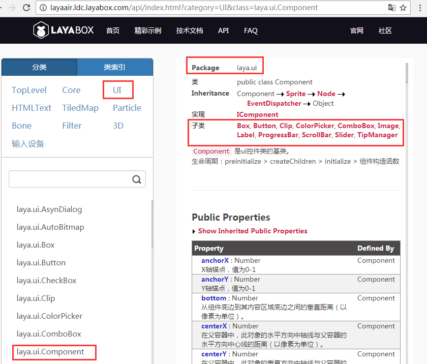

#LayaAirコンポーネントとコンポーネントのタイプの紹介

>LayaAirIDEのUI、動画などの可視化設定において、コンポーネントはほとんどどこにもありません。各コンポーネントは自分の属性、方法、イベントのセットを持っています。コンポーネントを使用すると、プログラム設計とインターフェース設計を分離し、コードの多重化性を向上させることができる。コンポーネントを深く理解してこそIDEの開発効率を向上させることができる。

##1、コンポーネントの継承関係

###1.1コンポーネントベースComponent

LayaAirIDEのマイコンは全部laya.uiのカバンの中にあります。**すべてのコンポーネントは直接または間接的にComponentクラスに継承されます。**（コンポーネントベースクラス）LayaAirエンジンのAPIドキュメントでUIの分類をクリックして、図1に示すように、見つけられます。[laya.ui.Component类](http://layaair.ldc.layabox.com/api/index.html?category=UI&class=laya.ui.Component)。関連するコンポーネントAPIの説明を見ることができます。

 (図1)

###1.2コンポーネント類継承関係

Sprite類はLayaAirエンジンの中で最も基本的な表示対象容器類です。Component類はSprite類から継承され、コンポーネントの共通の基礎属性、方法、インターフェースが追加され、コンポーネントのライフサイクルなどの拡張機能が規定されています。

コンポーネントのベースとしては、Box、Button、Clip、ColorPicker、Cobobox、Image、Label、Progess Bar、ScrrollBar、Slider、TipManagerがあります。`laya.ui.Component`のサブクラスです。コンポーネントの継承構造を図2に示します。

   (图2)

*Tips：図2の継続関係に示されるように、IDEで一般的に使用されるUIページDialogクラスはViewクラスに継承され、ViewクラスはBoxクラスに継続される。他のコンポーネントの引継ぎ関係を理解して覚えてください。*

##2、コンポーネントの分類

コンポーネント自体の構造と機能によって、laya.uiの下にあるコンポーネントを三つの種類に分けることができます。それぞれのビューコンポーネント、コンテナコンポーネント、ベースコンポーネントです。

###2.1ベースコンポーネント

基本的なコンポーネントはページ編集で最もよく使われているコンポーネントです。通過する`资源管理器`または`组件库`フィールドエディタにドラッグして可視化します。はい、あります`属性设置器`に属性値を設定し、シーンエディタで直接表示効果を確認します。

基礎コンポーネントはLabel、TextInput、TextArea、Button、Image、CheckBox、Radio、Clip、ProgessBar、Slider、HSlider、ValBar、ScrollBar、Commboxを含む。

*Tips：これらの基礎構成要素の詳細な紹介については、IDE構成要素属性の詳細な文書を参照することができる。*

###2.2容器類コンポーネント

容器類コンポーネントは、1つまたは複数の基礎部品が容器に変換することによって生成される。IDEで通過できます。`Ctrl+B`ショートカットキーは、1つ以上のベースコンポーネントをコンテナコンポーネントに変換します。図3に示すように。

   (动图3)

容器類コンポーネントは、Box、List、Tab、RadioGroup、View Stock、Panel、HBox、Vox、Tree、Spriteを含む。

###2.3ビューコンポーネント

ビュークラスのコンポーネントは、オブジェクトコンテナをページレベルで表示します。LayaAir IDEのUIシステムでは、ページはすべての表示コンポーネントを表示するためのもので、LayaAirのビューコンポーネントは唯一のものです。`View`を選択します`Dialog`。

### 