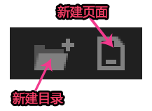

#ツールバーの紹介

>本編ではLayaAirIDE 1.7.3 bateスクリーンショットを採用していますが、異なる場合は最新のLayaAirIDEをダウンロードして、最新バージョンIDEに準じてください。

ツールバーは、エディタのメインウィンドウの真上にあり、メニューバーの下にあります。項目を開くと、8つのコントロールボタンまたは情報が表示され、特定のパネルの編集機能を提供したり、ワークフローを実行しやすくします。

​ 
（図1）

 

###一、プロジェクト操作ツール

​ 
（図2）

新しいディレクトリ:現在のプロジェクトにディレクトリフォルダを作成します。ショートカットキー(Ctrl+D)

新規ページ:選択したディレクトリに新しいページ(Page)を作成します。ショートカットキー(Ctrl+N)

 

###二、保存ツール

​ 
（図3）

現在を保存します。現在の操作ページを保存します。ショートカットキー（Ctrl+S）。

すべてを保存します。この項目に対するすべての変更、ショートカットキー（Ctrl+Shift+S）を保存します。

 

###三、取消しツール

​ 
（図4）

元に戻す:現在の操作をキャンセルします。ショートカットキー(Ctrl+Z)

取り消された操作を元に戻すことができます。ショートカットキー（Ctrl+Y）。

 

###四、リリースツールを更新する

​ 
（図5）

更新：ユーザーが新しいリソースを導入したり、ファイルに変更があったら、更新をクリックすると、プログラムが自動的に新しいリソースまたは設定をロードします。ショートカットキー（F 5）。

リリース：ユーザーが設計を完了したら、リリースをクリックして、公開ファイルを作成して共有または使用できます。ショートカットキー（F 12）。

 

###五、ビューツール

​         
（図6）

縮小表示：縮小表示ボタンをクリックするとシーンは自動的に拡大縮小されますが、幅の広いコントロールサイズ、ショートカットキー（Ctrl+）。

拡大表示：拡大表示ボタンを押すとシーンが自動的に拡大されます。拡大は幅の高さやコントロールの大きさに影響しません。ショートカットキー（Ctrl+-）。

ビューを復元します。ビューを復元するボタンをクリックすると、シーンが自動的に初期サイズに戻ります。ショートカットキー（Ctrl+\）。

 

###六、工具の配置

   

（図7）

左揃え：複数のコントロールの左揃えは、一番左のコントロールの開始座標を配置点として左揃えになります。

右揃え：複数のコントロールを右揃えにすると、一番右側のコントロールの終了座標で始点を右揃えにします。

水平方向中央揃え：複数のコントロールを水平方向に中央揃えにすると、自動的に水平中心座標を計算して中央揃えにします。

垂直中央揃え：複数のコントロールが垂直中央揃えで自動的に垂直中心座標を計算して中央揃えになります。

上揃え：複数のコントロールの上揃えで、一番上のコントロールの頂点座標を配置点として上揃えします。

下揃え：複数のコントロールの下揃えは、一番下のコントロールの下の座標を配置点として下の位置に配置します。

水平平均間隔：複数のコントロールは、水平間隔で自動的に計算され、平均距離で水平に配置されます。

垂直平均間隔：複数のコントロールが垂直間隔で自動的に計算され、平均距離で垂直に配置されます。

 

###七、シフト操作

​ 
（図8）

左上の角に移動します。選択したコントロールをシーンビューの左上の隅に移動します。

左下に移動します。選択したコントロールをシーンビューの左下に移動します。

右上の角に移動します。選択したコントロールをシーンビューの右上の隅に移動します。

右下に移動します。選択したコントロールをシーンビューの右下の位置に移動します。

水平中央に移動:選択したコントロールをシーンビューの水平中央に移動します。コントロールの垂直位置は変わりません。

垂直中央に移動します。選択したコントロールをシーンビューの垂直中央に移動します。コントロールの水平位置は変わりません。

原点中央に対して:選択したコントロールをシーンビューの原点(0,0)位置に移動し、原点位置で垂直と水平位置を中央にします。

 