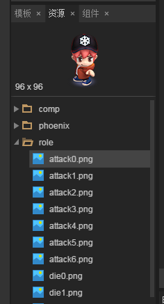

# 用LayaAirIDE制作图集动画

>本論文を読む前に、2 Dアニメーションの基礎となる図面アニメーション、Aimationコンポーネントの属性の詳細、および他のIDE基礎文書を読む必要があります。基本概念と操作本編はもう詳しく説明しません。

##1.制作目標

 


(図1)

アニメーション1のように。本編ではLayaAirIDEで図集動画を作成し、簡単なUIパネルとコントロールボタンを作成します。コードを作成して、制作した図面アニメーションを制御します。

##2.素材準備

使用するアニメーションパネル背景コンポーネントとボタンコンポーネント、およびアニメーションシーケンスフレームリソースをIDEのリソースマネージャにコピーします。この文書のUIコンポーネントは、compディレクトリにあります。動画リソースはroleディレクトリにあります。図2に示すように。

 


（図2）

##3.UIの背景を作る

3.1九宮格の設置

まずViewタイプのUIページを作成します。背景図のコンポーネントをシーンエディタにドラッグして、九宮枠を設定して、図3の効果に引き伸ばします。


###3.2アニメーションテンプレートの作成と運用

アニメーションの模式版の概要によって、コードを修正して、アニメーションの模式の創建方法Animation.createFraames()を加えて、その必要な二つのパラメータはそれぞれ動作のピクチャのシーケンスurlアドレスと動作の名前です。コードは以下の通りです。


```java

package
{
	import laya.debug.DebugPanel;
	import laya.display.Animation;
	import laya.display.Stage;
	import laya.events.Event;
	import laya.maths.Rectangle;
	import laya.utils.Handler;
	import laya.webgl.WebGL;
	
	import ui.PlayControlUI;

	public class AtlasAnimation
	{
		/****角色动画****/
		private var roleAni:Animation
		
		public function AtlasAnimation()
		{
			// 不支持WebGL时自动切换至Canvas
			Laya.init(1280,720, WebGL);
			//画布垂直居中对齐
			Laya.stage.alignV = Stage.ALIGN_MIDDLE;
			//画布水平居中对齐
			Laya.stage.alignH = Stage.ALIGN_CENTER;
			//等比缩放
			Laya.stage.scaleMode = Stage.SCALE_SHOWALL;
			//背景颜色
			Laya.stage.bgColor = "#1b2436";
			
			
			//加载角色图集资源
			Laya.loader.load(["res/atlas/role.atlas"], Handler.create(this, createAni));
		}
		
		private function createAni():void 
		{
			
			//实例化角色动画
			roleAni = new Animation();
			// 加载图集动画
			roleAni.loadAtlas("res/atlas/role.atlas");	
			// 设置动画每帧间播放间隔（单位：毫秒）
			roleAni.interval = 100;
			//角色动画放大
			roleAni.scale(1.4,1.4);			
			
			//创建动画模版，以供动作切换控制使用
			Animation.createFrames(actionUrls("stand",7),"stand");    	//站立动画
			Animation.createFrames(actionUrls("move",8),"move");		//移动动画
			Animation.createFrames(actionUrls("die",8),"die");			//死亡动画
			Animation.createFrames(actionUrls("attack",7),"attack");	//攻击动画
			
			//播放某个缓存的动画模版
			roleAni.play(0,true,"attack");	
			
			//动画实例无宽高，需通过getGraphicBounds()或getBounds()获取
			//获取动画的边界信息
			var bounds:Rectangle = roleAni.getGraphicBounds();
			//设置动画轴心点
			roleAni.pivot(bounds.width / 2, bounds.height / 2);
			//设置动画在舞台中心位置
			roleAni.pos(Laya.stage.width / 2-200, Laya.stage.height / 2);
			//加载到舞台
			Laya.stage.addChild(roleAni);

		}
		
		/**
		 * 动作资源的一组url数组（美术资源地址数组）
		 * @param aniName  动作的名称，用于生成url
		 * @param length   动画的帧数
		 */		
		private function actionUrls(aniName:String,length:int):Array
		{
			var urls:Array=[];
			for(var i:int=0;i<length;i++)
			{
				urls.push("role/" + aniName + i + ".png")
			}
			return urls;
		}
	}
}
```


上記のコードをコンパイルして実行します。デフォルトではすべてのアニメーションシーケンスを再生せず、キャラクターの攻撃動作のみを再生します。切り替え可能`roleAni.play(0,true,"attack");`の2番目のパラメータである「atack」は他の動画のモード名で効果を観察していますが、他の動画のモードは正しく再生されていますか？


##4.アニメの放送制御

作成されたアニメーション効果をよりよく観察するために、異なる動作のアニメーションモデルを切り替えて、より多くのアニメーション放送制御を理解させます。IDEで制御UIを作成し、テストキャラクターの動作を制御するボタン名nameを設定しました。UI効果図および説明は以下の通りである（図8）。

<br/>(図8)

UIリソースをプログラムにロードし、生成されたPlayControl UIクラスを実装し、UI傍受役の切り替えと制御コードの再生に参加する。

アニメーション放送制御は、アニメーションのstop（）方法及びアニメーションのindex現在の放映インデックス、countアニメーションの総長さ属性を使用しています。

tips：indexプレイインデックスとは、現在の動画（または動画の模式）のフレーム位置を指します。現在再生されているのがアニメ版である場合、indexは、図セットアニメーション全体のフレームインデックス位置ではなく、アニメーションテンプレートのフレームインデックス位置に切り替わります。また、count属性は、アニメーション全体の総長さからアニメーションモードの総長さ（総フレーム数）にも切り替わります。

コードの参考は以下の通りです。


```java

package
{
	import laya.debug.DebugPanel;
	import laya.display.Animation;
	import laya.display.Stage;
	import laya.events.Event;
	import laya.maths.Rectangle;
	import laya.utils.Handler;
	import laya.webgl.WebGL;
	
	import ui.PlayControlUI;

	public class AtlasAnimation
	{
		/****角色动画****/
		private var roleAni:Animation
		/***IDE制作的角色动画控制UI***/
		private var control:PlayControlUI
		
		public function AtlasAnimation()
		{
			// 不支持WebGL时自动切换至Canvas
			Laya.init(1280,720, WebGL);
			//画布垂直居中对齐
			Laya.stage.alignV = Stage.ALIGN_MIDDLE;
			//画布水平居中对齐
			Laya.stage.alignH = Stage.ALIGN_CENTER;
			//等比缩放
			Laya.stage.scaleMode = Stage.SCALE_SHOWALL;
			//背景颜色
			Laya.stage.bgColor = "#1b2436";
			
			//加载角色图集资源
			Laya.loader.load(["res/atlas/role.atlas","res/atlas/comp.atlas"], Handler.create(this, createAni));
		}
		
		private function createAni():void 
		{
			//实例化控制UI,并加载到舞台上
			control=new PlayControlUI();
			Laya.stage.addChild(control);
			
			
			//实例化角色动画
			roleAni = new Animation();
			// 加载图集动画
			roleAni.loadAtlas("res/atlas/role.atlas");	
			// 设置动画每帧间播放间隔（单位：毫秒）
			roleAni.interval = 100;
			//角色动画放大
			roleAni.scale(1.4,1.4)
			//默认会播放全部动画
			roleAni.play();	
			
			//动画实例无宽高，需通过getGraphicBounds()或getBounds获取
			//获取动画的边界信息
			var bounds:Rectangle = roleAni.getGraphicBounds();
			//设置动画轴心点
			roleAni.pivot(bounds.width / 2, bounds.height / 2);
			//设置动画在舞台中心位置
			roleAni.pos(Laya.stage.width / 2-120, Laya.stage.height / 2);
			//加载到舞台
			Laya.stage.addChild(roleAni);
			
			
			//创建动画模版，以供动画切换控制使用
			Animation.createFrames(actionUrls("stand",7),"stand");    	//站立动画
			Animation.createFrames(actionUrls("move",8),"move");		//移动动画
			Animation.createFrames(actionUrls("die",8),"die");			//死亡动画
			Animation.createFrames(actionUrls("attack",7),"attack");	//攻击动画
			
			//动画播放控制按钮组事件监听
			control.box_control.on(Event.MOUSE_DOWN,this,onControl);
			//动作切换按钮组事件监听
			control.box_frames.on(Event.MOUSE_DOWN,this,onChangeFrames);
		}
		
		/****角色动画切换****/
		private function onChangeFrames(e:Event):void
		{
			//根据名字播放动画模版（IDE中设置按钮名字name与动画模版设置名字需相同）
			roleAni.play(0,true,e.target.name);
			//改变标题
			control.title.text="当前播放动画为："+e.target.name
		}
		
		/****角色动画播放控制****/
		private function onControl(e:Event):void
		{
			//获得按钮名字（IDE中设置的按钮名字name）
			var names:String=e.target.name;
			if(names=="stop")
			{
				//动画停止
				roleAni.stop();	
				control.title.text="停止动画";
			}else if(names=="play")
			{
				//播放动画
				roleAni.play();	
				control.title.text="播放动画";
				
			}else if(names=="up")//动画的上一帧
			{
				//动画停止
				roleAni.stop();	
				//当前动画的帧位置减1（如播放动画模版，index、count都会切换为动画模版的帧位置与总帧数）
				roleAni.index--;
				//如果帧位置小于0，则帧位置等于当前动画的帧总数-1
				if(roleAni.index<0) roleAni.index=roleAni.count-1;
				control.title.text="当前帧位置为："+roleAni.index;
				
			}else if(names=="next")//动画的下一帧
			{
				//动画停止
				roleAni.stop();	
				//当前动画的帧位置加1（如播放动画模版，index、count都会切换为动画模版的帧位置与总帧数）
				roleAni.index++;
				//如果帧位置大于动画的帧总数-1，则帧位置等于0
				if(roleAni.index>roleAni.count-1) roleAni.index=0;
				control.title.text="当前帧位置为："+roleAni.index;
			}

		}
		
		/**
		 * 一组动画资源的url数组（美术资源地址数组）
		 * @param aniName  动作的名称，用于生成url
		 * @param length   动画的帧数
		 */		
		private function actionUrls(aniName:String,length:int):Array
		{
			var urls:Array=[];
			for(var i:int=0;i<length;i++)
			{
				urls.push("role/"+aniName+i+".png")
			}
			return urls;
		}
	}
}
```


コードをコンパイルして実行します。効果も図1に示します。異なるボタンをクリックすることで、異なる動画の動きや動画の停止やフレームの切り替えができます。