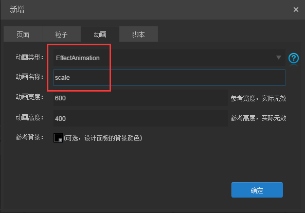
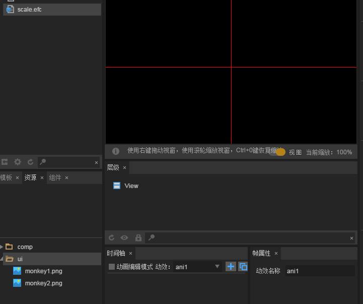
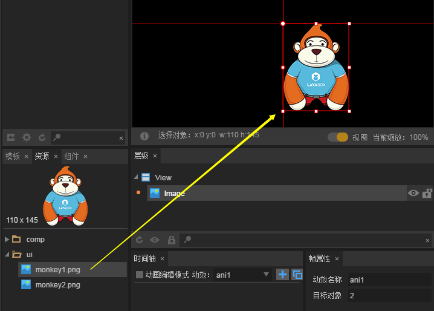
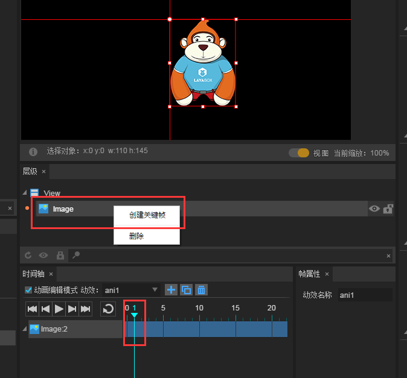
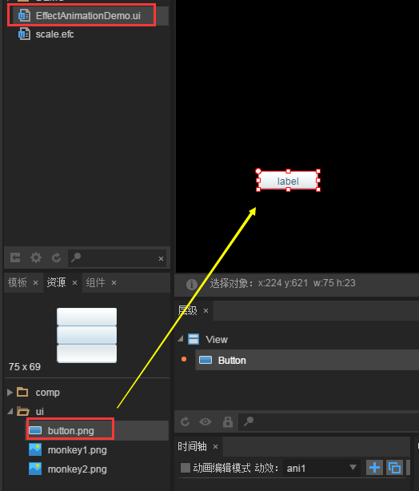
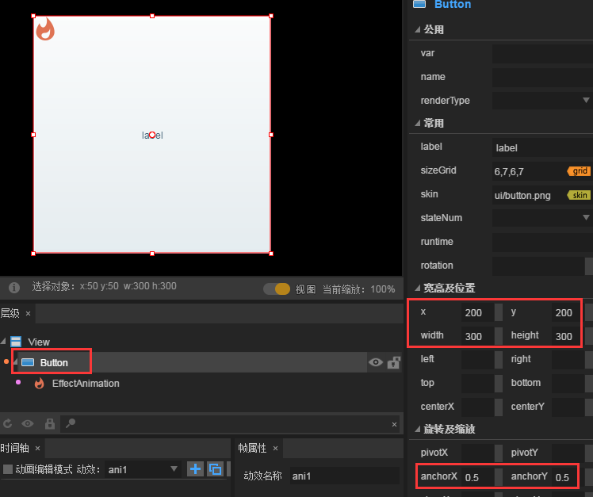
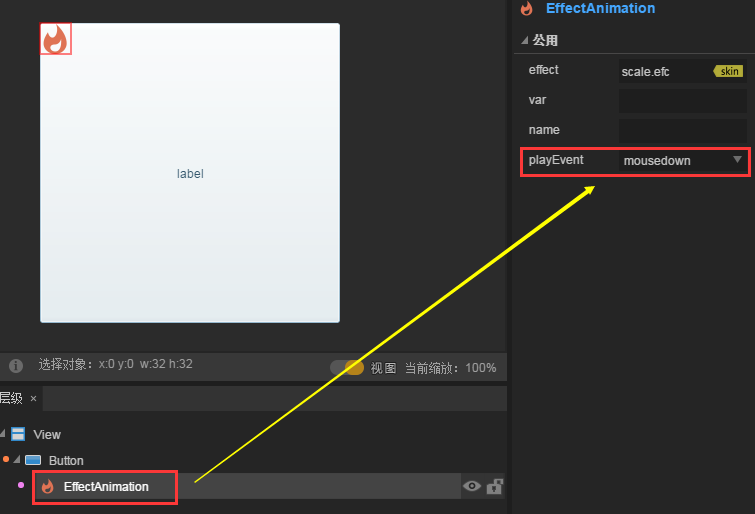
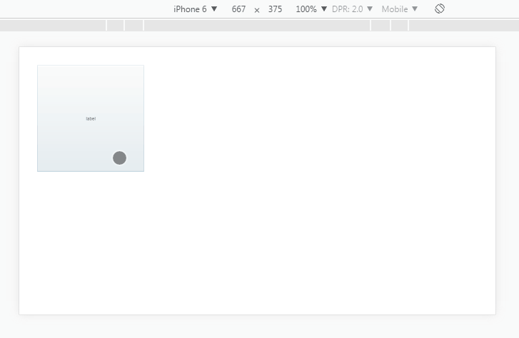
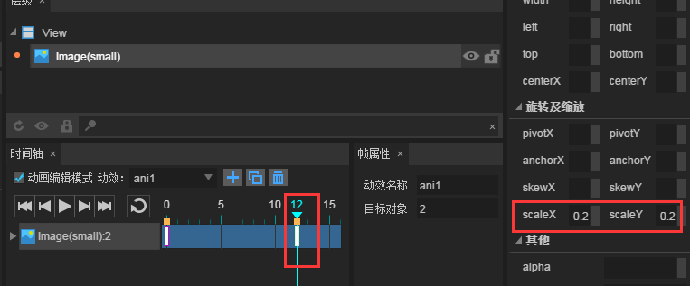
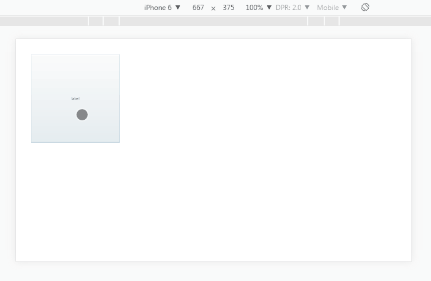

#アニメーションテンプレートを作成します。

###1、何が効果テンプレートですか？

アニメーション効果のテンプレートは、時間軸のアニメーション効果に基づいて、アニメーション効果を設定して、効果をあるコンポーネントに付加します。コンポーネントをエンコードする必要はないが、エンコードと同じアニメーション効果を手軽に実現できるようにします。アクティブテンプレートは独立して表示できません。アクティブテンプレートとしてUIページのコンポーネントだけがアニメーション効果を得られます。


###2、IDEでアクティブテンプレートを作成して使用する

####2.1 Effect Animationテンプレートファイルを作成する

プロジェクトマネージャでマウス`右键`-->選択`新建`-->`动画`。新しいアニメーションのパネルで、アニメーションタイプを選択します。`EffectAnimation`。ズーム効果の動画テンプレートを作成しますので、アニメーション名は`scale`を選択します。

 <br />（图1）


クリック`确定`を選択します。`scale.efc`のアクティブテンプレートファイルをダブルクリックして、アニメーション編集シーンを図2に示します。

<br/>(図2)


####2.2実効テンプレートの作成

**ターゲット:縮小して復元するアニメーション効果テンプレートを作成します。**

**ステップ1**私たちは資源管理器からImageコンポーネントをドラッグします。`scale.efc`のシーンエディタにあります。図3に示すように。

 <br /> (图3)


**ステップ2**:チェック`动画编辑模式`を選択して、`第1帧`和`Image`コンポーネントの上で右クリックします。`创建关键帧`。 図4に示すように。

<br/>(図4)


**ステップ3**を選択します`第1帧`を選択します。プロパティマネージャでは、回転とズームの`scaleX`を選択します`scaleY`属性値をすべて`0.2`。図5に示すように。属性値を設定すると、Image時間軸に自動的にズーム属性scaleXとscaleYが追加されます。(*私たちのこの動効果テンプレートは変位効果が必要ではないので、キーフレームが自動的に生成される属性Xを作成して直接削除すればいいです。＊）

<br/>(図5)

**Tips**効果テンプレートと時間軸アニメーションは重要な違いがあります。つまり、現在のアニメーション効果の最初のフレームに対してアニメーション効果を設定するのは無効です。例えば、まず0.2時間まで縮小したいです。時間軸アニメーションでは、第0フレームでアニメーションコンポーネントを直接0.2に縮小することができますが、動画テンプレートでは、第0フレームで直接スケーリング効果を設定することができません。他のフレーム（*1フレーム*）でスケーリング効果を設定しなければなりません。


**ステップ4**：第13フレームでキーフレームを作成（図4参照）、設定`scaleX`を選択します`scaleY`属性の値は`1`をクリックして、動画効果をプレビューします。

<br/>(図6)


####2.3 IDEにアクティブテンプレートを使用する

**ステップ1**：UIページを作成します。`EffectAnimation.ui`）Buttonコンポーネントを図7に示すようにシーンエディタにドラッグします。

 <br /> （图7）


**ステップ2**：作成したスケーリング効果のテンプレート（scale.efc）をButtonコンポーネントの下にドラッグして、動画8に示すようにします。

<br/>(図8)


**ステップ3**：中央ズーム効果を実現するために、ボタンをより明確にします。私たちはButtonのコンポーネントを選択して、プロパティパネルで、軸の中心のプロパティを設定します。`anchorX`を選択します`anchorY`の値は`0.5`そして、Buttonの幅の高さと軸点のxy軸位置を図9に示します。

<br/>(図9)

*Tips：枢軸ポイント効果はUIのコンポーネント属性に設定する必要があり、動効テンプレートに軸軸点効果を設定するとコンポーネントに無効になります。*


**ステップ4**：Buttonコンポーネントの下のアクティブテンプレートを選択し、右側のプロパティパネルで、再生を開始するイベントのプロパティを設定します。`playEvent`の値は`mousedown`。図10に示すように、F 12でUIページをエクスポートすると、プロジェクトで使用できます。

<br/>(図10)


###3、プロジェクトに効果テンプレートの効果を示す。

作成`Main.as`のエントリクラスを設定し、デフォルトのアプリケーションに設定します。作成コードは以下の通りです。


```java

package
{
	import laya.net.Loader;
	import laya.utils.Handler;
	import ui.EffectAnimationDemoUI;

	
	public class Main
	{
		public function Main()
		{
			//初始化舞台
			Laya.init(1334,750);
			//设置舞台背景色
			Laya.stage.bgColor = "#ffffff"    
			
			//加载图集资源，加载成功后添加到舞台
			Laya.loader.load("./res/atlas/ui.atlas",Handler.create(this,onLoaded));
			
		}
		
		private function onLoaded():void
		{	
			//实例导出的UI类
			var efc:EffectAnimationDemoUI = new EffectAnimationDemoUI();
			
			//添加到舞台
			Laya.stage.addChild(efc);
		}
	}
}
```


運転後、ボタンが押されると、動画効果は図11に示すようになります。

<br/>(図11)


###4、複数の動効テンプレートを作成する複雑な動作効果

ボタンを押したばかりで、小さいころから大きなアニメ効果が得られます。もう一つの動画テンプレートを作って、弾み時の縮小効果を実現します。これにより、押したり跳ねたりといった、スピーディな切り替えを実現した連続動画効果のデモンストレーションです。

まず、私達はもう一つの動効果テンプレートファイルを作成します。この動効果テンプレートは直接的に縮小されるためです。二つのキーフレームだけでいいです。図12に示すように、私達は`第12帧`を選択します`scaleX`を選択します`scaleY`の値を設定します`0.2`。

<br/>(図12)


その後、UIページでは、アクティブテンプレートをButtonコンポーネントの下にドラッグして設定する。`playEvent`属性は`mouseup`。図13に示すように。

<br/>(図13)


最後に保存した後、F 12でUIをエクスポートし、プロジェクトで先ほどのコードを再度コンパイルします。動作効果は、図14に示すように、連続的に押したり跳ねたりするイベントで、アニメーション効果は非常に滑らかです。

<br/>(図14)

これでEffect Animationの基礎教程は終了しました。開発者はLayaAirIDEの動画テンプレート機能を使って、様々なコンポーネントのアニメーション効果を迅速に開発することができます。


