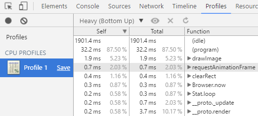

#Googleブラウザの性能アナライザを使う

### 

### **一、性能分析器（Profiles）**

パフォーマンスアナライザ（Profiles）はchrome開発者ツールの一部であり、ページの右ボタンで審査要素を選択したり、GoogleブラウザのページでF 12を押してchrome開発者ツールを開くことができます。Profilesをクリックして、性能アナライザパネルに切り替えます。

 

###二、**CPU占有分析**

Collect JavaScript CPU Profileを選択して、Startボタン（左の黒い丸をクリックしてもいいです）をクリックすると、Chromeは現在のウェブページを記録する方法の実行を開始します。このモニタを終了するには停止ボタン（または左側の赤い丸）をクリックします。モニタを終了したら、左のProfilesにモニタ結果ファイルが表示されます。クリックしてこのモニタ結果ファイルを開くことができます。
モニタ結果はデータテーブルとして表示されます。この表には、関数実行の時間、関数実行の順序と関係、およびCPU変化の傾向が記録されています。解析結果によりターゲットとなる最適化関数がある。

​ 
（図1）

​ 
（図2）

​ 
（図3）

 

### **三、メモリ占有分析**

Take Heap Snapshotを選択して、Take Snapshotボタンをクリックして、左側のProfiles欄で現在のウェブページのメモリスナップショット記録ファイルを作成します。
生成されたメモリスナップショットファイルは、データテーブルとして記録されており、現在のウェブページオブジェクトの個数、占有されているメモリサイズなどです。
次のメモリのスナップショットを撮ったら、ページを操作してからメモリのスナップショットを撮ります。2番目のメモリスナップショットを選択すると、Comprisonモードのこの2番目のスナップショットと最初のスナップショットの間の変化を選択できます。分析を通じて、ウェブページを最適化する。

​ 
（図4）

​ 
（図5）

​ 
（図6）