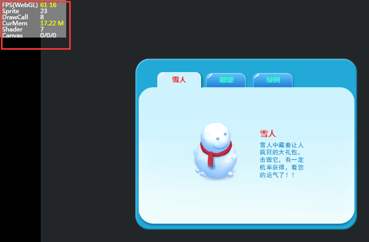

# CacheAs静态缓存优化

属性設定器における他の汎用性において，cacheAsキャッシュの最適化概念と機能的役割を紹介した。また、開発者がUIインターフェースを作る時に、できるだけ合理的に利用するように勧めています。次に、プロジェクトにおけるcacheAsの運用をUIの例で示します。また、cacheAsの使用前後にデータを分析して、開発者たちの参考にします。

まず、CacheAsキャッシュ機能を使用していない場合を見ます。webglのデバッグモードにおいて、UIの中の各フレームのSpriteレンダリングポイントは23個で、DrawCallレンダリング回数は8、Shader材質提出回数は7回であることが分かります。(*このデータは最適化後、性能最適化コントラスト*に使用できます。)

  
（図1）

##1、cacheAsはnormalのキャッシュの最適化である。

cacheAsを使用すると、cacheAsを「normal」モードに設定し、DrawCallとShaderは変わらず、Spriteノード数は23から8に低減され、ノードレンダリング性能は3倍近く最適化された。図2に示すように。

   (图2)

**Tips**:

cacheAs属性値が「normal」の場合、Canvasでキャンバスキャッシュを行い、webglモードでコマンドキャッシュを行います。このモード性能の最適化は中程度であり、フレームごとにレンダリングされたノード数を減らすことができるが、DrawCall数とShader数は減少しない。

##2、cacheAsはbitmapのキャッシュ最適化である。

cacheAsを使用するとcacheAsを「bitmap」モードに設定します。Spriteノード数は8で、DrawCallは1に下がり、Shader数は0に下がった。配置を修正しただけで，性能はcacheAsを使わずに10倍以上最適化した。効果は図3に示します。

 (図3)

**Tips**:

Canvasでは依然としてキャンバスキャッシュであり、webglモードではレンダーTargetキャッシュを使用して、静止したビットマップにキャッシュしてグラフィックスを提出するのと同じです。ここで注意すべきことは、webGLにおけるrendeTargetキャッシュモードは2048サイズの制限があり、2048を超えるとメモリオーバーヘッドが追加的に増加することである。また、継続的に描き直す場合は出費も大きいですが、ドラックコールを減らし、レンダリング性能が最高です。

本文書では、私たちのUI例は比較的簡単で、一部の大型ゲームについては、ノード数が50を超えるUIが多く、cacheAsキャッシュ技術を採用してから、レンダリング性能が何倍も向上します。

##3、キャッシュの最適化はどのように選択しますか？

###3.1メモリとCPUの考え

####ビットマップモードとメモリの増加

上記の例では、ビットマップキャッシュモードを使用した後、CurMemメモリの値が増加し、前の17.22 Mから18.27 Mに増加しました。ビットマップをキャッシュする時に一部のメモリが消費されましたが、UIの幅が大きくない限り、増加したメモリも大きくありません。

####頻繁に更新するCPUの消耗

最も注意したいのは、UIが頻繁に更新されるかどうかです。頻繁にCPUの損失が大きくなります。キャッシュビットマップの場合、サブオブジェクトが変更されると、エンジンは自動的にビットマップを再キャッシュし、ビットマップをキャッシュするプロセスはCPUを消費します。

cacheAsを使用するnormalまたはbitmapモードを選択するか、cacheAsを使用しないか、メモリの増加とCPU消費を重点的に考慮する必要があります。

###3.2頻繁に再描画するかどうかをテストします。

LayaAirエンジンが提供するDebugPanelデバッグツールは、ゲームのリメイクエリアを確認してくれます。コードに追加されます。`DebugPanel.init();`メソッドは、プロジェクトをコンパイルすると、ブラウザにデバッグウィンドウが表示されます。図4に示すように。

 (図4)

チェックします`显示当前cache重绘`」オプションまたは「`显示所有重绘区域`」をクリックします。UIが再描画されると、再描画エリアに緑の枠が表示され、緑の枠の左上には再描画回数と再描画時間が表示され、性能統計ツールのSprite、DrawCallなども変更されます。

マウス操作がない場合、緑の線枠が頻繁に現れたら、説明します。**UIは頻繁に再描画されますので、bitmapキャッシュモードを使わない方がいいです。normalモードは情状を考慮してください。**。もちろん、UIを階層的に管理し、頻繁に更新される層（cacheAsを使用しない）も、頻繁に更新されない層（cacheAsを使用して）も、この方法は性能を向上させることができる。

###3.3ローエンドモデルの配置要因

私達はゲームのプロジェクトをする時、普通は携帯電話の配置を考慮して、大多数の情況はゲームの適応の機種が多ければ多いほど良くなるので、ゲームのテスターも高校のローエンドの配置の携帯電話でテストに行って、それから最適化の提案を提供します。cacheAsを使う時も、携帯電話のメモリやCPUサイズを参考にする必要があります。

いくつかのローエンドマシンでは、CPUとメモリが高くないので、レンダリング性能を高めるためにcacheAsを使用すれば、問題が発生する可能性があります。

この時に開発者たちは取捨選択をしなければなりません。性能を選ぶか、それともゲーム機の広さを取るか、中に入れるかを選択します。より多くのローエンドモデルに適応する場合、cacheAsを使うかどうかは繰り返しテストし、normalとbitmapモードのどちらがより適しているかを比較し、性能を最適化する場合、CPUとメモリ損失をできるだけ減らす必要がある。

##4、どんな状況でcacheAsが使えないですか？

###4.1対象が非常に簡単な場合は使用できません。

オブジェクトが非常に単純な場合、例えば1つの単語や1つの画像など、cacheAsを設定することは、性能を向上させないばかりか、性能を損なうことになります。

###4.2常に変化する内容は使用できません。

容器内には常に変化する内容があります。例えば、容器内にアニメーションやカウントダウンがあります。この容器にcacheAsをセットすると、性能が損なわれます。

性能統計パネルのCanvas統計情報の最初の値を見ることができます。ずっと変化しているなら、描き直しているということです。この場合はcacheAsは使えません。