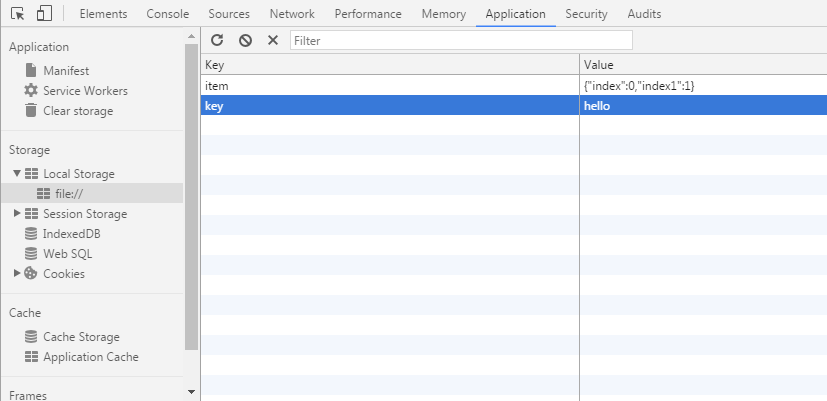

#Web Strageデータストア

HTML 5は、クライアントにデータを格納する2つの新しい方法を提供する。

**local Strage-時間制限のないデータストア**

**session Strage-一つのセッションに対するデータストア**

session Storrageに格納されているデータは、ブラウザセッション終了時にクリアされます。つまり、ブラウザが閉じられている時です。

これまではクッキーで作られていました。しかし、Cookieサイズは4 kに制限されており、大量のデータの格納には適しておらず、各サーバに対する要求によって伝達されており、Cookie速度が遅く、効率も高くない。Coolieの役割は、サーバと相互作用し、HTTP仕様の一部として存在するが、Web Strageは、ローカルにデータを格納するためだけに生じる。

HTML 5では、データはサーバ毎に要求されるものではなく、要求時のみデータを使用する。ウェブサイトの性能に影響を与えずに大量のデータを記憶することが可能になります。

異なるウェブサイトに対しては、データは異なるエリアに格納され、一つのウェブサイトは自身のデータにしかアクセスできない。そのため、ローカルデータの保存は完全にLocal Strageでできます。LayaAirエンジンはLocal Strageを簡単にパッケージ化しました。対応するクラスはLocal Strageです。簡単な例を通して、どうやって使うかを見てみます。


```javascript

Laya.init(100,100);
Laya.LocalStorage.setItem("key","hello");
var data = {"index":0,"index1":1};
var str = JSON.stringify(data);
Laya.LocalStorage.setItem("data","hello");
Laya.LocalStorage.setItem("item",str);
```


chromeで運転してショートカットキーF 12を押したら、次の図のようになります。

<br/>


図から先のデータが全部保存されているのが見えます。

これらのデータをクリアします。コードは以下の通りです。


```javascript

Laya.LocalStorage.setItem("key","hello");
var data = {"index":0,"index1":1};
var str = JSON.stringify(data);
Laya.LocalStorage.setItem("data","hello");
Laya.LocalStorage.setItem("item",str);
Laya.LocalStorage.removeItem("data");//清除数据
```


コードLaya.Local Storrage.removeItemを追加し、キーをdataとしたデータをクリアして、コンパイルして実行したらdataデータがなくなっています。下図のように：

<br/>

すべてのデータを整理して、元のコードの最後にコードを追加すればいいです。


```javascript

Laya.LocalStorage.clear();
```


コンパイルすると、ドメイン名に格納されていたすべてのデータが消えていることが分かります。

<br/>


session StorrageはLayaAirエンジンにはまだ封入されていませんが、そのまま使用できます。次にLayaAirでsession Strageをどう使うかを示します。次の例は、ページカウンタです。現在のセッションでユーザがページにアクセスする回数をカウントします。

LayaAirIDEを開いて空き項目を作成します。具体的なコードは以下の通りです。


```java

Laya.init(100,100);
var sessionStroage = Laya.Browser.window.sessionStroage;
if(sessionStorage.pagecount){
    sessionStorage.pagecount = parseInt(sessionStorage.pagecount)+1;
}
else{
    sessionStorage.pagecount = 1;
}
console.log(sessionStorage.pagecount);
```


var session Stroage=Laya.Browser.window.session Stroageとは、現在のページのsession Strageの会話オブジェクトを取得するという意味です。


ここでのロジックは、現在のセッションオブジェクトにパーゲコントロール属性があるかどうかを判断し、存在しない場合は初めてオープンして1に設定し、存在する場合はすでにオープンし、アキュムレータを行うことです。そして積算回数を出力します。このファイルをコンパイルして、Googleで運転して、F 12コンソールを開けて、出力が1であることを発見しました。そして、私達は絶えず更新します。そして、私たちはGoogleのブラウザを閉じて、このページを新たに開けます。この時出力されたのはまた1で、ページの更新回数はまた累積しています。これにより、session Strageは会話レベルの記憶対象であることが分かります。ブラウザを閉じると消えます。