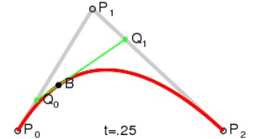
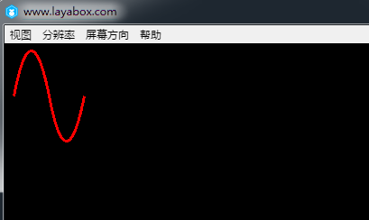

#曲線を描く


直線よりも曲線の描画と座標の関係が分かりにくいです。LayaAirエンジンはベジェ曲線を描いているので、本稿ではまずベジェ曲線の基礎について説明し、エンジンのAPIと結合して説明します。


### **一、ベジェ曲線の基礎**

ベゼル曲線は香港・マカオなどでベツェ曲線と呼ばれ、シンガポール・マレーシアなどでベチューン曲線と呼ばれています。ベゼル曲線は線分とノードからなり、ノードはドラッグ可能な支点であり、線分は伸縮性のあるゴムのようで、図形描画ツールで見た万年筆ツールはこのベクトル曲線を作っています。

ベジェ曲線は二次元グラフィックスアプリケーションに適用される数学曲線です。曲線の定義には4つの点があります。始点、終端点（アンカーポイントともいいます。）、および2つの分離された中間点です。二つの中間点をスライドさせると、ベジェ曲線の形が変わります。

直線、二次、三次などの式に基づいて、ベジェ曲線は一回、二次とも言われています。五次曲線の中には、一次、二次という文章もあります。話は同じことです。動画を通して直感的に理解してもらいます。

#### **1.1次曲線**

​<br/>
（図1）

説明：上の図はP 0からP 1までの連続点で、直線的なベゼル曲線を描いています。線形ベジェ曲線関数のtは、P 0からP 1までのB（t）によって表される曲線を通ります。例えば、t=0.25の場合、B(t)は、ポイントP 0からP 1パスの4分の1のところである。B（t）は、0から1までの連続tのように、P 0からP 1までの直線を記述する。

#### **1.2二次曲線**

​<br/>
（図2）

​<br/>
（図3）

説明：二次曲線を構築するために、上の図はP 0からP 1までの連続点Q 0で、一次曲線を記述します。直線ベッセル曲線は、P 1からP 2までの連続点Q 1で記述されています。Q 0からQ 1までの連続点B（t）には、二次曲線が記述されています。

#### **1.3三次曲線**

​<br/>
（図4）

​<br/>
（図5）

説明：三次曲線については、線形ベジェ曲線で記述できる仲介点Q 0,Q 1,Q 2と、二次曲線で記述される点R 0,R 1とで構成されています。

#### **1.4高次ベジェ曲線**

**高次のベジェ曲線はあまり見られないので、ここでは詳しく説明しないで、ベジェ曲線の原理をもっと知りたいです。他の関連記事を見ることができます。****

​<br>
（図6）四次曲線

​<br>
（図7）五次曲線


**###** **二、LayaAirエンジンAPIで二次曲線を描く******

LayaAirエンジンの曲線描画は二次ベッセル曲線を採用しています。開発者はAPIドキュメントでlaya.display.Graphics類を検索することができます。この方法の詳細は下図の通りです。

​<br>
（図8）

次にLayaAirエンジンでベクトル曲線を描きます。コード例は以下の通りです。


```javascript

(function()
{
    var Sprite = Laya.Sprite;
    var Stage  = Laya.Stage;
    var WebGL  = Laya.WebGL;
    var sp;
 
    (function()
    {
        //初始化舞台，不支持WebGL时自动切换至Canvas
        Laya.init(500, 300, WebGL);
        drawSomething();
    })();
 
    function drawSomething()
    {
        sp = new Sprite();
        Laya.stage.addChild(sp);
        //画曲线
        sp.graphics.drawCurves(10, 58, [0, 0, 19, -100, 39, 0], "#ff0000", 3);
    }
})();
```


発表後は下図のように簡単な曲線を描くことに成功しました。


​        <br>
（図9）

drawCurvesの第三位のpointsポイントセットのパラメータを増加することにより、曲線をより複雑にすることができます。修正されたコード例は以下の通りです。


```javascript

//增加58, 100与78, 0坐标让曲线更复杂一些
   
sp.graphics.drawCurves(10, 58, [0, 0, 19, -100, 39, 0, 58, 100, 78, 0], "#ff0000", 3);
```


リリース後は下図のように、

​<br>

（図10）
もっと複雑な曲線を描きたいなら、自分でdrawCurvesのパラメータを調整して、二次ベゼル曲線の原理を結び付けて理解します。

最後に注意してください。折れ線を描くのと同じように、3番目のパラメータのすべての座標は相対座標であり、1番目と2番目のパラメータの「10，58」に影響されます。「10，58」が変わると、全体の曲線に影響が出ます。


###三、LayaAirIDEでコントロールをドラッグして二次曲線を描きます。
****
​**ステップ1**：LayaAirIDEを開いて、デザインモードをクリックして、Viewページを新規作成します。****

​<br>
（図11）
****
**ステップ2**：コンポーネント内の曲線コンポーネントをViewページにドラッグすると、自動的にデフォルトの曲線が生成されます。****

​<br>
（図12）
****
**ステップ3*：コンポーネント属性のポイントの値を変更（追加/減少）し、曲線の位置や曲げの度合いを変更します。

​<br/>
（図13）

​<br/>
（図14）

これでLayaAirIDEのコンポーネントを通して曲線を描きます。