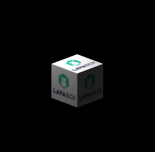

#LayaAir 3 Dの光源

照明は3 D世界において重要であり、3 D物体による立体光の変化、色の色調の変化、投影などは照明設定方式で達成できる。

##ライトの種類

ライトの種類はいろいろありますが、光源によって現れる効果は違っています。異なるパラメータを設定できます。IDEで作成した3 Dプロジェクトの中でコードを修正して、異なる種類の照明効果を見ることができます。

###点光（PointLight）

光は四方八方に向けて光を発する光源であり、全方向光または球状光とも呼ばれ、実際の点光源は電球やろうそくなどであり、光源は強度、色、減衰半径の属性を感じることができる。


```javascript

//创建点光
var light = scene.addChild(new Laya.PointLight());
//移动灯光位置
light.transform.translate(new Laya.Vector3(-3,5,0));
//设置点光照亮范围
light.range = 6;
//设置点光的衰减
light.attenuation = new Laya.Vector3(0.01,0.01,0.03);
```


rangeは点光源を設定する範囲であり、点光の照射範囲に相当し、数値が大きいほど、光照射範囲が大きくなり、図1では光照射範囲が小さいため、光に照らされていないところが黒であり、図2では照明範囲が照明とモデルの距離を超えているため、全てが明るく照らされている。

（図1）（図2）<br/>


ドット光源の減衰を設定するため、数値が小さいほど減衰が少ないので、光照射範囲内の物体の輝度が高い。


###平行光(Direction Light)

平行光は点光と大きな違いがあります。一定の方向があります。ラジアン値で設定できます。また、減衰や光照射範囲もなく、全シーンのモデルを照らします。3 D世界では常に一定方向の太陽光をシミュレートしている。


```javascript

//创建平行光
var light = scene.addChild(new Laya.DirectionLight());
//设置平行光的方向
light.direction = new Laya.Vector3(0.5, -1, 0);
```


###集光（SpotLight）

スポットライトとは、特定の光源の方向から射出される光のことで、例えば懐中電灯、舞台の筒などです。光照射エリアは距離要因によって徐々に拡大し、同僚の光照射エリアの端にも減衰現象がある。


```javascript

//添加聚光
var light = scene.addChild(new Laya.SpotLight());
//设置聚光的位置
light.transform.position = new Laya.Vector3(0,5,0);
//设置聚光的衰减
light.attenuation = new Laya.Vector3(0.1, 0, 0.1);
//设置聚光的方向
light.direction=new Laya.Vector3(0, -1, 0);
//设置聚光范围
light.range = 5;
//设置聚光值
light.spot = 5;
```


スポットライトは集光の減衰であり、設定された値が小さいほど、集光絞りのボケが小さく、逆に絞りが大きい。

directionは集光の方向であり、方向の値設定方式は平行光と一致する。

rangeは集光の照射範囲であり，点光と類似しており，違いは集光の方向のみで，点光の方向はない。

spotは集光値で、数値が小さいほど、光が強く、逆に弱いです。図3の集光値は5であり、図4の集光値は50であり、開発者は必要に応じて調整することができる。

（図3）（図4）<br/>


##光の要素

シーンで照明を使用すると、照明の範囲内のすべての3 Dモデルに影響が出ます。LayaAir 3 Dエンジンの照明には、シーンの明るさや色などを調整するための要素が含まれています。

###環境色（ambientColor）

**Tips：エンジン1.7.9版の後、照明の環境色設定をキャンセルしました。旧版はそのまま使用できます。環境色は材質に設定できます。**

環境色は、シーンの雰囲気色として簡単に理解できます。シーン中のモデルでは、それらの明るい面と暗い面は同時に環境色に影響され、環境色が明るいモデルほど全体的な輝度が高くなります。もちろん、環境色にもよく使われていますが、環境色によって、赤橙黄緑青青紫などの雰囲気を整えます。

コード設定環境色は次のように黄色の環境光が発生し、モデル全体が黄色で覆われています（図5）。

前回のコースでは3次元ベクトルを紹介しましたが、色の値を設定するために使用できます。もう一度振り返ってみますと、ベクトルの3つの要素はそれぞれ赤、緑、青の色を表しています。それらを組み合わせて千変万化の色になります。各色の最高値は1で、それを超えると露出効果が発生します。


```javascript

//设置灯光的环境色为纯黄色（计算机中，红+绿=黄）
light.ambientColor = new Laya.Vector3(1,1,0);
```


(图5)</br>


###拡散反射色(diffuseColor)

**Tips：エンジン1.7.9版の後、カラーライトの色属性設定を追加しました。diffuseColorと同じです。**

光源の色とも言われています。ライトは光の面の明るさや色に影響されます。例えば、キャンドルライトをなぞらえ似せて光源を黄色く調整することができます。モデルは光の面に黄色の色調を加えます。

下記のコードの中で、光源の色が純紅であることを設定しました。モデルは光の当たる部分に赤色の影響を与えます。環境光が（材質環境光色または旧版灯光環境光色）黄色であるため、受光面は赤＋黄＝オレンジ色の混合色です。


```javascript

//设置灯光的漫反射色为纯红色
//light.diffuseColor = new Laya.Vector3(1,0,0);
//设置灯光颜色为纯红色(与diffuseColor作用相同)
light.color = new Laya.Vector3(1,0,0);
```


（図6）<br/>

環境光をオフにすると、（図7）の効果が見られます。黄色の環境色の影響がないので、モデルの受光面はすべて光源色になります。そのため、プロジェクト開発の過程で、照明の様々な光と色の性質の混色の影響を総合的に考慮しなければなりません。

（図7）<br/>


###ハイライトカラー(specularColor)

**Tips：エンジン1.7.9版の後、照明のハイライトカラー設定をキャンセルしました。旧版はそのまま使用できます。ハイライトの色は材質に設定できます。**

モデルにとっては、光源の方向に向かっていて、角度が鋭く滑らかなところで高い光が発生し、高い光の明るさと色は、照明の高い光の色によって調整され、デフォルトのハイライト色は純白である。

調整モデルの高光色には二つの方法があります。一つはライトの上に調光色を設置することです。一つは材質の上に高い光のスタンプを設置することです。多くの場合は直接材質の上で高光色を調整し、処理がより便利で、効果がより真実です。

ボックスモデルは高光を発生できないので、比較的滑らかな球体モデルで観察したが、図8-1のコードなしに高光色を設定し、エンジンのデフォルト値は純白色であるため、白色調光を除くことを示した。下記のコードの中で、私達は高い光の色を設定して青で、図8-2ははっきり見ることができるため、球面の上で青の高い光を生んで、拡散の反射の赤色と加算して紫色を形成したためです。


```javascript

//设置高光颜色为蓝
light.specularColor = new Laya.Vector3(0.5,0.5,1);
```


（図8-1）(図8-2)<br/>


###投影（show）

投影は照明モデルを照射する時に発生する瞬間的な影であり、照明角度、照明強度、モデル位置などによって変化することができる。投影は3 D世界の最も重要な要素の一つであり、より強い立体感を生み出すことができる。

リアルタイムシャドウは非常に損失性能があり、ゲームシーン、特にモデル量が大きいので、一般的にはリアルタイム投影を使わず、静的な光照射スタンプを使用しています。

シーンに投影を発生させるには、ライトの次の属性を知る必要があります。

**show:**投影を開始するかどうか、ブール値はtrueに設定してから有効になります。

**show Distance:**投影の範囲とは、カメラからモデルまでの距離のことで、単位はメートルです。この範囲より大きいモデルは投影と投影を受け入れられず、開発者はシーンの大きさに応じて設定することができる。

**shadowPSSMCount：**シャドウスタンプの数が多くなればなるほど、シャドウがきめ細かくなり、性能損失が大きくなります。

**show Resolution：**投影の品質、投影範囲の影の大きさ。数値設定により品質が大きくなればなるほど、投影品質が高くなり、性能損失も高くなります。投影の質量値は2のN乗の単位で設定され、デフォルトは512で1024、2048…などに設定されます。

**shadowPCFType：**影は等級の0-3をぼかして、はっきりしない値はもっと大きくて、影は柔らかくて、効果はもっと良くて、しかし更に性能を消耗します。


ライトの属性をオンとセットするだけでは足りません。また、モデル上で投影属性を変更する必要があります。それぞれ：

**receive Shadow:**投影を受け入れるかどうかは、モデルのこの属性がtrueである場合、計算された投影はこのモデルに表示されます。ゲームでは、シーンの地面と、シーンの中で動くことができるエリアのモデルキャスティングのプロパティをtrueに設定します。

**cast Shadow:**投影が生成されるかどうかは、モデルのこの属性がtrueである場合、ライトは、影を発生させるモデル位置、モデルグリッドの形状の大きさ、照明の角度などに基づいて投影計算を行い、その後、影を受けるモデルに投影を生じる。例えばシーンのキャラクターやNPCなどのアクティブなゲーム要素がこの属性をオンにします。

投影をよく理解するために、以下のコードの例では平行光を使用してボックスボックスボックスボックスボックスボックスボックスボックスボックスのモデルとスフィアモデルを作成し、シーンにロードします。ボールは影を作るために使用されます。箱に投影を受けます。


```javascript

var LayaAir3D = (function () {
    function LayaAir3D() {

        //初始化引擎
        Laya3D.init(0, 0, true);

        //适配模式
        Laya.stage.scaleMode = Laya.Stage.SCALE_FULL;
        Laya.stage.screenMode = Laya.Stage.SCREEN_NONE;

        //开启统计信息
        Laya.Stat.show();

        //添加3D场景
        var scene = Laya.stage.addChild(new Laya.Scene());
        //创建摄像机（纵横比，近距裁剪，远距裁剪）
        var camera = new Laya.Camera(0,0.1,100);
        //加载到场景
        scene.addChild(camera);
        //移动摄像机位置
        camera.transform.translate(new Laya.Vector3(0, 4, 8));
        //旋转摄像机角度
        camera.transform.rotate(new Laya.Vector3( -30, 0, 0), true, false);
        //创建方向光
        var light = scene.addChild(new Laya.DirectionLight());
        //移动灯光位置
        light.transform.translate(new Laya.Vector3(0,5,0));
        //设置灯光方向
        light.direction = new Laya.Vector3(0.3, -1, 0);
        //设置灯光漫反射颜色
        light.diffuseColor = new Laya.Vector3(1, 0, 0);
        //设置灯光高光色
        light.specularColor = new Laya.Vector3(0, 0.5, 0.5);
        //添加灯光投影
        light.shadow=true;
        //产生投影的范围（如过小将不会产生投影）
        light.shadowDistance=45;
        //生成阴影贴图数量
        light.shadowPSSMCount = 1;
        //模糊等级,越大越高,效果更好，更耗性能
        light.shadowPCFType=1;
        //投影质量
        light.shadowResolution=2048;
      
        //创建盒子模型
        var box = scene.addChild(new Laya.MeshSprite3D(new Laya.BoxMesh(1.5,1.5,1.5)));
        //自身y座标旋转
        box.transform.rotate(new Laya.Vector3(0,45,0),true,false);
        //接受阴影
        box.meshRender.receiveShadow=true;
        //创建球体模型
        var sphere = scene.addChild(new Laya.MeshSprite3D(new Laya.SphereMesh()));
        //按父空间移动球体
        sphere.transform.translate(new Laya.Vector3(0,1.5,0),false);
        //产生阴影
        sphere.meshRender.castShadow=true;
        //创建材质
        var material = new Laya.StandardMaterial();
        //材质加载漫反射贴图
        material.diffuseTexture = Laya.Texture2D.load("res/layabox.png");
        //为模型赋材质（单个材质可赋给多个模型）
        sphere.meshRender.material = material;
        box.meshRender.material = material;

    }
    return LayaAir3D;
} ());

LayaAir3D();
```


(图9)（図10）<br/>

上記の2つの図は投影開始前と投影開始後の効果です。ライトとモデルに上記で紹介した関連属性を設定する必要があります。どのような部分が欠けても影が出ません。