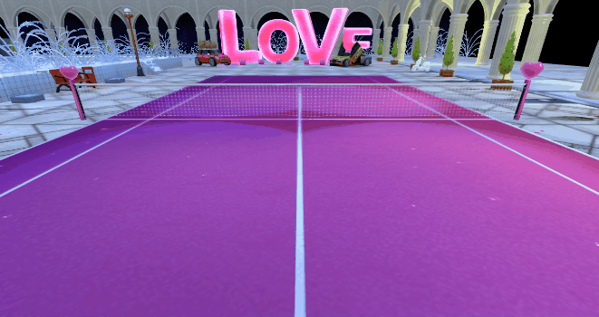

# 3D多场景运用示例

###多場面の運用

3 Dシーンは2 Dと混合して使用できるだけでなく、ステージ上にも複数の3 Dシーンがあり、2 Dに3 Dシーンを埋め込むことができ、シーン中のカメラビューを通じて、表示シーン画面の大きさと位置を制御することができる。

ゲームの中でよく使われています。例えば、キャラクターの属性インタフェースや、画面に3 Dキャラクターのモデルや動画が表示されます。装備バーで装備アイコンを変えたら、キャラクターのモデルも変更できます。

次の例では装備属性インターフェースを簡単にシミュレーションし（図1）、機能は画面をダブルクリックして装備インターフェースを開き、3 Dキャラクター待機動画と手元装備展示を表示し、画面のタイトルを押しながらドラッグできるインターフェースをクリックして、内部の3 Dシーン、キャラクターもフォローして移動します。

（図1）<br/>


###開発の考え方とコード

1、背景は3 Dメインシーンで、ゲームシーンの地図をロードする。

2、IDEで簡単なDialogタイプUIを作成し（Dialogはドラッグを設定することができる）、リリースする（図2）。RolePropViewクラスを確立してUIに継承し、単一の例モードに設定する（ほとんどのUIは単一の例である）。インタフェースの中にもう一つの3 Dシーンを作成して、キャラクターを表示するために、カメラのシャッターを2 Dインターフェースの大きさと一致させます。

(图2)</br>


3、インターフェイス追加後、マウスが画面上で押したり移動したりする時、メインシーンのカメラスクリプトが無効になり、インターフェイスの除去やマウスが画面上で押されないと有効です。スクリプトコンポーネントのenable属性で設定できます。

4、インターフェイスドラッグイベントの傍受を追加し、インターフェースをドラッグすると、インターフェースシーンでカメラのビューポイントが一緒に移動します。3 Dシーンのキャラクターは最初の位置にいます。

主なクラスLayaAir 3 DCGコードは以下の通りです。


```typescript

//初始化引擎
Laya3D.init(1280,720,true);
//适配模式
Laya.stage.scaleMode = Laya.Stage.SCALE_EXACTFIT;
Laya.stage.screenMode = Laya.Stage.SCREEN_NONE;
//开启统计信息
Laya.Stat.show();
//加载3D资源
Laya.loader.create(["LayaScene_loveScene/loveScene.ls","LayaScene_girl/girl.lh"],Laya.Handler.create(this,on3DComplete));

function on3DComplete(){
    //创建场景
    var scene = Laya.Scene.load("LayaScene_loveScene/loveScene.ls");
    Laya.stage.addChild(scene);
    //创建摄像机添加到场景
    this.camera = new Laya.Camera();
    scene.addChild(this.camera);
    //修改摄像机位置与方向
    this.camera.transform.translate(new Laya.Vector3(0,2,8),true);
    this.camera.transform.rotate(new Laya.Vector3(-23,0,0),true,false);
    //添加摄像机脚本并获取
    this.cameraScript = this.camera.addComponent(CameraMoveScript);

    //加载2D界面资源
    Laya.loader.load("res/atlas/comp.atlas",Laya.Handler.create(this,on2DComplete));
}
function on2DComplete(){
    //双击舞台创建角色属性UI
    Laya.stage.on(Laya.Event.DOUBLE_CLICK,this,createRoleUI);
}
function createRoleUI(){
    //创建角色属性UI（单例模型，预防打开多个）
    this.roleProp = RolePropView.getInstance();
    Laya.stage.addChild(this.roleProp);
    //界面拖动事件监听
    this.roleProp.on(Laya.Event.DRAG_MOVE,this,onDragMove);
    //鼠标在界面上按下时摄像机控制脚本失效
    this.roleProp.on(Laya.Event.MOUSE_DOWN,this,onScriptFalse);
    //界面移除或鼠标抬起后摄像机脚本启用
    this.roleProp.on(Laya.Event.RECOVERED,this,onScriptTrue);
    Laya.stage.on(Laya.Event.MOUSE_UP,this,onScriptTrue);
}
/*界面拖动回调*/
function onDragMove(){
    //摄像机控制脚本失效
    this.onScriptFalse();
    //界面中摄像机视口跟随移动
    this.roleProp.camera.viewport = new Laya.Viewport(this.roleProp.x,this.roleProp.y,this.roleProp.width,roleProp.height);
}
/*摄像机控制脚本启用*/
function onScriptTrue(){
    //摄像机控制脚本启用
    this.cameraScript.enable = true;
}
/*摄像机控制脚本失效*/
function onScriptFalse(){
    //摄像机控制脚本失效
    this.cameraScript.enable = false;
}
```


インターフェースクラスのRolePropViewは、内部で3 Dシーン、キャラクター、カメラを作成します。参考コードは以下の通りです。


```typescript

var RolePropView = (function(_super){
    function RolePropView(){
        RolePropView.super(this);

        //设置UI位置为居中显示
        this.xx = (1280 - this.width)/2;
        this.yy = (720 - this.height)/2;

        //与UI搭配的3D场景
        this.UIScene = new Laya.Scene();
        this.addChild(this.UIScene);

        //在对话框中，鼠标可点击触发拖动的区域
        this.dragArea = "0,0,520,80";

        //创建角色
        this.role = Laya.loader.getRes("LayaScene_girl/girl.lh");
        this.UIScene.addChild(this.role);
        //修改角色位置（超出摄像机视口后将不会显示）
        this.role.transform.translate(new Laya.Vector3(0,0,0),false);

        //创建摄像机
        this.camera = new Laya.Camera();
        this.UIScene.addChild(this.camera);
        //设置摄像机视口大小与UI一致
        this.camera.viewport = new Laya.Viewport(this.xx,this.yy,this.width,this.height);
        //摄像机位置
        this.camera.transform.translate(new Laya.Vector3(0,1.2,3),false);
        //关闭按钮事件监听
        this.btn_close.on(Laya.Event.MOUSE_DOWN,this,onClose);
    }
    Laya.class(RolePropView,"RolePropView",_super);
     /*角色装备UI界面单例方法*/
    RolePropView.getInstance = function () {
        if (this.instance == null) {
            this.instance = new RolePropView();
        }
        return this.instance;
    };
    /*关闭按钮事件回调*/
    function onClose(){
        //移除UI界面
        Laya.stage.removeChild(this);
        //恢复UI位置为居中显示
        this.pos(this.xx,this.yy);
        //恢复摄像机视口大小与位置
        this.camera.viewport = new Laya.Viewport(this.xx,this.yy,this.width,this.height);
    }
    return RolePropView;
})(ui.RolePropUI);
```


上記のコードをコンパイルして実行します。効果は図1に示します。