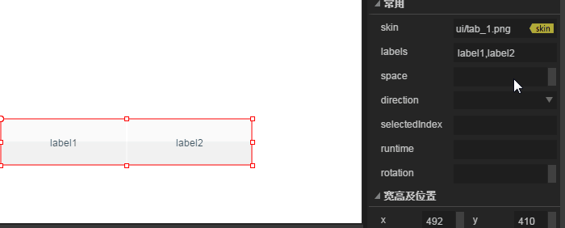

#Tabコンポーネント詳細

>多くのコンポーネント属性が共通であるため、一般的で一般的なコンポーネント属性は`属性设置器`文書で紹介しました。本編を読む前に、「プロパティ設定器」のドキュメントを読んでください。

##1、Tabコンポーネントを理解する

###1.1 Tabコンポーネントの役割

Tabコンポーネントは、タブボタンのセットを定義するために使用されます。例えば、複数ページの切り替え表示などです。図1に示すように。

 (図1)

###1.2 Tabセットの肌（skin）仕様

Tabセットの肌は`tab`または`tab_`プレフィックスの命名は、図2に示すように、皮膚設計規範において垂直等分の二状態図または三状態図である。

 (図2)三形Tab肌

*Tips：Tabコンポーネントの皮膚は九宮格属性が使えないので、資源設計の時に実際の応用時の大きさを決めます。*

###1.3 TabコンポーネントのAPI紹介

TabコンポーネントのAPI紹介は参考してください。[http://layaair.ldc.layabox.com/api/index.html?category=Core&class=laya.ui.Tab](http://layaair.ldc.layabox.com/api/index.html?category=Core&class=laya.ui.Tab)

##2、LayaAirIDEでTabコンポーネントを作成する

###2.1 Tabを作成する

クリックして選択`资源管理器`のTabコンポーネントのリソースを、シーンエディタにドラッグします。つまり、ページでTabコンポーネントを作成しました。図3に示すように。

​ (図3)

###2.2 Labelsでラベルを追加する

図3に示すように、デフォルトのTabコンポーネントには2つのラベルしかない。ラベルを追加したい場合は、labels属性に新たなラベルを追加すればいいです。ラベルのテキスト内容もこの属性に設定されています。図4-1に示すように動作します。

 (図4-1)

###2.3 Tabコンポーネントのレイアウト方向と間隔を変更する

Tabコンポーネントはデフォルトでは水平配列(*horizontal*)であり、direction属性を変更することにより、垂直配列(*vertical*)を実現する。**間隔を設定**space属性により実現できます。図4-2に示すように。
 

（図4-2）

###2.4ラジオ枠グループTabのデフォルトオプションを設定します。

selectedIndex属性は、Tabコンポーネントのインデックス値を変更するためのもので、デフォルトでは設定しない場合は、Tabコンポーネントのデフォルトのタブオプションを設定すると、selectedIndexの属性値、0は1番目のタブ、1は2番目のタブとして設定できます。これをもって類推する。動作効果は図4-3に示すようになります。

 

（図4-3）

##3、カスタムTabコンポーネント

上記の例では、同じTabリソースを使用して、labelsを設定することにより、3つのラベルのTabコンポーネントを生成した。しかし、実際のゲームでは、同じTabコンポーネントでラベルのスタイルに対するニーズが異なるため、labelsの設定では効果が得られません。この場合はカスタムTabコンポーネントを使用する必要があります。例えば図5に示す効果です。

​	 (図5)

###3.1美術資源の準備

次に、図6に示すように、3つの異なる2つの状態の美術リソースを使用してTabコンポーネントをカスタマイズします。

  (図6)

**Tips**:

特に写真の命名規則に注意してください。カスタムTabコンポーネントでは、複数のボタンコンポーネントを使っています。直接に使用することはできません。`Tab`コンポーネントの命名規則。使用できます`Button`コンポーネント`CheckBox`コンポーネント`Radio`コンポーネントの命名規則。図6で使用されるbtnプレフィックスは、Buttonコンポーネントの命名規則である。

​

###3.2 IDEでボタンを作成する

リソースをプロジェクトのリソースマネージャフォルダにコピーし、IDEで作成したButtonコンポーネントをリソースマネージャからシーンエディタにドラッグし、左から右にそれぞれのRadioコンポーネントのname属性を順次に「item 0、item 1、item 2...」に変更します。常に実行します。また、リソースは2状態ですので、stateNum属性値を2に設定する必要があります。ラベル属性を設定したテキストなどの効果を図7に示します。

 (図7)

###3.3 Tab容器コンポーネントに変換する

属性を調整したら、三つのボタンのセットを選択して、ショートカットキーを押します。`Ctrl+B`選択`Tab`コンテナコンポーネントをクリックします。`确定`変換が完了しました（図8）。

​ (図8)

変換に成功した後、デフォルトで選択された索引selected Indexは0（最初のTabタグ）、単一選択枠間隔spaceは4であり、方向directionは図9に示すように、設定しないか、または横方向に設定することができる。

​ (図9)

上記のいくつかのステップにより、カスタムTabコンポーネントの作成が成功したことが見られます。最初の選択ボックスがデフォルトで選択され、第3のフレーム選択状態に切り替わります。他の選択ボックスは第1のフレームが選択されていない状態です。

