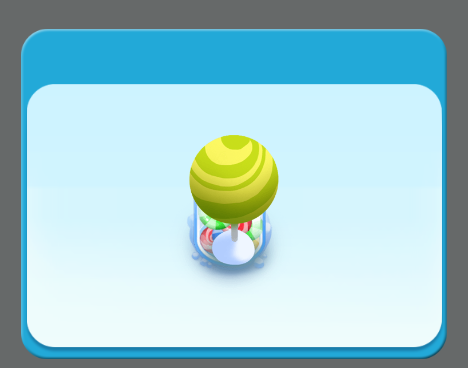
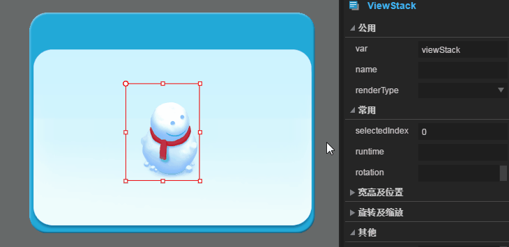

#View Stockコンポーネントの詳細

>多くのコンポーネント属性が共通であるため、一般的で一般的なコンポーネント属性は`属性设置器`文書で紹介しました。本編を読む前に、「プロパティ設定器」のドキュメントを読んでください。また、本編ではTabコンポーネントの知識について触れますので、Tabコンポーネントの詳細な文書を読んでください。

##1、View Stockコンポーネントを理解する

###1.1 View Stockコンポーネントの役割

View Stockコンポーネントは主に複数ページビューの切り替えに使用されます。複数のサブページが含まれていますが、デフォルトでは一つしか表示されません。サブページ索引で表示切り替えができます。一般的にはTabラベルと組み合わせてラベル切り替えページを作ります。図1に示すように。

<br/>(図1)

###1.2 View Stockコンポーネントのリソース（skin）仕様

View Stockコンポーネントは通します。`Ctrl+B`変換された容器類のコンポーネントは、独立したコンポーネントのリソース仕様がありません。この例では直接的にイメージコンポーネントのリソースを採用していますが、実際のゲーム開発では、実際の開発ニーズに応じて様々なUIコンポーネントを利用することができます。

###1.3 View StockコンポーネントのAPI紹介

View StockコンポーネントのAPIは使用します。参照してください。[http://layaair.ldc.layabox.com/api/index.html?category=Core&class=laya.ui.ViewStack](http://layaair.ldc.layabox.com/api/index.html?category=Core&class=laya.ui.ViewStack)。


##2、LayaAirIDEでView Stockコンポーネントを作成する

###2.1 View Stockページを作成する

####2.1.1美術資源の準備

ページの背景図と切り替えが必要なページ美術リソースを用意し、LayaAirIDEリソースマネージャに対応するプロジェクトディレクトリに入れます。

####2.1.2ページ背景画像のための九宮格の設定

ポップアップボックスのページの背景は通常九宮格を採用します。ここではまず背景の九宮格の属性を設定します。図2-1に示すように。

<br/>(図2-1)

####2.1.3ページの背景を作成する

九宮格を設定したばかりの背景図をシーンエディタにドラッグします。図2-2に示すように。

<br/>(図2-2)

####2.1.4 View Stockページを作成する

ページに関連するUIの基礎コンポーネントをuiファイルの`场景编辑器`を選択して、ショートカットキー`Ctrl+B`変換`ViewStack`容器セット。図3-1に示すように。

 <br /> (动图3-1)


####2.1.5 View Stockコンポーネントのサブページname属性を設定する

View Stockサブページname属性の命名規則は、item 0、item 1、item 2…です。」より多くのページがあれば、図3-2に示すように、この規則に従ってname属性を追加しないと、生成されたView Stockコンポーネントは無効なコンポーネントであり、正常に動作しません。

<br/>(図3-2)

**Tips**:*name属性は、そこの文字はitemでなければなりません。他の文字に変えられません。変更が完了したら、View Stockサブページを終了したら、デフォルトではitem 0のみを表示する場合は正常です。そうでないと、View Stockコンポーネントは有効になりません。*


####2.1.6ページのUIレイアウトを調整する

name属性を設定したら、veiwStockコンポーネントにダブルクリックして、サブページのUIレイアウトを調整します。この例では、異なるページで使用されるリソースのサイズと位置を調整し、3つのサブページを中央に配置します。効果を図3-3に示します。


​        <br/>(図3-3)


###2.2 View Stockのページ索引selectedIndexを設定する

View Stockコンポーネントはデフォルトでは、name属性はitem 0のピクチャを表示します。デフォルトのインデックスの属性selectedIndexのデフォルト値は0です。我々は、selectedIndex属性値を調整することにより、View Stockコンポーネントのデフォルト表示ページを変更することができます。効果は図4に示すようになります。

<br/>（动图4）


**Tips**:

**View StockコンポーネントのVar値は必ず設定し、コード作成時にVar名声の大域変数によってView Stockコンポーネントを制御し、selectedIndexの属性を変更して、ページの切り替えを実現する必要があります。本例ではview Stockを採用していますが、図4の右上に示すように、開発者は別の名前を付けてもいいです。**


###2.3制御用Tabラベルの作成

通常、View Stockコンポーネントは、対応する制御ラベルを必要とし、我々はTabタグを作成して、View Stockのサブページ切り替え表示を制御する。

リソースパネルのTabコンポーネントを選択し、UIページのシーンエディタにドラッグしてTabコンポーネントを生成します。Tabコンポーネントの美術資源は図5に示すように、上の図の背景スタイルとセットになっています。

​<br/>
（図5）

Tabコンポーネントをエディタにドラッグした後、位置を背景図に合わせて配置します。共通属性varをtabに設定し、プログラム起動制御に使用します。常用属性のlabelsを設定します。「雪だるま、砂糖缶、緑の木」ボタンインデックスは0です。他の属性のフォントサイズ、太字、フォントの状態色などを設定します。

表示効果は図6に示す通りです。


​        <br/>

（図6）


##3、コード制御によるView Stockコンポーネントの切り替え表示

上記のいくつかの制作ステップでは、IDE内のコンポーネントの作成と組み合わせを完了しました。次に、プログラムコードを通じてTabタグとView Stockのサブページの切り替え表示を関連づけます。

ページを保存して、F 12でページを発表して、発表した後にlayaUID.max.all.jsファイルの中で生成して、私達は直接それを使います。


ComponentDemo.jsを作成し、デフォルトのプログラムを設定して、コードを作成します。


```javascript

Laya.init(1334, 750,Laya.WebGL);
Laya.stage.scaleMode = "full";
Laya.stage.bgColor = "#ffffff";
//加载图集成功后，执行onLoaded回调方法
Laya.loader.load("res/atlas/comp.atlas",Laya.Handler.create(this,onLoaded));
function onLoaded(){
    //创建一个UI实例
    this.comp = new ui.ComponentDemoUI();
    //添加到舞台上显示
    Laya.stage.addChild(this.comp);
    //点击Tab选择按钮的处理
    this.comp.tab.selectHandler = new Laya.Handler(this,onSelecte);
}
/**根据选择Tab的索引切换页面**/
function onSelecte(index){
    //切换ViewStack子页面
    this.comp.viewStack.selectedIndex=index;
}
```


図10に示すように、例示コードを実行します。

<br/>（动图10） 