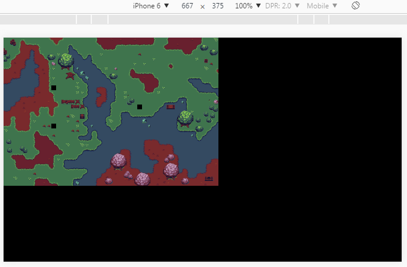
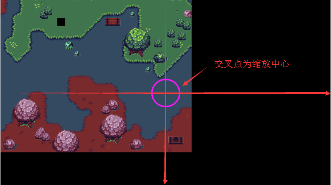
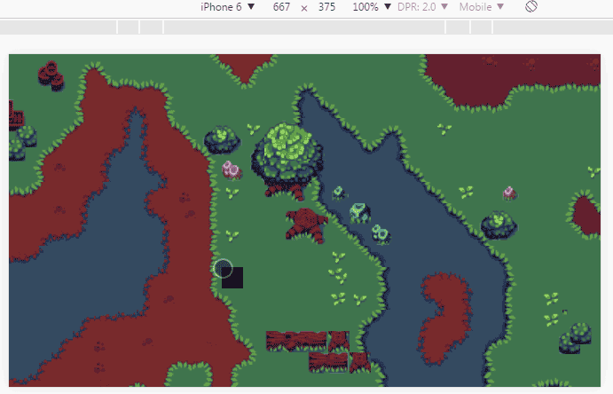
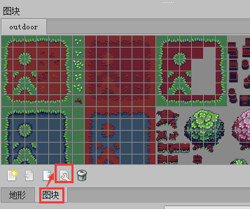
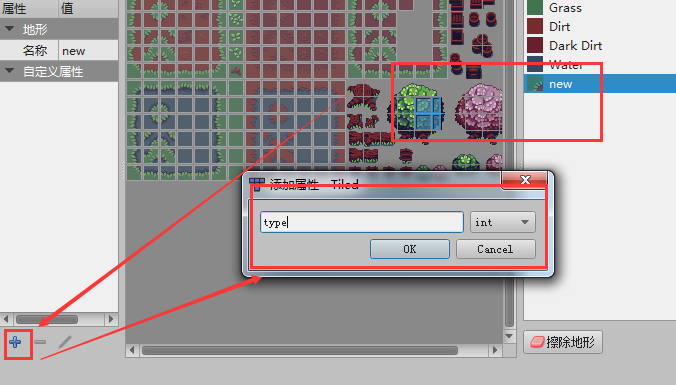

#LayaAirエンジンでTiled Map地図を解析します。

>author：charley

Tiled Map Editorは無料の地図エディタで、2 Dゲームの地図を編集することができます。LayaAirエンジンはTiled Mapから導出された地図を解析することをサポートします。本稿ではLayaAirエンジンの開発にTiled Map Editorを用いて導出した地図を紹介します。

>ここでは、Tiled Map地図ツールを熟知し、使用している開発者にのみ向いています。記事で紹介したTiled Map Editorの地図はLayaAirエンジンの項目でどのように使われていますか？Tiled Map Editorツールの自身の内容については、自分で第三者教程文書を調べてください。
>
>本文書の一部はLayaAirエンジンの1.7.7バージョンで追加されました。本記事を読む前にエンジンを1.7.7バージョンまたはそれ以上に更新してください。


##1、エンジンサポートのTiled Map地図をエクスポートします。

###1.1 Tiled Map Editorダウンロードインストール

公式ホームページを開く([http://www.mapeditor.org/](http://www.mapeditor.org/))をクリックします。`DownLoad at itch.io`ボタンをクリックしてダウンロードリンクに入ります。[https://thorbjorn.itch.io/tiled](https://thorbjorn.itch.io/tiled)を選択します。公式サイトが変更されたら、直接にページをダウンロードすることもできます。[http://www.mapeditor.org/download.html](http://www.mapeditor.org/download.html)ダウンロードリンクが見つかりました。

対応するシステムバージョンのリンクを見つけて、インストールをダウンロードしてください。

**Tips**:

*ダウンロードを開くと、協賛ソフトの有料ページが表示されます。お金を払いたくないなら、直接にNo thanksをクリックして、just take me to the downloadsをクリックして、無料ダウンロードのリンクに連れて行きます。*

*公式サイトのバージョンに問題があれば、github`https://github.com/layabox/layaair-doc`64ビットのwindows版のTiled 1.1.5*があります。


###1.2エクスポートエンジンがサポートするTiled Map地図フォーマット

Tiled Mapツールの具体的な使い方については、本論では多く説明しないで、自分でBaiduまたはGoogleの中で関連教程文書を検索することができます。エンジンと大きな関係があるのはフォーマットです。開発者が特に注意する必要があります。普通問題が発生するのはここでは注意していません。

####1.2.1地図を作成する場合、ブロック層のフォーマットに対する要求

新しい地図をクリックして、地図の大きさやブロックの大きさなどの初期パラメータを設定してから、名前を付けて保存してください。指定された位置があれば作成が完了します。

しかしながら、ブロック層フォーマットは、特に注意が必要である。**LayaAirエンジンは、Tiled Map地図がBase 64のブロック層フォーマットをサポートしていません。**だからここで`创建`新しい地図の場合**必須**を選択します`CSV格式`を選択します。

 


（図1）

**作成時に選択が間違ったら**を選択します。`图块层格式`**CSVまたはXMLに変更します。**は、図2に示すように、**Base 64に関するフォーマットはサポートされていません。**

 


（図2）

####1.2.2 Json形式にエクスポート

この例では、Tiled Mapの地図例orthogonal-outside.tmx(*Tiled Map地図インストールディレクトリのexamplesディレクトリの下にある*)を直接開きます。

#####エクスポートする時、私達はjsonのフォーマットを選びます。

Tiledツールの`文件`メニューからクリックします`另存为`完成したTiled地図を、jsonファイルタイプとして保存します。この例はorthogonal.jsonと名づけて、クリックしてください。`保存`を選択します**プロジェクトディレクトリ内**（この例は`项目根目录\bin\h5\res\TiledMap\`）を示します。

 


（図3）

###1.3図セットのパスを変更し、Tiledリソースをコピーする

#####ただjsonファイルとして保存するだけでは足りません。imageの絶対パスを相対パスに変更したいです。

私たちはIDEを通じて、先ほど保存したものを開けます。`orthogonal.json`を選択して、キーワードを検索します`"image"`デフォルトのイメージパスはTiledインストールディレクトリにあります。図4に示すように。

 


（図4）

#####パスはTiledのインストールディレクトリでは絶対だめです。

ですから、私たちはまずこの画像をプロジェクトディレクトリにコピーします。**を選択します。`orthogonal.json`同級である****


如图5所示。

 


#####（図5）
****
そしてorthogonal.jsonの中の`image`**パスを相対パスに変更しました。＊`"image":"buch-outdoor.png",`

準備段階が終わり、次は符号化段階に入ります。


##2、LayaAirエンジンはTiled Map地図を使用する。

###2.1 TiledMap地図を作成する

####2.1.1 createMap APIの説明

laya.map.TiledMapクラスのcreateMap方法はTiledMap地図を作成することができます。基本的なパラメータの説明は図6に示します。

 


（図6）

####2.1.2地図の作成例


```java

// 程序入口
class GameMain{
    private tMap:Laya.TiledMap;
    constructor()
    {
        //初始化舞台
        Laya.init(Laya.Browser.width,Laya.Browser.height,Laya.WebGL);
        //创建TiledMap实例
        this.tMap = new Laya.TiledMap();
        //创建Rectangle实例，视口区域
        var viewRect:Laya.Rectangle = new Laya.Rectangle();
        //创建TiledMap地图
        this.tMap.createMap("res/TiledMap/orthogonal.json",viewRect);
    }
}
new GameMain();
```


コードをコンパイルして実行します。効果は図7に示すように、地図が作成されました。

 


（図7）

###2.2制御地図

コントロールマップは先に地図のjsonをロードして、それからコールバックの方法の中で制御しなければなりません。実例に関連した用法を以下で理解する。

####2.2.1地図の拡大縮小

`laya.map.TiledMap`クラスの`scale`属性は地図のスケールをコントロールできます。私達は以前の例をそのまま使って、createMap方法の中で、リフレクトを追加して、それから使用します。`scale`属性は地図を拡大縮小します。

サンプルコードは以下の通りです。


```typescript

// 程序入口
class GameMain{
    private tMap:Laya.TiledMap;
    constructor()
    {
        //初始化舞台
        Laya.init(Laya.Browser.width,Laya.Browser.height,Laya.WebGL);
        //创建TiledMap实例
        this.tMap = new Laya.TiledMap();
        //创建Rectangle实例，视口区域
        var viewRect:Laya.Rectangle = new Laya.Rectangle();
        //创建TiledMap地图，加载orthogonal.json后，执行回调方法onMapLoaded()
        this.tMap.createMap("res/TiledMap/orthogonal.json",viewRect,Laya.Handler.create(this,this.onMapLoaded));
    }
    private onMapLoaded():void{
        //将原地图放大2倍
        this.tMap.scale = 2;
    }
}
new GameMain();
```


運転効果は図8に示します。

 


（図8）

####2.2.2地図の拡大縮小の中心点を設定する

明らかに、図8の効果は私たちが望むものではない。拡大後。一部は表示されていません。これはデフォルトのズームの中心点であり、視認口の中心領域に起因します。

####ビューエリアとデフォルトのズーム中心点の位置

ビューエリアは地図作成方法(*createMap*)の2番目のパラメータに設定されています。


```java

//创建Rectangle实例，视口区域
var viewRect:Laya.Rectangle = new Laya.Rectangle();
//创建TiledMap地图，加载orthogonal.json后，执行回调方法onMapLoaded()
this.tMap.createMap("res/TiledMap/orthogonal.json",viewRect,Laya.Handler.create(this,this.onMapLoaded));
```


コードを見ると、ブラウザの物理的な幅の高さにビューが設定されていることが分かります。`Laya.Browser.width, Laya.Browser.heigh`を選択します。スケーリングを制御する方法は、setViewPortPivotByScaleのデフォルト値が0.5です。それでは、中心点の位置は図9-1に示されています。

 


（図9-1）

地図を二倍に拡大すると（`this.tMap.scale = 2;`）ビュー領域のxとy軸の中心点でのズームですので、拡大すると図9-2の効果があります。

 


（図9-2）

次に、図9〜3を動かして、原図比の0.1から2倍のスケーリング変化効果により、scale属性の中心点をさらに理解する。

 


（図9-3）

####setView PortPivotByScaleで拡大縮小の中心点を設定します。

前に紹介したのは、標準のズーム中心の効果です。ズームの中心点はどう設定して変えますか？はい、`laya.map.TiledMap`クラスの`setViewPortPivotByScale()`メソッドは、ビューの中心点を設定することができます。APIベースの説明は図10に示されている。

 


（図10）

`setViewPortPivotByScale()`方法の最初のパラメータscaleXはX軸方向のスケーリング座標スケールであり、scaleYはY軸方向のスケーリング座標スケールである。

たとえば:


```java

this.tMap.setViewPortPivotByScale(0.1,0.5);
```


**コード説明**:

ビューのサイズを800*600と仮定します。

-scaleX値`0.1`x軸拡大縮小の中心点を示す座標は80（800＊0.1）

-scaleY値`0.5`y軸の拡大縮小の中心点を示す座標は300（600＊0.5）です。

コード運転時はx軸80、y軸300を目視口の中心点座標としてスケーリングします。


####拡大縮小の中心点を目視口の左上に設定します。

setView PortPivotByScaleの中心点が、`0,0`を選択します。前の例をそのまま使用して、コードは以下の通りです。


```typescript

// 程序入口
class GameMain{
    private tMap:Laya.TiledMap;
    constructor()
    {
        //初始化舞台
        Laya.init(Laya.Browser.width,Laya.Browser.height,Laya.WebGL);
        //创建TiledMap实例
        this.tMap = new Laya.TiledMap();
        //创建Rectangle实例，视口区域
        var viewRect:Laya.Rectangle = new Laya.Rectangle();
        //创建TiledMap地图，加载orthogonal.json后，执行回调方法onMapLoaded()
        this.tMap.createMap("res/TiledMap/orthogonal.json",viewRect,Laya.Handler.create(this,this.onMapLoaded));
    }
    private onMapLoaded():void{
        //设置缩放中心点为视口的左上角
        this.tMap.setViewPortPivotByScale(0,0);
        //将原地图放大2倍
        this.tMap.scale = 2;
    }
}
new GameMain();
```


拡大縮小の中心点を視認口の左上隅に設置し、さらに2倍拡大する場合、iPhone 6の設備にフルスクリーンを敷いてもいいです。効果は図11に示すようになります。

 


（図11）


###2.3地図をドラッグする

地図が拡大されると、全部表示できません。この場合は地図をドラッグしてすべてを見る必要があります。

地図をドラッグするには、前に紹介した方法のほかにも、必要です。`moveViewPort()`（アイコンタクトの移動）方法と`changeViewPort()`（目元の大きさを変える）方法です。これらの2つのAPIの基礎は、図12−1および12−2に示されている。

 


（図12-1）


 


（図12-2）

コードを直接確認して、この二つの方法の使用を理解します。


```typescript

// 程序入口
class GameMain{
    private tMap:Laya.TiledMap;
    private scaleValue:number = 0;
    private MapX:number = 0;
    private MapY:number = 0;
    private mLastMouseX:number;
    private mLastMouseY:number;
    constructor()
    {
        //初始化舞台
        Laya.init(Laya.Browser.width,Laya.Browser.height,Laya.WebGL);
        //创建TiledMap实例
        this.tMap = new Laya.TiledMap();
        //创建Rectangle实例，视口区域
        var viewRect:Laya.Rectangle = new Laya.Rectangle();
        //创建TiledMap地图，加载orthogonal.json后，执行回调方法onMapLoaded()
        this.tMap.createMap("res/TiledMap/orthogonal.json",viewRect,Laya.Handler.create(this,this.onMapLoaded));
    }
    private onMapLoaded():void{
        //设置缩放中心点为视口的左上角
        this.tMap.setViewPortPivotByScale(0,0);
        //将原地图放大3倍
        this.tMap.scale = 3;

        Laya.stage.on(Laya.Event.RESIZE,this,this.resize);
        Laya.stage.on(Laya.Event.MOUSE_DOWN, this, this.mouseDown);
        Laya.stage.on(Laya.Event.MOUSE_UP, this, this.mouseUp);
        this.resize();
    }
    /**
     * 移动地图视口
     */
    private mouseMove():void{
        var moveX:number = this.MapX - (Laya.stage.mouseX - this.mLastMouseX);
        var moveY:number = this.MapY - (Laya.stage.mouseY - this.mLastMouseY)
			//移动地图视口
        this.tMap.moveViewPort(moveX, moveY);
    }
    private mouseUp():void
    {
        this.MapX = this.MapX - (Laya.stage.mouseX - this.mLastMouseX);
        this.MapY = this.MapY - (Laya.stage.mouseY - this.mLastMouseY);
        Laya.stage.off(Laya.Event.MOUSE_MOVE, this, this.mouseMove);
    }
    
    private mouseDown():void
    {
        this.mLastMouseX = Laya.stage.mouseX;
        this.mLastMouseY = Laya.stage.mouseY;
        Laya.stage.on(Laya.Event.MOUSE_MOVE, this, this.mouseMove);
    }		
    

    /**
     *  改变视口大小
     *  重设地图视口区域
     */	
    private resize():void
    {
        //改变视口大小
        this.tMap.changeViewPort(this.MapX, this.MapY, Laya.Browser.width, Laya.Browser.height);
    }
}
new GameMain();
```


コード運転効果は図13に示すとおりです。

 


（図13）


##3、Tiled Map使用最適化

###3.1地図を廃棄する

Tiled Mapaが使用されなくなった場合は、destroy（）方法を用いて廃棄し、占有されたメモリを回収する必要があります。

たとえば:


```java

this.tMap.destroy();
```


###3.2キャッシュ関連

####3.2.1自動キャッシュのオンとオフ

LayaAirエンジンがTiledMapを使用すると、デフォルトでは動画のないブロックが自動的にキャッシュされ、キャッシュタイプはデフォルトではnormalとなります。


```java

//自动缓存没有动画的地块
this.tMap.autoCache = true;
//自动缓存的类型,地图较大时建议使用normal
this.tMap.autoCacheType = "normal";
//消除缩放导致的缝隙,也就是去黑边，1.7.7版本新增的优化属性
this.tMap.antiCrack = true;
```


以上のコード属性はエンジンのデフォルトです。多くの場合、デフォルト値を維持すればよく、追加設定は必要ありません。

なぜもう一度紹介しますか？

キャッシュした後のTiled地図には黒いエッジが現れることがあるからです。1.7.7バージョンでantiCrack属性が追加されましたが、normalキャッシュによるほとんどの黒辺を消去することができます。しかし、現在の黒い問題が解決されていない場合。自動キャッシュをオフにすることで、黒縁（すきま）問題を解決することができます。

####3.2.2キャッシュブロックサイズの設定

####キャッシュブロックの設定推奨

TiledMap地図はすべて一つのセルブロックをつなぎ合わせて構成されています。キャッシュ時に元のサイズを維持すると、ブロックが多い場合、パフォーマンスに影響があります。したがって、キャッシュブロックの設定を開始し、キャッシュブロックのサイズを512ピクセル程度に設定し、元のブロックの整数倍を維持しなければならないことを提案します。

例えば、本明細書の例の単一ブロックサイズは`16*16`キャッシュブロックは16の32倍、すなわち`512*512`。

単図であれば`15*15`を選択します。`510*510`（34倍）は、このように類推して、できるだけ元のブロックの整数倍を前提に512前後に設定されます。おすすめ`为512*512`。

####キャッシュブロックの具体的な設定方法

キャッシュブロックの設定はクリアーマップ作成時に設定する必要があります。4番目のパラメータgridSizeを設定します。例は以下の通りです。


```javascript

//为第二个参数创建Rectangle实例，视口区域
var viewRect:Laya.Rectangle = new Laya.Rectangle(0, 0, Laya.Browser.width, Laya.Browser.height);

//为第四个参数gridSize创建一个512*512大小的Point对象实例
var gridSize:Laya.Point = new Laya.Point(512, 512);

//创建TiledMap地图
this.tMap.createMap("res/TiledMap/orthogonal.json",viewRect, Laya.Handler.create(this,this.onMapLoaded), null, gridSize)
```


###3.3レイヤーを結合する

####3.3.1統合レイヤーを開く

TiledMapに複数のレイヤーがある場合は、統合レイヤーのプロパティenabeleMergLayerを開いて、レイヤーを結合して、性能を向上させます。

オープンの方式は:


```java

//开启图层合并
this.tMap.enableMergeLayer = true;
```


**Tips**:

注意したいのは、統合前のレイヤーを操作する必要があるとそのまま統合できません。合併により、前のレイヤーを操作できなくなります。

####3.3.2レイヤーをグループ化する

TiledMapでレイヤーをグループ化していないと、レイヤーが結合されると、すべてのレイヤーが結合されます。したがって、複数のレイヤーに分けてそれぞれ操作する必要がある場合。TiledMapでレイヤーをグループ化できます。

####TiledMapレイヤーのグループ化方式：

TiledMap地図エディタを開き、グループ化するレイヤーを選択して、レイヤーのカスタム属性バーに名前を付けます。`layer`の`string`タイプの属性図14-1に示すように動作します。

 


（図14-1）

OKをクリックして、追加が完了したら、カスタム属性のレイヤーを追加しました。グループ名を設定します。

例えば、ブロック層2とブロック層3のパケット名をlayaAirとします。layaAirというレイヤーは、enabeleMergLayerを開いたら、同じレイヤーに結合されます。操作は図14-2に示します。

 


（図14-2）

統合したレイヤーを開くと、レイヤー属性にlayer属性を追加できます。動作時は隣のレイヤーと同じ属性のレイヤーを結合して性能を向上させます。

####3.4カバーされた格子を除去する

下層の格子が遮蔽され、遮蔽ブロックが透明ではない場合、レンダリングされずに遮蔽された部分が直接除去され、性能を向上させることができる。

上書きされたオープンを削除するには、次のようにします。


```java

//移除被非透明地块覆盖的部分
this.tMap.removeCoveredTile = true;
```


**Tips**:

開いたら、取り外された部分を操作することは不可能です。この機能をオンにする前に、削除部分を操作しないことを確認します。

####removeCoveredTileオープンの前提

Tiled Mapにない場合は、`图块`設定`type`属性は、removeCoveredTileを開いても無効です。したがって、開く前に、先にTiledMapエディタで、ブロックのためにカスタム属性typeを追加し、1に設定する必要があります。

**Tiled Mapでブロックtypeを設定する操作方法**

ブロックパネルで、ブロック編集をクリックして、ブロック地形編集パネルを開きます。動作は図15-1に示されています。

 


（図15-1）

ブロックの地形編集パネルで、地形を選択し、ユーザー定義の属性バーをクリックします。`+`アイコンをクリックして、追加します`int`タイプ`type`を選択します。OKをクリックして追加を完了します。操作は図15-2に示すとおりです。


 


（図15-2）

追加が完了したら、type属性値を1に設定します。動作は図15-3に示すとおりです。

 


（図15-3）

カスタム属性typeが1の地形に設定されている限り、removeCoveredTileがオンされた後に。遮蔽されて見えない場合は、性能を向上させるために、除去されてもよい。


##この文章は賞賛します

本論文があなたのために役立つと思ったら、スキャンコードの作者への賞賛を歓迎します。激励は私たちがより多くの優れた文書を書くための動力です。

