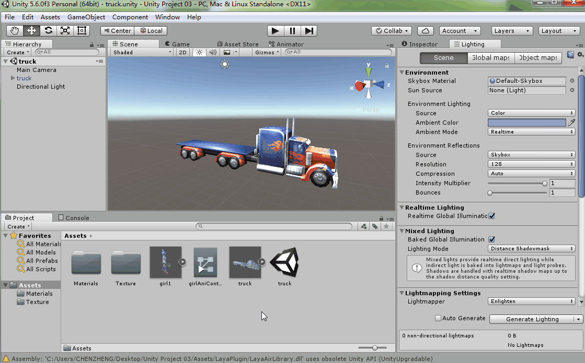
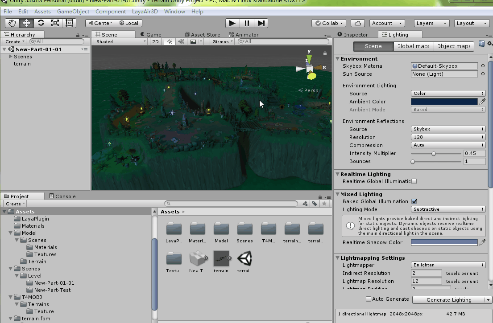
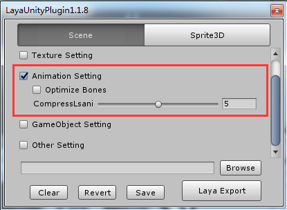
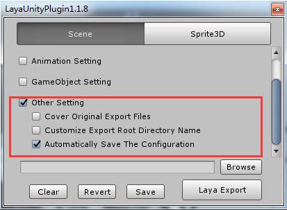

##Unityプラグインの使用

>###重要なヒント:

###LayaAir 1.xバージョンのエンジンは、似合うのはUnity 5.6.6 xです。ですから、開発者はUnity 5.6.6 xのバージョンをダウンロードすることに対応してください。他のバージョンについては、一部互換性がない場合があります。


###LayaAir 3 Dエクスポートツールをダウンロード

ダウンロードアドレスhttp://ldc.layabox.com/download/tools/LayaAir 3 D Convert Tools.zip

または、ガイド下のメニュー-----ツール----3 D変換ツール（図1）。

ダウンロードが完了したら、私たちはFBXフォーマットを変換するためのFBXToolsツールを見ることができます。このツールは今のところ更新を維持しません。開発者たちにもう一つのunityを使ってプラグインをエクスポートするツールを提案します。開発者たちがゲームの世界を構築して、使用を導き出すのに便利です。

<br>（图1）


###エクスポートプラグインのインストール

unityを起動し、新規プロジェクトを作成し、ゲームに必要な資源や材質、スタンプなどを導入し、プロジェクト名を自分のニーズに合わせて命名することができます。ctrl+sは私たちのシーンを保存しています。ここに名前をtruckといいます。

リソース管理画面で、LayaAir 3 D変換ツールを右クリックして導入します。プラグインバージョンはLayaAirエンジン機能の増加により更新されますが、導入方法は完全に一致しています。

インポートツールが成功すると、リソース管理画面にLayaPluginというフォルダが表示されます。また、unityメニューバーにはリードプラグインメニューLayaPluginも表示されます。図2のように：

<br>（图2）


​

###エクスポートリソースの設定

私たちはunityで車のモデルを作成して、LayaAirのプラグインでエクスポートします。メニューバーのLayaPluginをクリックすると、エクスポートパネルが表示されます。ここで詳しく説明します。

<br/>(図3)


####リソースのカテゴリをエクスポート

**Sceneカテゴリ**シーン全体を指すのです。シーンの中のモデル、材質、スタンプ、動画、またはフォトスタンプのすべての導出に関わらず、主にシーン制作に使われます。ファイルの拡張子はlsです。Sceneクラスまたはその継承クラスでロードする必要があります。

**Sprite 3 Dカテゴリ**シーンに比べて光照贴图の導出が少なく、キャラクターやゲーム中のアイテムの単独リソース導出によく使われます。ファイルの拡張子は.lhで、Spite 3 Dでロードします。

それらのローディングは「3 D技術文書-LayaAir 3 Dモデル編」で紹介します。

####Meshセット

グリッドデータの導出設定は、チェックした後に2つの情報（図4）が現れ、それらのは圧縮モデルのグリッドlmファイルサイズとして機能し、プロジェクトのようにカットしないことを推奨します。

Ignore Vetices Tangentは、頂点カット情報を無視します。
Ignore Vetices Colorは頂点色情報を無視します。

<br/>(図4)


####Texture Setting

スタンプ導出設定は、チェックした後に（図5）のような情報が出てきます。layaAirエンジンでは、pngとjpg形式の画像しかサポートされていません。項目に他のフォーマットが使用されていると、ゲームローディング時にエラーが発生するため、変換が必要です。

Original Texture Typeは、フォーマットのオリジナルテクスチャフォーマットの種類を変換する必要があります。
Non-PNG|JPG非png𞓜jpgは現在tga、pspd、gif、tif、bmp、exrフォーマットをサポートしています。
PNG、JPG原始シーンで使用されているpngフォーマットのリソース及び使用されているjpgフォーマットのリソース
LightMapの光は貼る図を照らして、（Sceneカテゴリを選んでエクスポートしてこそある）、手動ps処理を提案します。

ターゲットテクスチャタイプの変換
PNGはpng形式に変換され、透明チャンネルがあります。
JPG変換はjpgに圧縮機能が付いています。圧縮品質を選択できます。

<br/>(図5)


####Animation Setting

アニメーションのエクスポート設定(図6)

Optimize Bonesは、無駄な骨格を削除します。骨格の動画再生に影響しない無駄な骨格だけを削除します。骨格を作るなら、慎重に選んでください。
Copress Lsaniは一時的に不要です。開発中、骨格動画データを圧縮し、ファイルサイズを小さくします。

<br/>(図6)


####Terrain Setting

unity型導出設定（図7）

Covert Terrain To Mesh
シーンに地型がある場合は、メッシュモデルに変換します。
untiyの地型の製作はとても便利で、筆で地の形の高さを描くことができます。例えば、山川や川の溝など、ブラシで複数の細部のスタンプを描くこともできます。LayaAirエクスポートプラグインは地の形をMeshに変えて開発者に使いやすいです。違いは材質と普通の材質が違っています。細かいスタンプが含まれています。

Resolution
導出したモデルグリッド面数の最適化設定は、通常はMedium中程度でOKです。以下は設定された最適化レベルで、小1級あたりは4で割った面数の精度に相当します。
Very Height最適化後の面数が最高です。
Height最適化後の面数は相対的に高いです。
Medium最適化後の面数は中ぐらいです。
Low最適化後の面数が低い
Very Low最適化後の面数が一番低い

<br>（图7）


####GameObject Setting

ゲームアイテムノード設定（図8）

Ignore Null Game Objecs
エクスポート時は空ノードを無視し、LayaAirエンジンがサポートしていないノードもライトノードのように空ノードとして記憶し、精霊数を減らすことができます。
注：1.5.0版はカメラのエクスポートに対応していますので、空きノードを無視してカメラのエクスポートに影響はありません。

Ignore Not Active Game Object
エクスポート時にunityシーンで非アクティブなノードを無視します。

Optimize Game Objects
エクスポート時にunityシーンの第1段ノードからフラットツリー構造を撮影し、不要なノードをすべて削除し、精霊数を最大限に減らすことができます。

バッtch Make The First Level Game Object
バッチ導出（sprite 3 dを選択しなければならない）は、シーン内のすべてのステージノードを一括して導出する。


 <br>（图8）


####Other Setting

その他設定（図9）

カバーOriginal Export Files
エクスポート時に元のエクスポートファイルを上書きします。

Custoomize Export Root Directory Name
フォルダ名をカスタマイズしてエクスポートします。デフォルトのフォルダ名は「layaScene+シーン名」です。

Automatic ally Save The Configration
エクスポート時に現在の設定を自動保存します。


 <br/>(図9)


####エクスポートの設定

Borowerが保存するファイルパス
Clear Configは現在の設定をクリアします。
Revert Configは設定テーブルから保存されているプロファイルを読み込みます。
Save Configは現在の設定を保存し、保存後、次のオープン後に直接に使用する前に配置され、開発者たちが操作しやすいです。
LayaAir RunをクリックするとLayaAirエンジンを使って直接にこのシーンを実行できます。
LayaAirRun使用上の注意事項：
1.Node環境、express拡張モジュールを設置しなければならない（ツールにはexpressが内蔵されています。正常に使用できない場合は、自分でインストールしてください）。
2.シーンではカメラがあることを確保し、自分でその位置、角度を調整し、最終的にはlayaAir運行効果はUnity運行結果と一致します。
LayaAir Exportは現在のリソースをエクスポートし、クリックすると、現在のシーンまたはモデルのデータを指定のパスにエクスポートします。


 <br/>(図10)


###エクスポートするリソースを簡単に紹介します。

出力シーン設定を設定した後、Laya Exportボタンをクリックし、エクスポートしたらデフォルトのLayaSchengrouckフォルダが生成されます（図10）。


 <br>（图11）


上の図のファイルリソースを参照してください。エクスポート後に.ls、.lm、.lmatデータリソース、およびスタンプpng、tgaリソースが生成されます。

lsはシーンファイルで、Sceneカテゴリをエクスポートする時に生成します。シーンに必要な各種データ、モデル、光照射スタンプ、位置などを含んで、Sceneクラスでロードします。

.lhはモデルファイルで、Sprite 3 Dカテゴリをエクスポートするときに生成されます。光のマッピングファイルの情報が不足しています。他は.lsと同じです。

lmはモデルデータファイルであり、FBXフォーマットの変換に相当し、Mesh Sprite 3 Dクラスでロードできます。

lmatは材質データファイルで、unityでモデルに設定された材質情報で、ロード.lsまたは.lhファイルの場合は自動的にロードされます。lmatは材質が発生します。lmatはまた、いくつかの属性を手動で変更することができます。

laniは動画データファイル（図10のモデルは動画がないので、エクスポート時には生成されません）であり、モデルに動画があれば、エクスポート後にアニメーション構成ファイルを生成し、骨格やフレームアニメーション情報を含んでいます。

これらの具体的な使い方は、後続の授業ドキュメントで詳しく紹介されます。


###簡単な読み込み例

私たちはLayaSceencuruckフォルダの内容を全部プロジェクトのルートディレクトリのbin/h 5/下にコピーします。

Tips：この章では、簡単なローディングアプリケーションだけを紹介しています。エクスポートすると、様々なフォーマットが生成されます。その詳細な説明は、3 D技術文書の「LayaAir 3 DシーンScene」と「LayaAir 3 Dモデル」篇で紹介します。

シーンをロードします。lsコードの例は以下の通りです。


```java


class LayaAir3D
{
      constructor() 
      {
        //初始化引擎
        Laya3D.init(0, 0,true);
        Laya.stage.scaleMode = Laya.Stage.SCALE_FULL;
        Laya.stage.screenMode = Laya.Stage.SCREEN_NONE;
        Laya.Stat.show();

        //添加3D场景
        var scene = Laya.Scene.load("LayaScene_truck/truck.ls");
        Laya.stage.addChild(scene);

        //创建摄像机(横纵比，近距裁剪，远距裁剪)
        var camera= new Laya.Camera( 0, 0.1, 1000);
        //加载到场景
        scene.addChild(camera);
        //移动摄像机位置
        camera.transform.position=new Laya.Vector3(-8, 4, 15);
        //旋转摄像机角度
        camera.transform.rotate(new Laya.Vector3( -8, -25, 0), true, false);
	}		
}
new LayaAir3D();
```


上記の簡単なコードをコンパイルして実行すると、シーンローディングに成功し、シーン中のモデルも3 Dビューに表示されることがわかった（図10）。


 <br/>(図12)

