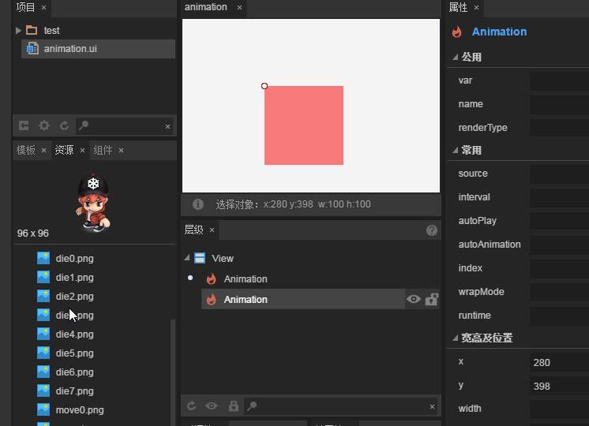
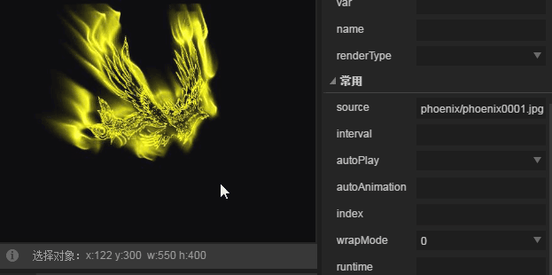

#Animationコンポーネントのプロパティの詳細

>多くのコンポーネント属性が共通であるため、一般的で一般的なコンポーネント属性は`属性设置器`文書で紹介しました。本編を読む前に、「プロパティ設定器」のドキュメントを読んでください。

##1、初歩的な認知Animationコンポーネント

アニメーションのセットはアニメーションのセットです。簡単にアニメーションを作成したり、LayaAirIDEを使ってアニメーションを作成したりできます。図1に示すように。

 

(図1)

AnimationのAPI紹介は参考にしてください。[https://layaair.ldc.layabox.com/api/?category=Core&class=laya.display.Animation](https://layaair.ldc.layabox.com/api/?category=Core&class=laya.display.Animation)

##2、LayaAirIDEでAnimationコンポーネントを作成する

###2.1アニメーションの作成

Animationは、一般的なUIコンポーネントではなく、コンテナコンポーネントでもありません。Animationモジュールを作るには、まず`组件库`に直接AnimationモジュールをIDEにドラッグします。`场景编辑器`にあります。図2に示すように。

 

（図2）

###2.2ソーシャル属性によりアニメーションデータソースを受信する

LayaAirIDEでAnimationコンポーネントを作成した後は、source属性でアニメーションデータソースを受信してから使用する必要があります。source属性は、ピクチャセット（複数のピクチャは、通常シーケンスフレーム図）、図セットファイル（.atlasまたは.json拡張子）、アニメーションファイル（.ani拡張子）の3種類を受信することができる。

####2.2.1シーケンスフレーム画像で作成する

開く`资源管理器`私たちは美術資源を何枚も作ります。`同时选中`を選択します`拖拽`はい、`source`プロパティバーを選択して、シーンで作成したばかりのアニメーションを選択して、`回车`キーを押すと、動画の再生効果がプレビューされます。図3に示すように。

 

（図3）

**Tips**：このタイプを使って作成したアニメーションは、動画テンプレートキャッシュにキャッシュされません。キャッシュが必要な場合は、loadImages()メソッドを使用します。

####2.2.2図鑑ファイルで作成する

もし私たちがギャラリーファイルを置くなら`资源管理器`ディレクトリは、直接にセットファイルを作成することもできます。`拖拽`はい、`source`プロパティバーを選択して、シーンで作成したばかりのアニメーションを選択して、`回车`キーを押すと、動画の再生効果がプレビューされます。図4に示すように。

 

（図4）

**Tips**：このタイプを使って作成した動画テンプレートは動画テンプレートキャッシュにキャッシュされません。キャッシュまたは作成済みのコールバックが必要であれば、loadAtlas()メソッドを使用します。

####2.2.3アニメーションファイルで作成する

作成された時間軸アニメーションファイル（拡張子は.ani）は、図5に示すように、Animationアニメーションコンポーネントのデータソースとしても良いです。`拖拽`はい、`source`プロパティバーを選択して、シーンで作成したばかりのアニメーションを選択して、`回车`キーを押すと、動画の再生効果がプレビューされます。

 

（図5を参照）

###2.3アニメーションの再生モードを制御する（wrapMode）

動画再生モードのプロパティwrapModeは、3つの値を選択して、デフォルトは0で、順に再生します。1を選択すると、順序を追って再生します。2を選ぶ時、pingpong（卓球）のモードで、はっきりしているのは繰り返し放送します。次のシーケンス図リソースのセットを選択して、異なるモードでの再生差をそれぞれ実証します。

####2.3.1正序モード再生

デフォルトでは、wrapMode属性が設定されていない場合や、wrapMode属性値を0に設定している場合は、プロローグプレイモードとなります。つまりシーケンス図は前から後の順番で再生されます。

図6に示すように、シーケンス図phoenix 0001からphoenix 0025まで、順次再生される。放送が終わったら、再度phoenix 0001からphoenix 0025まで、繰り返し再生します。

 

（図6）

####2.3.2逆転モードでの再生

wrapMode属性値を1に設定すると、順次再生モードとなります。つまりシーケンス図の後から前の順番で再生します。正のプレイモードとは正反対です。

図7に示すように、シーケンス図phoenix 0025からphoenix 0001まで順次再生する。放送が終わったら、再度phoenix 0025からphoenix 0001まで、繰り返し再生します。

 

（図7）

####2.3.3 pingpong（卓球）モードでの再生

よく観察してみると、正順か倒順か、この鳳凰の動きは滑らかではないことが分かります。この図面を設計する時、美術は翼を設計して上から下へ飛ぶだけなので、動作フレームが欠けていて、動きが滑らかに見えなくなりました。

wrapMode属性値を2時のpingpongモードに設定すると、ちょうどこの問題を解決することができます。同じ動作は、phoenix 0001からphoenix 0025までの順に再生されます。直接phoenix 0001に戻るのではなく、phoenix 0024からphoenix 0001までの順に再生されます。動作を滑らかにし、完璧にします。このため、pingpongモードはゲームでよく使われるモードの一つでもあり、効果を保障するという前提で美術資源量を大幅に減らすことができます。効果は図8に示すようになります。

 

(図8)

####2.4アニメーション再生のフレーム間隔時間（interval）

`interval`属性は、アニメーション再生のフレーム間隔時間（単位：ミリ秒）を設定できます。標準値は50ミリ秒です。例えば、フェニックスのアニメーションを放送したばかりです。100ミリ秒に設定します。効果は図9に示すようになります。

 

（図9を参照）

**Tips**:*動画が再生されている場合、設定後にフレームサイクルタイマーをリセットする開始時間は現在の時間となります。つまり、頻繁にintervalを設定すると、動画フレーム更新の時間間隔が予想より遅くなり、更新しないこともあります。*

####2.5自動再生設定（atoPlay）

autPlay属性は自動再生かどうかを設定できます。デフォルトはfalseで、自動再生はしません。trueに設定すると、アニメーションが作成され、舞台に追加されて自動的に再生されます。この属性設定はIDEで即時プレビューできません。リリース実行時に属性設定効果を確認する必要があります。

####2.6按動効果名称自動再生（aut Animation）

LayaAir IDEで作成された時間軸アニメーションファイル（.ani拡張子）には、複数のアニメーションからなるアニメのセットがありますが、aut Animation属性により、いずれかのアニメーション名を選択してプレイできます。

**Tips**:

##-LayaAirIDEでは、`autoAnimation`属性はデータソースのみです。`source`）属性は時間軸アニメーションファイルの(.ani拡張子)のみ設定できます。 `autoAnimation`属性値に対応する`时间轴动画`編集中の`帧属性`パネル`动效名称`で設定した名前です。

####2.7再生の開始位置（index）を設定する

index属性は、アニメーションのフレームインデックスを指定することができ、デフォルトのインデックスは0で、アニメーションのいずれかのフレームに設定することができます。設定後、設定されたアニメーションフレームにジャンプします。

Tips：この属性は、コードまたはクリックイベントによって手動でアニメーションフレームを切り替えるなど、静的な指定にのみ使用される。自動再生に設定しても、0番目のフレームから再生します。インデックスの設定には関係ありません。

####2.8ミキシングモードを設定する

ハイブリッドモード`blendMode`属性はデフォルトではオープンしません。lighterオプションに設定すると、ミックスモードがオンします。オープン後の効果は図10に示すようになります。

  

（図10）

**Tips**:*混合モードの背景は必ず舞台の画布の中にある。例えば、Laya.stage.bgColorのみの設定では、ミキシングモードは実現できません。図10ではGraphicsの矩形を採用している。*

