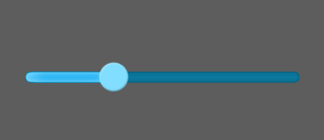

#HSliderコンポーネント参照

##1、HSliderコンポーネントを理解する

###1.1 HSliderの役割と効果のデモンストレーション

HSliderとValderのコンポーネントは、それぞれ、横スライドバーと縦スライドバーを表すSliderのコンポーネントのサブクラスである。ユーザはスライダレールの間をスライダを動かすことで値を選択できます。プレーヤーの進捗制御、音量制御、UIによる数値調整などによく使われる。

HSliderモジュールは水平方向を採用する。スライダレールは左から右に拡大されますが、スライドブロックの位置の数値を示すラベルはレールの上部にあり、非表示になります。

​       
（図1）

###1.2 HSliderコンポーネントの肌（skin）仕様

HSliderリソース命名規則はhslierをプレフィックス名とし、そのデフォルトリソースは全部で3つで、それぞれスライダリソースです。`hslider$bar.png`、プログレスバーのリソース`hslider$progress.png`及び原図資源`hsliser.png`。

資源は少なくとも二つあります。一つの底図資源、一つのスライダ資源があります。そうでないとスライド機能が実現できません。プログレスバーのリソースコンポーネントが不足しています。プログレスを表示しないだけです。

tips：プログレスバー資源`vslider$progress.png`地図リソースとの接続が可能です。`vsliser.png`交換、交換後の進捗は逆方向に表示されます。

 
（図2）

###1.3 HSliderコンポーネントのAPI紹介

HSliderのAPI紹介は参考にしてください。[http://layaair.ldc.layabox.com/api/index.html?category=Core&class=laya.ui.HSlider](http://layaair.ldc.layabox.com/api/index.html?category=Core&class=laya.ui.HSlider)。

##2、LayaAirIDEでHSliderコンポーネントを作成する

###1.1 HSliderを作成する

リソースパネルのHSliderコンポーネントのリソースを選択し、ページの編集エリアにドラッグして置くと、HSliderコンポーネントをページに追加できます。

HSliderをエディターエリアにドラッグした後、sizGrid九宮格属性を設定し、拡大させた後は引っ張らないようにします。スケーリング後は次のように効果が現れます。

​ 
（図2）

###1.2 HSliderコンポーネントの一般的な属性

HSliderの属性maxの値が20、属性minの値が0、属性valueの値が5に設定されたら、次のように表示されます。

​ 
（図3）

**max:**HSliderスライダを一番右にドラッグした場合の最大値は、デフォルトの値は100です。

**min:**Hslederスライダを一番左にドラッグした場合の最小値は、デフォルトでは0です。

**value:**スライダが現在位置している値は、maxまたはminに等しいか、またはそれらの間の値です。

​ 
（図4）

リリース後にコンパイル運転します。表示効果は以下の通りです。スライダをドラッグして値を選択できます。

​ 
（図5）

###1.3 HSliderコンポーネントの特殊なその他の属性

共通の他の属性は「属性設定器」に詳しく紹介されていますが、以下はHSliderコンポーネントに関する特殊な属性です。

𞓜**属性**𞓜**機能説明**𞓜
|-------------------------------------------|
|allowClickBack 124;は、スライダーをクリックしてvalue属性値を変更することができるかどうかを指定します。𞓜
|show Label 124;は、スライダの上に隠れてvalue値を表示するラベルを指定します。𞓜
|tick 124;スライダーの目盛値とは、スライダがドラッグするたびに変化するvalue値のことです。標準値は1です𞓜

 
