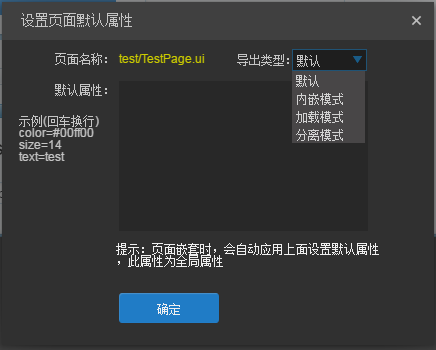

#プロジェクトマネージャ

>本編ではLayaAirIDE 1.7.3 bateスクリーンショットを採用していますが、異なる場合は最新のLayaAirIDEをダウンロードして、最新バージョンIDEに準じてください。

##一、プロジェクトマネージャパネルの紹介

プロジェクトマネージャは私たちがプロジェクトを訪問し管理するための作業領域です。私たちが使用している間、プロジェクトマネージャは`项目文件夹\laya\pages`」の目次と工程ページをツリー構造で示します。図1に示すように、

​        

（図1）

**ツリーのページリスト:**作成またはインポートされたプロジェクトフォルダとページが表示されます。

**場所ディレクトリを開く:**選択したページの場所ディレクトリを開きます。

**属性を設定:**ポップアップの属性設定ウィンドウでは、ページのエクスポートタイプとデフォルトの属性を設定できます。例えば、デフォルトサイズ、カラーなど、この属性は大域共通です。

​        

（図2）

エクスポートタイプのデフォルトは**埋め込みモード**このモードをエクスポートすると、ページの設定情報をプロジェクトコードファイルにエクスポートします。採用する**読み込みモード**を選択します。すべてのページの設定情報をJson形式のファイルにエクスポートします。**分離モード**Json形式としてエクスポートされますが、分離モードは各ページを独立にエクスポートし、複数のjsonファイルを生成します。

**ページリストを更新:**プロジェクトページを導入したら、更新ページリストをクリックして、新たに導入したファイルを同期して表示します。

**キーワード検索バー:**検索バーにキーワードを素早く入力して、キーワードがあるページをフィルタリングして、ページの位置を素早く特定することができます。図3に示すように

​        

（図3）

 

##二、プロジェクトマネージャの右ボタンの機能紹介

**開く**

右ボタン`文件`をクリックして、**このファイルはシーンエディタで直接開くことができます。**

右ボタン`目录`をクリックして、**現在のディレクトリのリソースマネージャを直接開くことができます。**

**名前を変更**

ディレクトリまたはファイルの名前を再設定します。

**テンプレートに変換**

この機能はUIファイルのみが使用でき、テンプレートとしてUIを設定し、テンプレートライブラリに保存して使用される。通常のテンプレートとカスタムテンプレートとして設定できます。

**Clone**

ファイルには全く同じプロジェクトファイルがコピーされます。

ディレクトリに対しては、ディレクトリ全体（ディレクトリ内のファイルを含む）をコピーします。

**デフォルトの属性を設定**

はい、そうするしかないです`文件`ページのデフォルトの属性を設定し、タイプをエクスポートします。図4-1に示すように。

　　 (図4-1)

**削除**

右ボタンの`删除`機能を使用して、ディレクトリやファイルを削除します。ページを選択してから直接にBackspaceまたはDeleteキーを押して削除することもできます。ディレクトリフォルダを選択して削除すると、ディレクトリの下のすべての項目ページが削除されますので、慎重に操作してください。

**新規作成**

プロジェクトマネージャでは、UIページ/シーン、粒子、アニメーション、スクリプトを新規に作成することができます。ポップアップメニューバーを右クリックして、新しい機能を選択すればいいです。図4-2に示すように

​        

（図4-2）

 **新しいディレクトリ**

プロジェクトマネージャに直接ディレクトリを作成することもできます。

​**特に注意が必要です**TS項目は、ディレクトリを新規作成する際に、2つの重要なルールがあります。

1、新規作成禁止ディレクトリの名前は`ui`コードで時報が間違って表示されます。

2、同じ縦方向のディレクトリの下にリネームディレクトリがあることを禁止します。例えば、親ディレクトリとサブディレクトリの同名（aa\aa）、または親ディレクトリと孫ディレクトリの同名（aa\bb\aa）は、いくつかの階層的な関係を隔てていても、同じ縦方向のディレクトリの下で、任意の階層的関係の同じディレクトリの名前は禁止されており、エラーが発生します。

**場所を開く**

ファイルまたはディレクトリを選択して、この機能をクリックしてファイルまたはディレクトリのリソースマネージャディレクトリを開くことができます。

