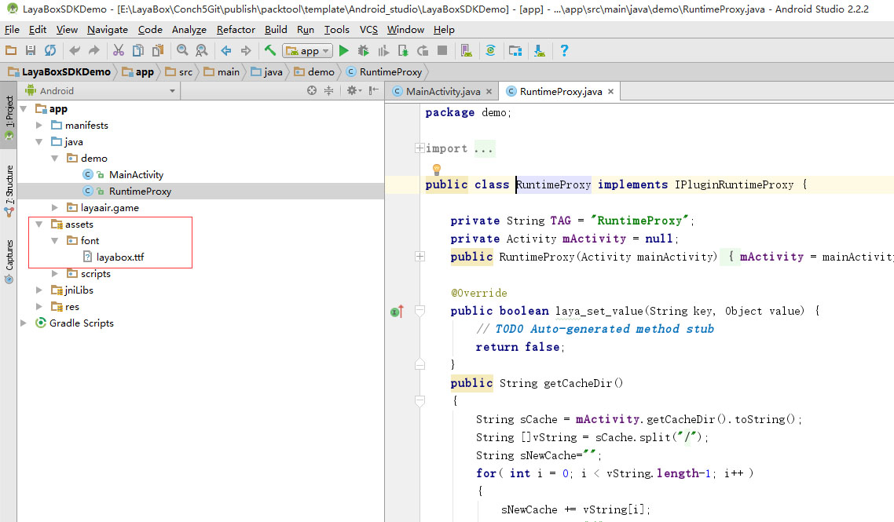

#埋め込みフォント

##1.フォント紹介

Andrriodデバイスの種類が多く、Androidのフォントファイルが統一されていないため、各システムのデフォルトの中国語フォントのルートには違いがあります（加えて、国内の多くのメーカーがカスタマイズ）、font.ttfを読み込むのは難しい問題です。

LayaPlayerのポリシーは、androidのシステムバージョン番号に基づいて、一枚はフォントファイルのパスを挙げて、もしロードに成功したら、システムのデフォルトフォントを使って、もしローディングが成功しないならば、LayaBoxサイトから一つのフォントをダウンロードしてローカルに格納して、二回目に入ったら、直接にローカルワードを読みます。

LayaPlayer-00.95以降のバージョンは、開発者がappをパッケージ化する際に、デフォルトではフォントをappにパッケージ化し、いくつかの特殊なデバイスではなく、初めて実行する場合はネットワーク上で4 MBのTTFフォントをダウンロードし、ユーザーの体験に影響を与えます。

##2.フォントの埋め込み方法

1、androidプロジェクトを構築して、astesディレクトリを見つけて、fontディレクトリを作成して、植え付けたいフォントファイルを「layabox.ttf」と改名します。図1に示すように、

2、LayaPlayer-00.5.5以降のバージョンだけがサポートされます。

3、LayaPlayer-09.5以降のバージョンは、テンプレートプロジェクトはデフォルトではttfフォントが埋め込まれています。このようにすると、appkの体積が増加します。もしあなたがappkサイズを気にするなら、asets/font/layabox.ttfというフォントファイルを削除することができます。

##3.iOS埋め込みフォント

1、LayaPlayer-09.7以降のバージョンはiOSがデフォルトフォントに埋め込むことをサポートしています。具体的なやり方はandroidと同じです。resourceでfontディレクトリを作成して、埋め込むフォントをlayabox.ttfと改名すればいいです。下図2のように：

