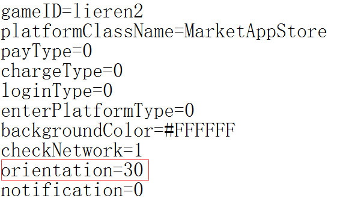
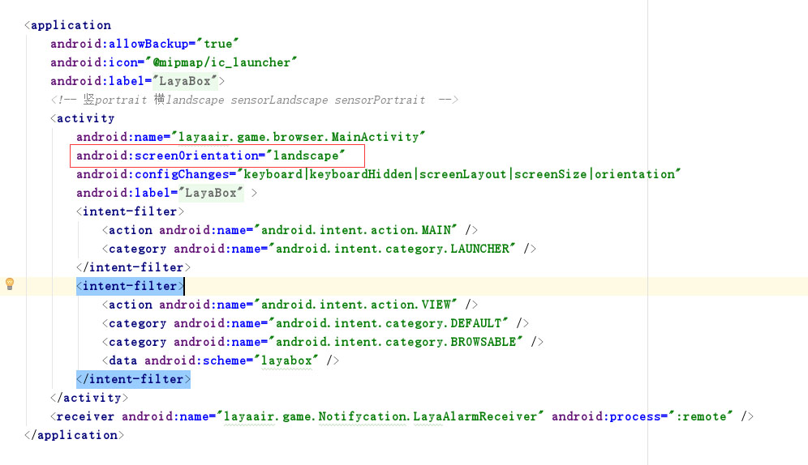

#  横竖屏设置
##1.iOS

iOSプロジェクトの構築に成功したら、レスポンス/config.iniファイルを開いて、修正する。`orientation=30`の値は、下図のようになります。


パラメータの意味は以下の通りです。

```

orientation=2   //竖屏：IOS home键在下   
orientation=4   //竖屏：IOS home键在上   
orientation=8   //横屏：IOS home键在左   
orientation=16  //横屏：IOS home键在右   
```

orentationの値は使えます。`按位或`のように設定します。例えば、

```

orientation=6   //代表竖屏可以任意旋转  
orientation=24  //代表横屏可以任意旋转  
```


##2.android

Android Manifest.xmlファイルを開いて、Androidプロジェクトの構築に成功しました。activityタグの中にscreenOrientationパラメータがあります。開発者は自分のニーズに応じて修正できます。下図のように。


設定可能なパラメータはandroidの標準であり、これには過多な説明は行われません。以下の通りです。


```

"landscape","portrait","full_sensor","sensor_landscape","sensor_portrait","reverse_landscape","reverse_portrait"
```


##3.htmlで設定

プロジェクトの起動xxx.1（通常はindex）に画面の方向を設定し、screenorentationの値を修正すればいいです。

```

<meta name='laya' screenorientation='landscape' />
```


設定可能なパラメータは以下の通りです。


```

"landscape","portrait","full_sensor","sensor_landscape","sensor_portrait",
```

LayaAirで作成したプロジェクトはデフォルトで増加しました。`<meta name="laya" screenorientation="landscape">`このラベルは開発者が自分のニーズに合わせて手作業で修正する必要があります。

##4.実行順序

アプリケーションは起動時に先に読み取り、iOSのconfigに画面の向きやandroidのmanifistに画面の向きが設定されています。index.まで解析した時に読みます。`<meta name="laya" screenorientation="landscape">`このラベルは、画面の方向を再設定します。

例えば、androidのmanifestでポータブルとして設定されていますが、これまでのタブはlandscapeとして設定されています。運転中にandroidの画面が少し回転して、縦画面から横画面に回転しています。

**Tips：開発者は二つの値を同じに設定することを提案します。このようにプログラムが実行中に画面が回転する現象が発生しないようにします。**
