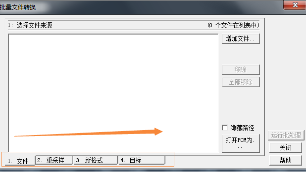
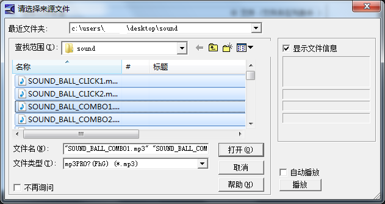

#音について

LayaPlayerでは、BGM、サウンドの2つのモードがあります。

##1.背景音楽

LayaPlayerでは、バックグラウンドミュージックはmp 3形式のみ対応しています。バックグラウンドミュージックは一つしか再生できません。

##2.サウンド効果

プロジェクトの中で、音効はすべて高周波の発生事件で、運行の効率を確保するため、LayaPlayerはopenALを使って音効を放送して、mp 3がストリームのメディアのフォーマットなため、現在まだ解析することができません。
**Tips:**  
**1、LayaPlayerでは、音声効果はwavとoggフォーマットのみをサポートします。**  
**2、wavとoggは8位と16位しかサポートしていません。32位はまだサポートしていません。**
**3、注意：LayaPlayer-00.5.5以前のバージョンは、wavとoggは22050サンプリング率、16 bit、モノラルのみに対応しています。**

どのように現在のLayaPlayerのバージョンを調べますか？二つの方法があります。
1、JSで呼び出す`conch.config.getRuntimeVersion();`メソッドはバージョン番号を取得します。
2、設備をコンピュータに挿して、ロゴを確認します。


##3.ヒント情報

1、LayaAir-1.7.5以降のバージョンで、もし呼び出したら`SoundManager.playSound()`ただし、入力されたファイル形式がmp 3であると、ヒント情報が表示されます。
`The sound only supports wav or ogg format,for optimal performance reason,please refer to the official website document.`  
この時にmp 3をwavまたはggに変換します。

2、LayaAir-1.7.5以前のバージョンでは、エラーメッセージはありませんでした。再生するたびに効果が現れます。**カートン現象**この場合、MP 3フォーマットを使用した再生音効果のために、フォーマットを変換する必要があります。

##4.互換性を解決する

もしあなたのプロジェクトがウェブページのバージョンでmp 3形式を使うなら、LayaPlayerの中でwav形式を使います。プロジェクトは配置ファイルを使用してロードすることを提案します。このように配置ファイルをロードするところだけで、LayaPlayer実行環境と判断するコードを追加します。疑似コードは以下の通りです。


```javascript

if(window.conch)
{
    ...加载 "soundConfig-LayaPlayer.json"
}
else
{
    ...加载 "soundConfig-json"
}
SoundManager.playSound(soundJson[0].url,1);
....
SoundManager.playSound(soundJson[1].url,1);
```


**Tips**  
*1、conchはLayaPlayerの環境でしか呼び出しできません。ウェブページのバージョンにはconchの定義がありません。存在するかどうかを判断する必要があります。＊
*2、as言語を使って開発する場合は、`Browser.window['conch'] `このようにしてconchオブジェクトを取得します。*
*3、または使う`if(Render.isConchApp )`判断してもいいです。*

##5.Cool Edit Proツールを使って音声フォーマットの変換を行う
今はMP 3に対してwavを変換できるツールがたくさんあります。ここで簡単に紹介するCool Edit Proツールです。mp 3変換wavの具体的な操作手順を紹介します。
1、まず自分でダウンロードして、まずCool Edit Proツールをインストールして、Cool Edit Proプログラムを開きます。


2、左上の「ファイル」の下の「一括変換」をクリックして、「一括変換」サブメニューに入ります。




**注意：次の1、2、3、4のステップを一括ファイルに変換してください。**

3、ファイルのソースを選択します。右をクリックしてファイルを追加します。ここでsoundファイルのすべてのファイルを選択してバッチ処理を行います。その後クリックして開きます。




4、サンプルの種類を変換します。再サンプリングカタログの下でクリックして目標フォーマットを変更します。ここで私達が必要とするサンプルレート22050 Hz、モノラル、16ビットビットビットを選択して、クリックして確定します。


5、新しいフォーマットを選択します。出力フォーマットは私達が必要なWindows PCM（*.wav）、フォーマットタイプは22050 Hz、16ビット、モノラルを選択します。


8、ターゲットフォルダとファイル名を選択します。ここは簡単に出力ディレクトリを選択してください。そして「実行バッチ処理」をクリックして出力するために必要なファイルがあります。「ファイル一括変換完了」というメッセージが出たら、MP 3変換wavの一括変換が成功したということです。


9、Cool Edit Proを実行してバッチ処理を行う時に次のパチンコが現れたら、Resample.xfmファイルを新たに取り替えるだけで、Cool Edit Proを再起動すればいいです。


**このような場合は、cool edit reample.xfmを検索したり、正規版cool editを買ったりします。（わかりました）**

**10、オンラインでダウンロードしたcool edit proが大量に変換されていない場合、先に回してもいいです。大量に変換されます。**
