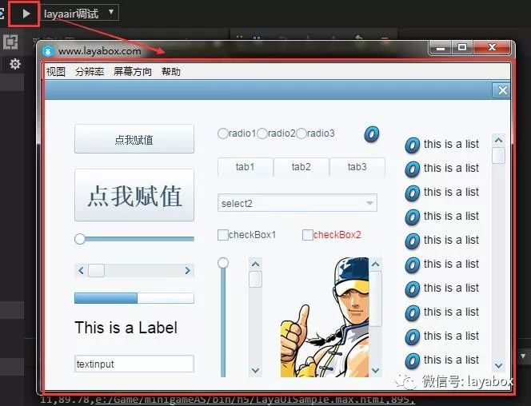
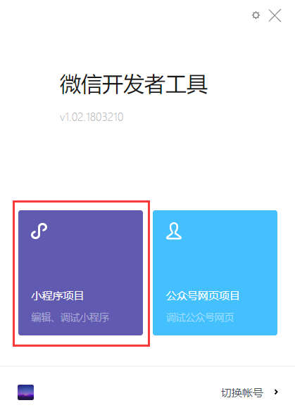
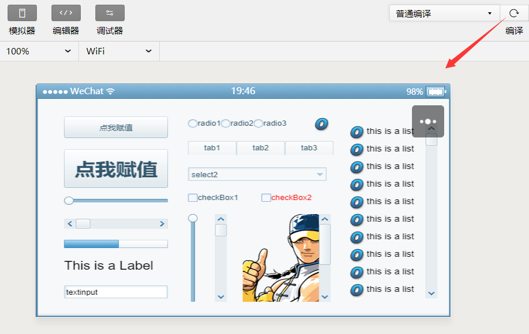

# 创建第一个微信小游戏

>*Author:charley*

###一、開発環境を整える

####1、LayaAirIDE統合開発環境をダウンロードしてインストールする

LayaAirIDEはLayaAirエンジンの集積開発環境であり、LayaAirエンジンとサンプルプロジェクト、UI、アニメーションなどの可視化編集、プロジェクトコードの作成と管理などの開発ツールを集積しています。**開発者は直接LayaAirIDEを使ってWeChat型ゲームを作成することができます。**

**公式サイトのダウンロード**:[http://ldc.layabox.com/layadownload/?type=layaairide](http://ldc.layabox.com/layadownload/?type=layaairide)

>Tips：1.7.17のバージョンから3 D適応とキャッシュ管理が追加されたので、開発者は1.7.17またはより高いバージョンを使用することを提案します。

####2、ミニゲーム開発ツールをダウンロードしてインストールする

ミニゲーム開発ツールはミニゲーム開発とテストの環境です。LayaAirエンジンの開発者はLayaAirIDEを使ってプロジェクト開発を行うことができます。このミニゲーム開発ツールをインストールするのは主にミニゲームプロジェクトのコンパイル、プレビュー、実機テストとデバッグ、アップロードリリースなどです。

**開発ツールのダウンロード先**:
[https://developers.weixin.qq.com/minigame/dev/devtools/download.html](https://developers.weixin.qq.com/minigame/dev/devtools/download.html)

  

####3、小さなプログラムを作成した企業開発者アカウントは、開発者ID（AppID）を取得します。

アプリIDがなくてもデバッグは開発できますが、機能は制限されます。開発する前に、まず小さなプログラムの開発者アカウントを作ったほうがいいです。

登録住所：[https://mp.weixin.qq.com/wxopen/waregister?action=step1](https://mp.weixin.qq.com/wxopen/waregister?action=step1)

**Tips:**

*個人の開発者は印号が必要ではないですが、支払い機能を開通することはできません。ゲーム中に支払い機能があるなら、企業開発者のアカウントを使用しなければなりません。そして、プレート番号を提出します。*

開発者アカウントを登録して登録した後、設定メニューの開発設定で開発者IDを取得することができます。

**Tips:**

>*開発者はまず開発者アカウントを登録して、アプリIDを記録することを提案します。*

### 

###二、LayaAirIDEで微信小ゲームプロジェクトを作成し、発表する。

####1、LayaAirIDEでミニゲームのサンプル項目を作成する

LayaAirIDEを開き、新規プロジェクトを作成します。「ウィーチャットゲームの例」を選択して、プロジェクト名、プロジェクトパス、開発言語タイプ、エンジンバージョンを設定します。ミニゲームプロジェクトを作成することができます。下の図のように。

####2、例示的な項目効果を表示する

プロジェクトを作成したら、直接にデバッグボタンまたはF 5をクリックします。まず例を見てみましょう。

  

>ASとTSの項目については、デバッグを開く前に自動的にコンパイルを開始します。だからこのステップはスキップしないでください。

####3、ミニゲームとしてリリース

プロジェクトの発表ボタンをクリックして、ポップアップのリリースプロジェクトのインターフェイスの中で、発表のプラットフォームを選んでWeChatの小さいゲームです。そしてディレクトリを変えたくないなら、直接にリリースすればいいです。

 

**Tips**:

>リリースプラットフォームの右側にある疑問符アイコンをクリックして、各オプションの説明を確認することができます。

###三、WeChat開発者ツールでミニゲームプロジェクトを作成する

####1、開発者アカウントに登録し、項目の種類を選択する

WeChat web開発者ツールを開き、開発者のWeChat Scodeで登録します。を選択します**プログラム**項目設定に入るにはクリックしてください。

 

####2、ミニゲームプロジェクトを作成する

プログラム項目設定パネルには、`项目目录`LayaAirIDEがリリースしたばかりのミニゲームのカタログを選択することができます。（今のところ、これはプロセスを実行するためだけに、新しいIDEバージョンはミニゲームに対してより適切なプログラムを発表しました。後のドキュメントは変更されます。）アプリIDは前に準備したIDで入力すればいいです。入力しなくても開発デバッグができますが、機能が制限されます。だからAppIDを入力したほうがいいです。

 

####3、WeChat開発者ツールのコンパイル

小さいゲームのプロジェクトの作成を完成した後に、編集をクリックして、ツールの中で効果とデバッグをプレビューすることができて、私達はモード装置の中の効果とLayaAirIDEの中のデバッグの効果が一致することを見ることができます。

 

####4、実機テストとデバッグ

LayaAirIDEでもプロジェクトの効果を調整できますので、適切に関連する問題がない限り、基本的に両方の効果が一致しない場合があります。ここで一番重要なのはクリックです。**プレビュー**機能は、携帯電話のウィーチャットを通じてコードをスキャンし、ウィーチャット内で実機テストとデバッグを行う。

 

**Tips:**

本物のマシンをアップロードする時、デフォルトでは4 Mを超えてはいけません。パッケージは8 Mを超えてはいけません。だからIDEはカタログを発行します。サンプル項目のlibsというディレクトリは直接削除できます。この例のプロジェクトが使えるのは、code.jsに統合されているからです。4 Mを超えるとアップロードできないかもしれません。この問題は新しいバージョンでも最適化されます。

WeChatでコードをスキャンすると、プログラム項目を起動し、右上の浮遊窓ボタンをクリックして、デバッグと性能監視パネルを開くことができます。

実機調整と性能モニタパネルを開けたら、下図のようになります。

 

これで、完全なミニゲームの開発プロセスは終了しました。簡単ですか？LayaAirIDEで開発されたミニゲームプロジェクトは、基本的にはシームレスなミニゲームアイテムです。