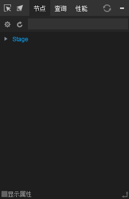
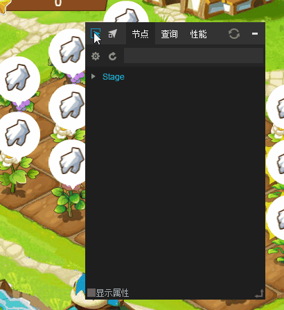
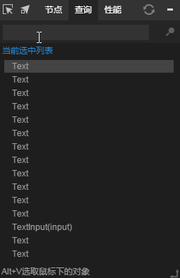
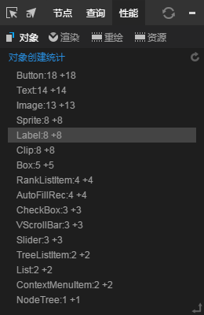
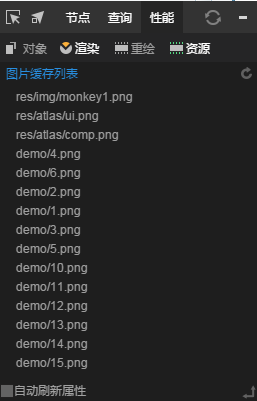
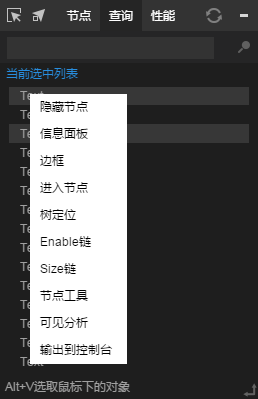

#Layair DebugTool 디버그 도구

###1, DebugTool 디버그 패널 사용하기

프로젝트에서 Layaia Debug 라이브러리를 도입한 'laya.debug.DebugTool';

Layaiair DebugTool 디버그 패널은 Div 에 기반된 디버그 창입니다. 디버깅을 다운로드할 필요가 없습니다. 디버깅 라이브러리를 인용하면 프로젝트에서 실행할 수 있습니다.디버그 패널 시작`DebugTool.init()`에 자리잡다,...`laya.debug.DebugTool`종류 중, 무대 초기화 방법`Laya.init()`다음의 임의코드 중 사용을 늘립니다. 예를 들어 다음 코드 표시:

입구 종류 Main.as


```java

package
{
	import laya.debug.DebugTool;
	import laya.display.Sprite;
	
	public class Main
	{
		public function Main()
		{
			//初始化舞台
			Laya.init(1334,750);    
			//调用DebugTool调试面板
			DebugTool.init();
			//设置舞台背景色
			Laya.stage.bgColor  = "#ffffff";
			
			var Img:Sprite = new Sprite(); 			 
			//添加到舞台
			Laya.stage.addChild(Img);   
			Img.loadImage("res/img/monkey1.png",200); 	
		}
	}
}
```


디버그 패널은 성공한 후 그림 1개처럼 사용됩니다.

  


(그림 1)


###2, 노드 선택 기능

디버깅 패널 맨 먼저 클릭.`选取`단추 아이콘.

그리고 게임 페이지의 노드에서 미끄러져 노드 테두리를 나타냅니다.

마우스를 누르면 이 노드를 선택할 수 있습니다.이와 함께 디버깅 패널의 노드 분류에서 이 노드 값의 속성 정보를 나타낸다.효과는 동도 2소와 같다.

 


(동도 2)


###3, 디스플레이 속성 설정

디버그 패널 2열 톱니바퀴 아이콘을 누르면 설정할 수 있다`要显示的属性`.

새 팝업 표시 속성 설정 패널 안에 노드 삭제에 표시할 속성 정보를 추가할 수 있습니다.관련 조작은 동영상 3개와 같다.

  


(동도 3)


###4, 드래그 선택

왼쪽 단추 클릭 끝 두 번째`拖动选取`단추 아이콘을 누르고 보고 싶은 디스플레이 노드를 누르면 디버깅 패널에서 이 노드를 볼 수 있습니다. 이 노드 속성 정보를 누르고, 동작 동영상 4개의 시드를 보여 줍니다.


  


(동도 4)


###5, 빠른 검색 기능

####5.1 단축키로 페이지 노드 대상

길이로 단축키 누르기`Alt+V`또한 마우스로 페이지 노드 대상을 선택하는 방식이다.페이지의 노드 대상을 얻을 수 있으며, 오른쪽 단추로 조작하거나 빠른 속도로 이 대상의 속성을 조회할 수 있습니다.

  


(동도 5-1)

####5.2 키워드 검색을 통해 페이지 노드 대상 목록

단축키에 대한 정확한 위치 선택 방식을 통과할 수 있습니다`对象查询`단추 (* 확대경 아이콘 *) 이 대상 목록을 가져옵니다.

확대 렌즈 아이콘을 클릭하면 새 대상 검색 패널을 찾을 수 있습니다. name 또는 클라스에 키워드를 포함하는 대상을 찾을 수 있습니다.5-2의 지시대로.

 


(사진 5-2)

####5.3 대상에서 속성 검색

단축키나 키워드를 통해 위치한 대상이든 속성 조회 기능을 통해 속성치를 빠르게 조회할 수 있다.

운영 방식`属性查询输入框`중**입력**하나 더`属性名称`(여러 속성은 영문 쉼표로 띄워야 한다), 그리고`按回车键`속성 내용을 얻을 수 있습니다.동작 방식은 동도 5-3의 제시와 같다.

  


(동도 5-3)


###6、성능 통계

####6.1 대상 통계 생성

클릭`对象`단추, 대상 생성 통계 정보, 정보의 내용은 각각`对象名、当前运行创建的对象数量、当前运行距上次运行增加的对象数量`.통계 정보는 6-1의 시사와 같다.

   


（6-1）

####6.2 대상 통계 작성 자세 및 증량 자세

대상 작성된 통계 정보 목록에서 마우스 오른쪽 단추를 누르면 조회 통계의 자세한 상황과 증량 창출의 자세한 상황은 그림 6-2에 따라 제시된다.

   


(사진 6-2)

####렌더용시 통계

렌더용은 현재 게임 렌더가 소모된 사용을 조회할 때 단위는 밀리초 (ms) 로 집계된다.클릭`渲染`버튼은 현재 게임 렌더를 할 때 통계 데이터를 얻을 수 있으며, 그림 6-3이 제시하는 것과 같다.

   


(사진 6-3)


####6.4 cache 재생 통계

클릭`重绘`단추는 Cche에서 다시 그리는 데이터 순위를 조회할 수 있으며, 수량 많은 대상이 앞줄에 있습니다.효과는 6-4의 시사와 같다.

   


(사진 6-4)


####6.5 자원 캐시 통계

클릭`资源`단추 를 알 수 있다**자원 캐시 목록**6-5에 제시한 것처럼.

   


(사진 6-5)


###7, 오른쪽 키 기능 메뉴

디버그 패널에서 오른쪽 버튼은 해당 기능식 메뉴를 팝니다.특히 노드, 조회 및 보카시 성능 통계의 오른쪽 키 기능 메뉴는 숙련되어 파악과 파악이 필요하다.

 


(그림 7)


오른쪽 단추 중 기능은 비교적 쉽게 이해된다.개발자는 하나하나 체험할 수 있다.여기 포인트로 봐주세요.**노드 도구**이 도구는 선택한 노드 를 표시할 수 있습니다 / 숨기기, 현재 노드 를 표시할 수 있는 mouseEnable 관계 사슬을 표시할 수 있으며, 선택한 노드 시즈 관계 사슬 등을 표시할 수 있습니다.실용과 상용을 비교하다.

노드 도구는 동영상 8시에 제시한 것처럼 조작된다.

  


(동도 8)


