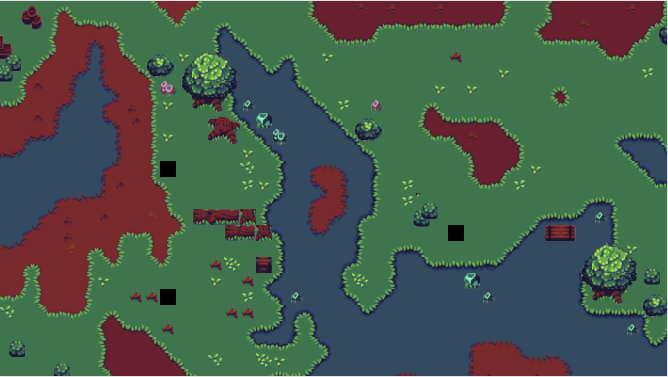
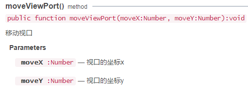

#Layair 엔진으로 Tiled Map 지도를 분석하기 (자세하게)

> author:charley
>>

Tiled Map Editor 는 무료 지도 편집기로 2D 게임 지도를 편집할 수 있으며, Layaiair 엔진이 Tiled Map 내보내는 지도를 지원합니다.이 글은 Layaiair 엔진 개발에서 Tiled Map Editor 내보내는 지도를 어떻게 사용할지 설명할 것이다.

>> 주의: 본문은 익숙하고 Tiled Map 지도 도구를 사용하는 개발자입니다.Tiled Map Editor 내보내는 지도가 Layaiaiair 엔진 항목에서 어떻게 사용할지 알립니다. Tiled Map Editor 도구에 대한 자신의 내용은 제3자 교정 문서를 스스로 찾아보십시오.
>>
>본 문서 중 일부 내용은 Layair 엔진 1.7.7 버전에서 새로 증가하였습니다. 본문 읽기 전에 엔진을 1.7.7 버전이나 더 높게 업데이트해 주세요.


##1, 엔진 지원 Tiled Map 지도

###1.1 Tiled Map Editor 다운로드 설치

공식 홈페이지 열기[http://www.mapeditor.org/](http://www.mapeditor.org/)클릭`DownLoad at itch.io`단추 다운로드 링크[https://thorbjorn.itch.io/tiled](https://thorbjorn.itch.io/tiled)무엇만약 홈페이지 개판하면, 바로 다운로드[http://www.mapeditor.org/download.html](http://www.mapeditor.org/download.html)다운로드 링크를 찾았습니다.

시스템 버전 링크를 찾을 수 있으며, 다운로드 설치를 다운로드하면 (* 본 문서가 사용하는 버전은 Tiled 1.5 *) 입니다.

**Tips**：

*다운로드를 켜면 이 소프트웨어의 요금 지불 페이지를 팝니다. 요금을 내지 않으려면 No thanks, just take me to the downloads, 무료 다운로드 링크에 들어갈 것입니다.*

* 홈페이지 버전에 문제가 있다면 github`https://github.com/layabox/layaair-doc`64명의 windows 버전의 Tiled 1.1.5*이 있습니다.


###1.2 엔진 지원 Tiled Map 지도 형식

Tiled Map 도구의 구체적인 사용 방식은 본문은 많지 않아 바이두나 구글에서 관련 교과서를 검색할 수 있다.엔진과 막중한 관계가 있는 것은 형식이다.개발자가 각별히 주의해야 하는데, 일반적으로 문제가 생기면 여기에서 주의하지 않는다.

####1.2.1 지도를 생성할 때, 그림 블록 형식에 대한 요구

새 지도를 누르면 지도의 크기와 블록 크기 등 초기 인자를 설정한 후, 다른 이름으로 저장하면 지정한 위치가 생성되었습니다.

그러나, 그림 블록 형식 은 특별히 주의해야 한다**Layaiair 엔진은 Tiled Map 지도를 Base64 의 그림 블록 형식으로 지원하지 않습니다.**그래서`创建`새 지도 시**반드시**되다`CSV格式`그림 1 개.

 


(그림 1)

**창립할 때 잘못 골랐어요.**속성 패널에서`图块层格式`**CSV 나 XML 로 바꿨어요.**두 가지 지시대로**Base64 관련 형식은 지원하지 않는다.**

 


(2)

####1.2.2 json 형식으로 내보내기

이 예를 들어 Tiled Map 의 예례 지도를 직접 엽니다. orthogonal-outside.tmx (* Tiled Map 지도에 설치된 examples 디렉토리 아래 *)

#####내보낼 때 우리는 json 의 형식을 선택해야 한다.

Tiled 도구`文件`메뉴에 클릭`另存为`완료된 Tiled 지도를 다시 json 파일 형식으로 저장합니다. orthogonal.json`保存`두다**항목 목록**예`项目根目录\bin\h5\res\TiledMap\`) 3 개처럼.

 


(그림 3)

###1.3 그림 경로와 Tiled 자원 복사

#####다만 json 파일로 저장할 뿐 부족합니다. 우리는 아이메이지 절대경로를 상대 경로로 변경해야 합니다.

IDE 를 통해서 저장된 것을 열기`orthogonal.json`검색 키워드`"image"`기본 image 경로가 Tiled 설치 디렉터리에 위치한 것을 발견할 것입니다.시계가 네 개처럼 보이다.

 


(그림 4)

#####경로가 Tiled 설치 디렉터리에 안 될 것이다.

그래서 우리는 먼저 ** 이 그림을 (* buch-outdoor.png *) 프로젝트로 복사해야 합니다**이전`orthogonal.json`동급****

제시한 대로.

 


#####(그림 5)
****
그리고 orthogonal.json 중`image`**경로가 상대 경로 변경됨 * *`"image":"buch-outdoor.png",`

준비 단계가 끝나면 인코딩 단계에 들어가기 시작하는데...


##2, Layair 엔진 Tiled Map 지도 사용

###2.1 TiledMap 지도 만들기

####2.1.1 createMap API 설명

laya.map.TiledMap 종류의 createMap 방법으로 TiledMap 지도를 만들 수 있습니다.기초의 인자 설명은 그림 6시와 같다.

 


(그림 6)

####2.1.2 지도 생성 사례


```java

package
{
	import laya.map.TiledMap;
	import laya.maths.Rectangle;
	import laya.utils.Browser;
	import laya.webgl.WebGL;

	public class TiledMapDemo
	{

		private var tMap:TiledMap;
		public function TiledMapDemo()
		{
			//初始化舞台
			Laya.init(Browser.width, Browser.height, WebGL);
			//创建TiledMap实例
			tMap = new TiledMap();
			//创建Rectangle实例，视口区域
			var viewRect:Rectangle = new Rectangle(0, 0, Browser.width, Browser.height);
			//创建TiledMap地图
			tMap.createMap("res/TiledMap/orthogonal.json",viewRect);
		}
	}
}
```


번역 코드 실행, 효과는 7 개 시사와 같이 지도가 창건되었음을 설명합니다.

 


(그림 7)

###2.2 제어 지도

지도를 제어하려면 지도의 json 을 먼저 가재한 후 조정 방법에서 제어해야 한다.다음은 실례와 관련한 용법을 결합할 것이다.

####2.2.1 지도의 축소

`laya.map.TiledMap`클래스`scale`속성은 지도의 축소 비율을 제어할 수 있다.Google은 기존 예시를 따라서 createMap 방법 안에서 조정을 늘리고 사용합니다.`scale`속성 지도에 대한 축소.

예시 코드 다음과 같습니다:


```typescript

package
{
	import laya.map.TiledMap;
	import laya.maths.Rectangle;
	import laya.utils.Browser;
	import laya.utils.Handler;
	import laya.webgl.WebGL;

	public class TiledMapDemo
	{
		private var tMap:TiledMap;
		public function TiledMapDemo()
		{
			//初始化舞台
			Laya.init(Browser.width, Browser.height, WebGL);
			
			//创建TiledMap实例
			tMap = new TiledMap();
			//创建Rectangle实例，视口区域
			var viewRect:Rectangle = new Rectangle(0, 0, Browser.width, Browser.height);
			
			//创建TiledMap地图，加载orthogonal.json后，执行回调方法onMapLoaded()
			tMap.createMap("res/TiledMap/orthogonal.json",viewRect, Handler.create(this,onMapLoaded));
		}
  
		private function onMapLoaded():void
		{
			//将原地图放大2倍
			tMap.scale = 2;
		}
	}
}
```


실행 효과는 그림 8시와 같다.

 


(그림 8)

####2.2.2 지도 설치 축소 중심점

8 중 효과를 내는 것은 우리가 원하는 것이 아니다.확대 후.일부가 드러나지 않았다.이것은 기본 크기의 조정의 중심점이다. 시각의 중심 지역에서 생긴 것이다.

####시각 영역과 기본 크기 조정 센터 위치

관찰 영역은 지도법 (* createMap *) 의 두 번째 인자에 설정되어 있습니다.


```java

//创建Rectangle实例，视口区域
var viewRect:Rectangle = new Rectangle(0, 0, Browser.width, Browser.height);
//创建TiledMap地图，加载orthogonal.json后，执行回调方法onMapLoaded()
tMap.createMap("res/TiledMap/orthogonal.json",viewRect, Handler.create(this,onMapLoaded));
```


검사를 통해, 우리는 브라우저로 설정된 물리적 넓이가 높다는 것을 발견했다`Browser.width, Browser.heigh`무엇조정 방법 setViewportPivotByScale 기본값은 0.5다.그럼 중심점의 위치는 그림 9-1의 그림 같다.

 


(그림 9-1)

지도가 두 배로 확대될 때`tMap.scale = 2;`) 시각 구역의 x 와 y 축 중심점으로 줄여서 확대 후 9-2의 효과가 생긴다.

 


(그림 9-2)

Google은 동영상 9-3, 원도 비율의 0.1에서 2배의 축소 효과를 통해 scale 속성의 중심점을 더욱 이해한다.

 


(동도 9-3)

####setViewportPivotByScale 방법으로 센터 크기 설정

전문에서 소개된 것은 기본 축소 센터의 효과이다.그럼 어떻게 설정과 조정 센터를 변경할까요?… 에`laya.map.TiledMap`클래스`setViewPortPivotByScale()`방법이 시각의 중심점을 설정할 수 있다.API 기초 설명은 그림 10개와 같다.

 


(그림 10)

`setViewPortPivotByScale()`방법의 첫 번째 인자 scaleX 는 X 축 방향의 축소 좌표 비율이며, scaley는 Y 축 방향의 축소 좌표 비율이다.

예를 들어:


```java

tMap.setViewPortPivotByScale(0.1,0.5);
```


**코드 설명**：

눈 크기 800*600

- scaleX 값`0.1`x 축 축소 센터의 좌표는 80(80*0.1)이다.

- scaley값`0.5`이축 축소 센터의 좌표는 300(600*0.5)이다.

코드 실행 시 x 축 80, y 축 300 인터페이스 중심점 좌표 축소.


####중심점 크기를 시각의 왼쪽 좌상각으로 설정합니다

setViewportPivotByScale의 축소 센터를 설정합니다`0,0`시각의 왼쪽 모서리.계속 앞의 예례를 따라 인코딩은 다음과 같습니다:


```java

package
{
	import laya.map.TiledMap;
	import laya.maths.Rectangle;
	import laya.utils.Browser;
	import laya.utils.Handler;
	import laya.webgl.WebGL;
	
	public class TiledMapDemo
	{
		private var tMap:TiledMap;
		public function TiledMapDemo()
		{
			//初始化舞台
			Laya.init(Browser.width, Browser.height, WebGL);
			//创建TiledMap实例
			tMap = new TiledMap();
			//创建Rectangle实例，视口区域
			var viewRect:Rectangle = new Rectangle(0, 0, Browser.width, Browser.height);
			//创建TiledMap地图，加载orthogonal.json后，执行回调方法onMapLoaded()
			tMap.createMap("res/TiledMap/orthogonal.json",viewRect, Handler.create(this,onMapLoaded));
		}
		
		private function onMapLoaded():void
		{
			//设置缩放中心点为视口的左上角
			tMap.setViewPortPivotByScale(0,0);
			//将原地图放大2倍
			tMap.scale = 2;
		}
	}
}
```


크기 조정 센터를 눈 왼쪽 좌쪽에 설치하고 2배 더 확대할 때, 우리는 아이폰6 장치에 전체 화면을 깔 수 있고, 검은 변이 없다.효과는 마치 11시와 같다.

 


(도 11)


###2.3 드래그 지도

지도가 확대된 후 모두 표시할 수 없습니다.이때 지도를 이끌어 모두 살펴볼 필요가 있다.

지도를 끌어당기는 것은 전문에서 소개하는 방법 외에도 쓸 필요가 있다`moveViewPort()`(이동 시각) 방법`changeViewPort()`식별 크기를 바꾸다.이 두 API 의 기초 설명은 그림 12-1 과 12-2의 제시.

 


(사진 12-1)


 


(사진 12-2)

이 두 가지 방법의 사용을 직접 확인하세요.


```java

package
{
	import laya.events.Event;
	import laya.map.TiledMap;
	import laya.maths.Rectangle;
	import laya.utils.Browser;
	import laya.utils.Handler;
	import laya.webgl.WebGL;

	public class TiledMapDemo
	{

		private var tMap:TiledMap;
		private var scaleValue:Number = 0;
		private var MapX:Number = 0;
		private var MapY:Number = 0;
		private var mLastMouseX:Number;
		private var mLastMouseY:Number;
		public function TiledMapDemo()
		{
			//初始化舞台
			Laya.init(Browser.width, Browser.height, WebGL);
			//创建TiledMap实例
			tMap = new TiledMap();
			
			//创建Rectangle实例，视口区域
			var viewRect:Rectangle = new Rectangle(0, 0, Browser.width, Browser.height);
			//创建TiledMap地图，加载orthogonal.json后，执行回调方法onMapLoaded()
			tMap.createMap("res/TiledMap/orthogonal.json",viewRect, Handler.create(this,onMapLoaded));
		}


		private function onMapLoaded():void
		{
			//设置缩放中心点为视口的左上角
			tMap.setViewPortPivotByScale(0,0);
			//将原地图放大3倍          
			tMap.scale = 3;
			
			Laya.stage.on(Event.RESIZE,this, this.resize);
			Laya.stage.on(Event.MOUSE_DOWN, this, this.mouseDown);
			Laya.stage.on(Event.MOUSE_UP, this, this.mouseUp);
			resize();
		}
		
		/**
		 * 移动地图视口
		 */
		private function mouseMove():void
		{
			var moveX:Number = MapX - (Laya.stage.mouseX - mLastMouseX);
			var moveY:Number = MapY - (Laya.stage.mouseY - mLastMouseY)
			//移动地图视口
			tMap.moveViewPort(moveX, moveY);
		}
		
		
		private function mouseUp():void
		{
			MapX = MapX - (Laya.stage.mouseX - mLastMouseX);
			MapY = MapY - (Laya.stage.mouseY - mLastMouseY);
			Laya.stage.off(Event.MOUSE_MOVE, this, this.mouseMove);
		}
		
		private function mouseDown():void
		{
			mLastMouseX = Laya.stage.mouseX;
			mLastMouseY = Laya.stage.mouseY;
			Laya.stage.on(Event.MOUSE_MOVE, this, this.mouseMove);
		}		
		

		/**
		 *  改变视口大小
		 *  重设地图视口区域
		 */	
		private function resize():void
		{
			//改变视口大小
			tMap.changeViewPort(MapX, MapY, Browser.width, Browser.height);
		}
	}
}
```


코드 실행 효과는 동영상 13개 시사됩니다.

 


(동도 13)


##3, Tiled Map 사용 최적화

###3.1 지도를 소각하다

Tiled Mapa 는 사용하지 않을 때 destroy () 방법을 사용해서 소각되고, 재활용된 메모리를 회수해야 합니다.

예를 들어:


```java

tMap.destroy();
```


###3.2 캐시 관련

####3.2.1 켜고 닫기 자동 캐시

Layaiair 엔진은 TiledMap 을 사용할 때 기본값은 애니메이션이 없는 블록을 자동으로 캐시, 캐시 유형은 기본적으로 normal 입니다.


```java

//自动缓存没有动画的地块
tMap.autoCache = true;
//自动缓存的类型,地图较大时建议使用normal
tMap.autoCacheType = "normal";
//消除缩放导致的缝隙,也就是去黑边，1.7.7版本新增的优化属性
tMap.antiCrack = true;
```


이상의 코드 속성은 엔진의 기본값이며, 대부분의 경우 기본 값을 유지하면, 추가 설정이 필요 없습니다.

그러면 왜 다시 소개해야 되지?

캐시 후 Tiled 지도가 흑가 발생할 수 있기 때문이다.1.7.7 버전에서 anticrack 속성을 새로 늘렸음에도 불구하고 대부분 normal 캐시로 인한 블랙을 제거할 수 있다.하지만 현현의 검은 테두리 문제가 해결되지 않았다면.자동 캐시를 통해 흑가 (틈) 문제를 해결할 수 있다.

####3.2.2 캐시 블록 크기 설정

####캐시 블록 설정 추천

TiledMap 지도는 모두 하나의 단원 블록으로 구성되어 있다.캐시 크기를 유지하면 작은 그림 블록이 많은 경우에는 성능에 영향을 끼칠 수 있다.따라서 캐시 블록 설정을 열고 캐시 블록의 크기를 512픽셀 정도로 설정하고 원소도 블록의 정수를 유지해야 합니다.

예컨대, 본문 예제 중 단도 블록 크기`16*16`그러면 캐시 블록 16의 32배 설정이 가능합니다`512*512`.

하면, 만약, 만약...`15*15`캐시 블록 설정 가능`510*510`(34배), 이런 유추는 원구의 정수 배의 전제에 512정도 설치된다.추천`为512*512`.

####캐시 블록

캐시 블록의 설정은 createMap (지도를 창건할 때 설정해야 합니다.네 번째 인자 gridSize 설정, 예를 아래와 같습니다:


```javascript

//为第二个参数创建Rectangle实例，视口区域
var viewRect:Rectangle = new Rectangle(0, 0, Browser.width, Browser.height);

//为第四个参数gridSize创建一个512*512大小的Point对象实例
var gridSize:Point = new Point(512, 512);

//创建TiledMap地图
tMap.createMap("res/TiledMap/orthogonal.json",viewRect, Handler.create(this,onMapLoaded), null, gridSize)
```


###3.3 합병 도층

####3.3.1 합병 도층

TiledMap 에 여러 개의 도층을 합병하는 속성 enableMergeLayer, 도층을 합쳐 성능을 높일 수 있습니다.

시작하는 방식은:


```java

//开启图层合并
tMap.enableMergeLayer = true;
```


**Tips**:

합병 전 도층에 대한 조작이 필요하다면 직접 합병할 수 없다는 것이 주의된다.합병 후 통합 전 도층에 대한 조작이 불가능하기 때문이다.

####3.3.2 도층 합병 그룹

TiledMap 에서 도층을 그룹으로 나누지 않았다면, 도층을 합병할 때 모든 도층을 함께 합쳐줍니다.따라서 여러 도층으로 나뉘어 작동하는 시점이다.TiledMap 에서 도층을 분조할 수 있습니다.

####TiledMap 도트 그룹 방식:

TiledMap 지도 편집기를 엽니다. 그룹을 나누는 도층의 사용자 정의 속성 표시줄에 이름을 추가합니다.`layer`의`string`유형 속성.조작은 그림 14-1과 같다.

 


(사진 14-1)

클릭 OK, 완성 후 사용자 정의 속성 layer 도면을 추가합니다.그룹 이름을 설정합니다.

예를 들어 우리는 블록 2와 블록 3의 그룹 이름을 layaiaiair로 설정하고, layaiair의 도층으로 알려져 enableMergeLayer 를 열고 동일한 도층으로 합병할 것이다.그림 14-2의 시사.

 


(사진 14-2)

합병 도층을 시작할 때, 도층 속성 안에 layer 속성을 추가할 수 있으며, 실행할 때 이웃의 layer 속성 같은 도층을 합쳐 성능을 높일 수 있습니다

####덮어진 체크 지우기

하층의 체크가 가려지거나 땅덩어리를 가리는 것은 투명하지 않다면 가려진 부분은 직접 제거하고 과장되지 않고 성능을 높일 수 있다.

덮어쓰기 위한 시작 방식 삭제:


```java

//移除被非透明地块覆盖的部分
tMap.removeCoveredTile = true;
```


**Tips**：

켜진 후 제거된 부분에 대한 조작이 필요하다면 불가능하다.이 기능을 개시하기 전에 이 기능을 확인하고 일부 제거에 대한 조작은 하지 않도록 해야 한다.

####removeCoveredTile 열기 전제

Tiled Map 에 없었으면 좋겠어요.`图块`설치`type`속성, 레모veCoveveredTile 켜도 효력이 없다.그래서 켜기 전에 TiledMap 편집기에서 그림 블록을 위한 속성 type 를 추가하여 1로 설정합니다.

**Tiled Map 그림 블록 type 의 작업 방식 설정**

그림 블록 판넬에서 그림 블록을 편집하고 지형 편집 판넬을 엽니다.조작은 그림 15-1과 같다.

 


(사진 15-1)

그림 블록 지형 편집 판넬 안에서 지형, 사용자 정의 속성 표시줄, 클릭`+`아이콘`int`유형의`type`속성.그리고 OK 클릭하고 추가하기.조작은 그림 15-2의 시사와 같다.


 


(사진 15-2)

추가된 후, type 속성 값을 1로 설정합니다.조작은 그림 15-3의 시사와 같다.

 


(사진 15-3)

사용자 정의 속성 type (type) 가 1의 지형으로 설정된다면 removeCoveveveredTile가 시작됩니다.가릴 수 없을 때 제거되며 성능을 높일 수 있다.


##본문 칭찬

만약 본문은 당신에게 도움이 된다고 생각하시면, 스코드가 작가님을 환영합니다. 당신의 격려는 우리가 더 우수한 문서의 동력입니다.

