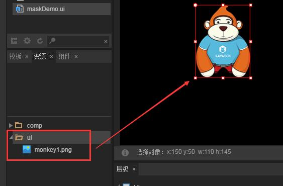

#커버를 설치하다

>> Layair의 커버는 대상 (비디오 및 벡터도 지원, 대상 모양에 따라 커버를 할 수 있습니다.
>>


##커버 API 소개

에 자리잡다,...[laya.display.Sprite](http://layaair.ldc.layabox.com/api/index.html?category=Core&class=laya.display.Sprite%3Ch1%3Emask)API 내, 이 속성 설명은 그림 1의 보여 주기:

< br / > (그림 1)


##둘째, 간단한 커버 사례

###2.1. Layair 엔진으로 한 장의 비트맵을 보이도록 하겠습니다.

MaskDemo.as 입구 종류를 생성하고 기본 응용 프로그램으로 설정합니다 (FlashBuilder) 를 추천합니다.


```java

package
{
	import laya.display.Sprite;
	import laya.resource.Texture;
	import laya.utils.Handler;
	
	public class MaskDemo
	{
		private var Res:String;
		private var img:Sprite;
      
		public function MaskDemo()
		{
			Laya.init(1136,640);
			//设置舞台背景色
			Laya.stage.bgColor = "#ffffff"        
			//资源路径              
			Res = "res/img/monkey1.png";
			
			//先加载图片资源，在图片资源加载成功后，通过回调方法绘制图片并添加到舞台
			Laya.loader.load(Res,Handler.create(this,graphicsImg));          
		}
			
		private function graphicsImg():void
		{
			img = new Sprite();
			//获取图片资源，绘制到画布
			img.graphics.drawTexture(Laya.loader.getRes(Res),150,50);
			
			//添加到舞台
			Laya.stage.addChild(img);
		}	
	}
}
```


컴파일 실행 효과는 그림 2의 보여 주기:

< br / > (그림 2)

###2.2 원형 커버 영역 만들기

부호로 원형의 커버 영역을 생성합니다.마스크 속성을 통해 커버 효과를 실현할 수 있습니다.코드와 주석을 계속 보시고, 우리는 2.1의 사례 코드를 다음과 같이 변경합니다:


```java

package
{
	import laya.display.Sprite;
	import laya.resource.Texture;
	import laya.utils.Handler;
	
	public class MaskDemo
	{
		private var Res:String;
		private var img:Sprite;
		
		public function MaskDemo()
		{
			Laya.init(1136,640);
			//设置舞台背景色
			Laya.stage.bgColor = "#ffffff"      
			//资源路径
			Res = "res/img/monkey1.png";		
			
			//先加载图片资源，在图片资源加载成功后，通过回调方法绘制图片并添加到舞台
			Laya.loader.load(Res,Handler.create(this,graphicsImg));   
		}
		
		private function graphicsImg():void
		{
			img = new Sprite();
			//获取图片资源，绘制到画布
			img.graphics.drawTexture(Laya.loader.getRes(Res),150,50);
			
			//添加到舞台
			Laya.stage.addChild(img);
			
			
			//创建遮罩对象
			var cMask:Sprite = new Sprite();
			//画一个圆形的遮罩区域
			cMask.graphics.drawCircle(80,80,50,"#ff0000");
          	//圆形所在的位置坐标
			cMask.pos(120,50);
          
         	//实现img显示对象的遮罩效果
			img.mask = cMask;
			
		}
	}
}
```


실행 효과는 그림 3의 시사와 같다:

< br / > (그림 3)

대비 코드를 통해 커버가 간단하게 이루어지고 있는 디스플레이 대상 cMask 을 가리기 상대로 임g 대상에 대한 mask 속성으로 img 디스플레이 대상의 커버 효과를 이룩했다.


##3. 레이어이더에 커버 설치

>> 직접 코드에 커버를 설치하는 것 말고도 Layaiaiairide를 통해 커버를 설치할 수 있다.다음은 우리가 순서대로 조작하도록 안내한다.

단계: UI 페이지 만들기`maskDemo.ui`자원 도입.*(이 단계는 알 수 없는 IDE 장절에 UI 생성 및 자원 가져오는 문서를 살펴보세요)*


절차 2: 자원 판넬에서 하나 끌어 넣기`Image`구성 요소가 장면 편집 구역에 도착하면, 그림 4개가 제시하는 것과 같다.

< br / > (그림 4)


절차 3: 더블 클릭 진입`Image`구성 요소 내부, 그리고 구성 패널 하나 끌어 넣기`Sprite`구성 요소는 그림 5개처럼 보여 준다.

< br / > (그림 5)


단계 4: 선택`Sprite`구성 요소, 오른쪽 속성 패널에서 공유 속성`renderType`설치하다`mask`여섯을 바라다.

< br / > (그림 6)


절차 5: 쌍격 진입`Sprite`구성 요소 내부, 그리고 구성 패널 하나 끌어 넣기`Graphics`원형 구성 요소, 위치 및 크기 조정.계급 관계는 7 시에 제시하는 것과 같다.

< br / > (7)


단계 6: 연속 클릭 편집 구역의 공백 영역 하차`Image`구성 요소 내부에서는 커버의 효과를 볼 수 있고, 그림이 8개처럼 보여 준다.

< br / > (그림 8)


##4, 프로젝트 중 LayairierIDE 설정 커버 적용

###4.1 발표 UI

IDE 인터페이스에 누르기`F12`커버 효과를 내는 UI 페이지가 발표됩니다.`src/ui`디렉토리 아래 UI 종류 생성`bin/h5/res/atlas`디렉토리 아래에 있는 도화 파일

< br / > (그림 9)


###4.2 IDE 생성된 종류와 그림으로 커버 효과

입구 종류 만들기`Main.as`인코딩:


```java

package
{
	import laya.net.Loader;
	import laya.utils.Handler;	
	import ui.maskDemoUI;
	
	public class Main
	{
		public function Main()
		{
			//初始化舞台
			Laya.init(1136,640);
			//设置舞台背景色
			Laya.stage.bgColor = "#ffffff"    
				
			//加载图集资源，加载成功后添加到舞台
			Laya.loader.load("res/atlas/ui.atlas",Handler.create(this,onLoaded));
			
		}
		
		private function onLoaded():void
		{
			var cMask:maskDemoUI = new maskDemoUI();
			Laya.stage.addChild(cMask);
		}
	}
}
```


실행 효과는 그림 10개처럼, 우리는 빠르게 커버의 효과를 실현했다.

< br / > (그림 10)

