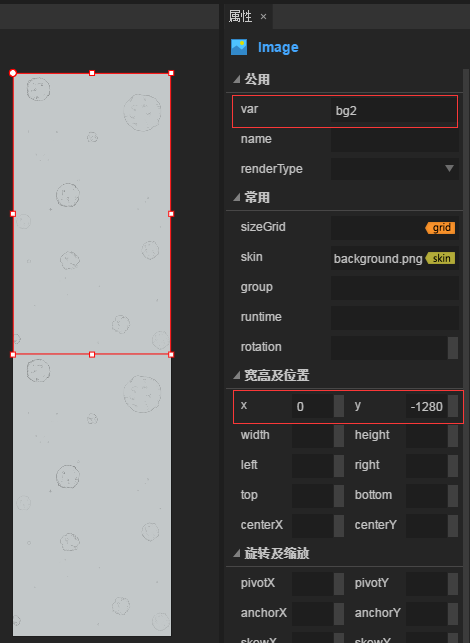
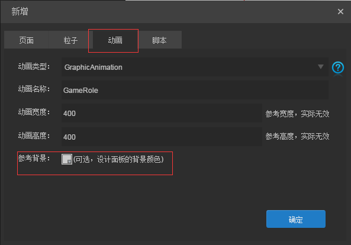

#2, 편집기 시각화 자원 제작

###게임 가시화 자원 개요

이전 과정에서 우리는 개발 사고를 분석해 미술 소재 자원의 준비, 분류를 진행했다.이 수업에서 먼저 코드를 조급해 하지 말고 UI 인터페이스 와 애니메이션 을 만들어 논리처리를 한다.Layaiairide는 강력한 시각화 편집 도구로 게임에서 볼 수 있는 부분은 IDE 에서 이루어질 수 있다.

이러한 시각화된 요소들은: 각 종류 구성 요소, 아이콘, UI 페이지, 애니메이션, 지도, 입자 등이다.만약 학우들이 IDE 구성 요소에 익숙하지 않다면, 자세한 교정은 '기술 문서 — Layaiair IDE 편'을 볼 수 있다.‘비행기 대전’의 가시화 자원을 한 걸음 한 단계 제작한다.

###게임 페이지 만들기

이 예에서 항목 관리자에 따라 새로 만들기 시작하는 페이지, 게임 진행 중 페이지, 게임 종료 페이지, 게임 종료 페이지.(그림 1, 2).

대중폰 화면에 적응하기 위해 페이지 해상도를 720X1280.게임 진행 중 게임 지도 페이지는 기본 View 형식 페이지를 선택합니다.Dialog 유형에 애니메이션 효과를 사용하기 때문에 "시작" 과 "끝" 페이지를 사용합니다.

< br / > (그림 1)

< br / > (그림 2)

새 페이지에 대한 설명은 다음 테이블을 참고하십시오.

본 게임 IDE 코시화 파일 설명
------------------------------------------------------------------------------------------------------------------------------------------------------------------------------------------
1,124가ameBg.ui
1244개 GameOver.ui
124가amePlay 124테오 게임 중 페이지, View 페이지 유형
테두리 게임 시작

####게임 프로세스 페이지 제작

GameStart.ui 페이지를 열기 후 자원이나 구성 관리자에서 해당하는 구성 요소나 자원을 끌어들여 IDE 도구를 통해 위치 조정, 그룹, IDE 차원 계면으로 요소 계급과 상쇄 관계 (비슷한 photoShop 도층)오른쪽 속성 표시줄도 원소 폭 높은 위치, 회전 축소 조정 작업에 따라 최종 미술 효과도 필요합니다.

페이지 레이아웃 조정 후 프로그램이 필요한 원소에 변수 이름 (var 속성)예를 들어 텍스트 상자 Text 구성 요소 var 는 txt load, 버튼을 넣는 Box 구성 요소 var (Btn start).

GamePlay, GameOver 페이지와 GameStart 페이지 제작 방식은 기본적으로 같다 (그림 5) 는 더 이상 설명을 하지 않는다.

< br / > (그림 3)

< br / > (그림 4)

< br / > (그림 5)

####게임 지도 배경

작성, GameBg.ui 페이지를 열 때 자원 관리자에서 background.png 에서 배경 편집기 를 배경 으로 사용하고, 위 아래 두 쪽 이 연속적으로 정렬되어 있으며, 지도가 끊임없이 굴러 사용됩니다.두 장의 그림 변수 이름 (var 속성) 을 bg1, bg2 로 설정합니다.bg2 의 y 좌표는-1280.

물론 긴 2방 연속도 한 장만 써도 된다.어떤 게임은 배경에 2층을 설치하고, 1층의 원경 (만속 굴림) 을 설치한다.

< br / > (그림 6)

이로써 게임 페이지가 완성되어 저장한 후 발표 (단축키 F12) 를 저장합니다."코드 모드" 에서 항목... src 디렉토리에서 유i 폴더를 생성했습니다. 폴더에는 IDE 에서 생성된 4가지 UI 종류, 프로그램에서 실제 예화 후에는 무대에 가재할 수 있습니다.

###게임 페이지 단추 애니메이션

때때로 인터페이스의 효과는 더 나은 만큼 단추나 인터페이스 요소에 애니메이션 효과를 더할 수 있다.예를 들어 페이지 중 "단추를 다시 시작하면 클릭 후 위로 뛰어 움직일 수 있다.다음은 이례로 만드는 방법을 배워보자.

1. 장면 편집기에서 선택한 '단추를 다시 시작합니다.그리고 시간축 인터페이스의 '애니메이션 편집 모드', 재생 제어 단추 및 시간축 (7)이 나타난다.

< br / > (7)

2. 8프레임 정도의 위치를 선택하여 버튼을 위로 10개의 픽셀 정도 이동하고 시간축에 해당하는 대상명칭과 두 개의 관건.클릭 대상자 이름 왼쪽의 작은 삼각, 아래쪽은 y 속성이 나타날 수 있으며, 같은 두 개의 관건 프레임.이것은 우리가 상대 y 축 의 속성 을 바꾸기 때문 이다. 물론 다른 속성 을 바꾸면 x, alpha, scaleX 등도 대상 명 아래 에 나타난다.

대상 이름 위 방영 제어 버튼을 누르면 애니메이션을 관찰할 수 있습니다!애니메이션이 너무 빠르거나 느리다고 생각하면 마우스가 좌우로 이동하는 관건이 적당한 위치에 도착할 수 있다.

< br / > (그림 8)

3. 더 풍부한 애니메이션 효과에 이르기 위해 y 축의 첫 프레임 선택, 오른쪽'프레임 속성'인터페이스에'느릿느릿'선택이 나타납니다(8)'를 선택하면 유형 유형을 엘스티컷으로 선택하면 버튼은 빠른 회탄 효과를 가져올 수 있습니다.학생들도 다른 유동 선택을 선택할 수 있다.

마지막으로 우리는 이 애니메이션 이름을 aniu restart 로 바꾸어 프로그램을 편리하게 호출합니다.

주: 애니메이션 편집기는 많은 카리스마 애니메이션 효과를 만들 수 있다.자세한 교정은 "기술 문서 — Layaiaiair IDE 편 — 아이디를 사용합니다.

###게임 캐릭터 애니메이션

프로젝트 관리자에서 오른쪽 단추를 새로 짓고 GameRole.ani 캐릭터 애니메이션 (단축키 Ctrl + N) 을 열어서 게임에 필요한 각종 애니메이션 자원을 만들 수 있습니다.

캐릭터 애니메이션 형식은 기본적으로 GraphicAnimiation(그림 9), 애니메이션 페이지 크기가 게임에 무효가 되어 취향에 따라 기호에 따라 흑백으로 구성되어 참고색을 조정하는 것이 비흑백이다.

< br / > (그림 9)

애니메이션 파일을 작성한 후 자원 관리자 중 역할 자원 폴더 gameRole, 애니메이션 자원을 만들어야 할 자원은 캐릭터의 유형과 애니메이션 상태에 해당합니다.수요에 따라 우리 역할 유형은 총 4종, 주인공 hero, 적의 enemy 1-3, 도구 ufo1-2, 그리고 탄알bullet1-2.애니메이션 상태는 비행 fly, 부상 hit, 사망 down.

만약 자원명: herou down1, 영웅을 대표하는 사망 상태 1 프레임 애니메이션.여기에서 우리는 한 개의 시계로 명확하게 설명할 수 있다.

테두리 (으) 테두리 (으) 헤르메 (으) 주역 (으르메 (으르베) 적1 (으) 적1 (으르메 (으) 적 1
------------------------------------------------------------------------------------------------------------------------------------------------------------------------------------------------------------------------------------------------------------------------------------------------------------------------------
1244비행 (하) 헤로 (하) hero fly1 (하) 헤로 (하) fly1 (하) 네덜란드 (하) 네덜란드 (하) 네덜란드 (하) 노르미2 (하) 노르메
테네마 다쳐
12444사 사망 – hero u down1 – 444 – unemy 1 – unemy 1 – u down1

캐릭터 애니메이션 방법 만들기

1. 애니메이션 편집기 인터페이스에서 '애니메이션 편집 모드' 를 선택하면 재생 제어 단추 및 시간축 (그림 10).

< br / > (그림 10)

2. 자원 관리자 중 단장 또는 여러 장의 애니메이션 자원 그림을 선택하여 시간축에 생성된 애니메이션 (그림 11) 을 생성한다.

예를 들어 주인공 비행 애니메이션 만들기, herou fly1, herou fly2 장의 그림 두 장을 끌어 시간축에서 주인공의 비행 애니메이션 을 생성하고, 순환 버튼을 켜고 재생 프로그램을 누르면 효과를 볼 수 있다. 애니메이션이 너무 빠르거나 느린 것 같거나 정률을 조절할 수 있다.

< br / > (그림 11)

3. 장면 편집기에서 애니메이션 자원을 조정한다.프로젝트에서 캐릭터 충돌은 배역 중심의 반경으로 계산하기 때문에 캐릭터 애니메이션의 중심을 원점으로 조정해야 하며 코드10을 적게 쓸 수 있다.

프레임율은 애니메이션 파일 자체 재생 주파수, 게임 프로그램의 주파수 프레임에 방해되지 않는 모든 애니메이션의 프레임 조정 시간 간격으로 프레임만 12프레임으로 설정하면 된다.

주: 재생 후 재생 상태는 UI 에 직접 방치하는 데 유효하고 애니메이션 필요로 애니메이션의 플lay () 방법 재생 (그림 10.

< br / > (그림 10)

4. 효과 이름을 수정합니다.IDE (IDE) 는 기본적으로 ani 0 으로 사용하기 어려우니, 게임 프로그램에서 사용하기 어려우며, 그룹 이름과 캐릭터 형식과 애니메이션 상태를 구별하는 데 사용해야 한다.

애니메이션 전환 시 play () 방법으로 애니메이션을 전환합니다. 예를 들어 다음 그림 속 이름 hero fly, hero.die, hero.play (0, true, "hero u fly") 주인공 비행 애니메이션을 방영합니다.hero.play (0, true, "hero u die") 주인공의 죽음 애니메이션을 방송합니다.

이번 사례에서는 애니메이션 자원이 크지 않기 때문에 우리는 모든 캐릭터 애니메이션을 GameRole.ui 중에서 주인공, 적과 총알과 도구를 포함한다.'첨가'단추를 누르면 새 시간축이 나타날 때 4단계를 반복하면 모든 캐릭터 애니메이션을 완성할 수 있습니다.추가된 동효가 동효 하라 목록에서 어떤 애니메이션을 다시 편집할 수 있습니다.

< br / > (그림 11)

종합적으로 이 수업에서 우리는 모든 게임을 시화할 수 있는 소재를 만들어 게임 후 순서를 개발하여 기초를 다졌다.프로젝트 개발 과정에서 UI 인터페이스 변경이 많을 때 미술 직무의 동료들이 IDE 페이지 및 애니메이션 제작을 배우고 작업 능률을 높일 수 있다.미술이 완성된 후 절차를 간단하게 조정하면 발표할 수 있으며 UI 논리 처리를 진행할 수 있다.