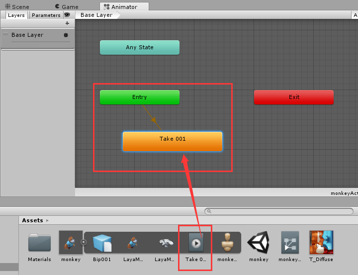
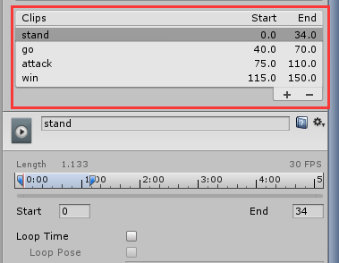

##Layair3D 애니메이션

현재 Layaiar3D 엔진은 애니메이션 부분에 대해 다량의 조정을 하고 있지만, 애니메이션 애니메이션에 대한 보류는 했지만 개발자들이 새로운 애니메이션 구성 요소를 사용할 것을 건의했다.새 애니메이션 애니메이터 구성은 로판 애니메이션의 여러 종류를 정합, 분류하지 않고 개발시간을 절약하고, 골격 애니메이션, 재질 애니메이션, 강체 애니메이션, 카메라 애니메이션 등을 포함했다.

애니메이터 애니메이션 구성 지원 유닛이 내보내는 애니메이션, 골격 애니메이션 모형은 유닛 도입 후 통합 편집, 재질 애니메이션, 강체 애니메이션, 유닛 에니메이션 편집, 유닛에서 직접 사용하면 된다.


###캐릭터 골격 애니메이션

게임 캐릭터 복피 골격 애니메이션은 3D 게임에서 대량의 운용으로 캐릭터 애니메이션 모형을 유닛 에디션을 편집한 뒤 리야에이어로 내보내는 것이다.

####애니메이션 편집 절차

1. 모형 가져오기.유닛 자원 관리자에서 오른쪽 단추를 가져오기 (Import New Assets) FBX 형식 자원, 스티커 자원, 모형 끌어당겨서 재질 스티커를 조정하고 저장하고, 이 예에 저장된 장면은'monkey'라고 합니다.

2, 애니메이션 컨트롤러 만들기.유닛 자원 관리자 가운데 오른쪽 버튼을 켜서 메뉴 만들기 (Create) 애니메이션 컨트롤러 (Animmator Controller) 에 따라 애니메이션에 이름을 붙여 본례에서 'monkeyAction'으로 이름을 지었다.

3. 애니메이션 컨트롤러 편집.애니메이션 컨트롤러를 두 번 누르면 애니메이션 컨트롤러 인터페이스 편집, 가져오는 모형 오른쪽'작은 삼각'을 누르면 '재생 태그' 파일을 모형 애니메이션 파일로, 기본적으로 'Take 001' 으로 잡아당겨 애니메이션 컨트롤러 인터페이스 (그림 1) 로 저장합니다.

<br>>

(그림 1)

4. 애니메이션 컨트롤러 납치.장면 속 캐릭터 모형을 선택하여 캐릭터 애니메이션 컨트롤을 선택한 모형 애니메이션 구성 요소 (2) 에 부여해 애니메이션 구성 요소를 늘려야 한다. 그렇지 않으면 내보내는 애니메이션은 방영되지 않는다.

< br > (그림 2)

이상의 절차를 거쳐 우리는 캐릭터 애니메이션을 유닛의 편집을 완성하고 유닛에서 실행 버튼을 누르면 우리는 애니메이션이 방영되는 것을 볼 수 있다.애니메이션 재생에 문제가 없다면 이전'유닛 플러그인 도구 사용'교정 방법에 따라 Layair의 자원을 내보낼 수 있다.

**Tips: 다른 애니메이션은 유닛 처리 방식도 일치하고, 다음과 같은 절차: 장면 모형에 애니메이션 구성 요소인 애니메이션 컨트롤러 만들기 — 애니메이션 콘솔을 애니메이션 컨트롤러에 넣어 모형 애니메이션 구성 요소를 추가합니다.**


####Layair 캐릭터 애니메이션 실현

다음 자원 카탈로그로 내보내기 (H5 디렉토리) 로 배역 자원을 불러오는 후 자동으로 애니메이션 재생 (그림 3), 참고코드 다음과 같습니다


```java

package {
	import laya.d3.component.Animator;
	import laya.d3.core.Camera;
	import laya.d3.core.Sprite3D;
	import laya.d3.core.scene.Scene;
	import laya.d3.math.Vector3;
	import laya.display.Stage;
	import laya.events.Event;
	import laya.utils.Handler;
	import laya.utils.Stat;

	public class LayaAir3D_Animator
	{
		public function LayaAir3D_Animator() 
		{
			//初始化引擎
			Laya3D.init(1000, 500,true);
			
			//适配模式
			Laya.stage.scaleMode = Stage.SCALE_FULL;
			Laya.stage.screenMode = Stage.SCREEN_NONE;

			//开启统计信息
			Stat.show();
			
			//预加载角色动画资源
			Laya.loader.create("monkey/monkey.lh",Handler.create(this,onModelOK),null,Sprite3D);
		}		
		
		private function onModelOK():void
		{
			//添加3D场景
			var scene:Scene = new Scene();
			Laya.stage.addChild(scene);
			
			//创建摄像机(横纵比，近距裁剪，远距裁剪)
			var camera:Camera = new Camera( 0, 0.1, 1000);
			//加载到场景
			scene.addChild(camera);
			//旋转摄像机角度
			camera.transform.rotate(new Vector3( -25, 0, 0), false, false);
			//移动摄像机位置
			camera.transform.position=new Vector3(0, 5, 10);
			//加入摄像机移动控制脚本
			camera.addComponent(CameraMoveScript);
			
			//添加蒙皮动画角色模型
			var role3D:Sprite3D=Laya.loader.getRes("monkey/monkey.lh");
          	//加载到场景
			scene.addChild(role3D);
		}
	}
}
```


< br > (그림 3)


####캐릭터 애니메이션 제어와 분해

**애니메이션 구성 요소 가져오기**

위의 예를 통해 우리는 애니메이션이 자동으로 방영되는 것을 보고 애니메이션은 몇 가지 동작을 포함해 어떻게 애니메이션의 방영을 통제할까?우선 모형상의 애니메이션 구성 요소를 가져야 재생 통제, 멈춰야 한다.

Layaiair 3D 엔진의 3D 모형 Sprite3D 종류가 getCompontByType () 방법으로 모형 구성 요소를 가져왔습니다.애니메이션 모형이 새로 생성할 때 엔진은 기본적으로 애니메이터 애니메이터 애니메이션 요소를 부여하기 때문에 다음 코드를 참고할 수 있습니다.

LH 파일을 열기, 애니메이션 구성 요소가 모형으로 바인다면 'getChildAt (0)' 을 사용하여 캐니메이션 모델 모델을 가져왔습니다.그리고 getCompontByType(Animmator) 방법을 통해 애니메이션 구성 요소를 얻습니다.


```java

//获取角色动画组件
var ani:Animator=role3D.getChildAt(0).getComponentByType(Animator) as Animator;
```


**Tips: 때로는 lh 혹은 ls 파일에 여러 부자 차원 관계가 존재하고 애니메이션 구성 요소가 1층에 있을 수 없고 2층일 수도 있고 3층일 수도 있다.따라서 애니메이션 구성 요소를 가져오기 전에 ls 나 lh, 애니메이션 모형이 있는 계층 관계를 확인하고, getChildAt (), getChildByName () 등의 방법으로 모형을 얻은 다음 애니메이션 구성 요소를 가져올 수 있습니다.그렇지 않으면 절차가 틀리게 된다!!**


**재생 제어**

애니메이션 구성 요소가 생겨서 왜 그 중 하나밖에 안 나와?동작에 대한 통제와 전환을 위한 두 가지 방법이 있다.

####1. 코드 정의 애니메이션 편집

유닛에서 애니메이션에 대한 구분을 하지 않았고, 우리는 모형적인 기본 애니메이션 Take 001, 플러그인은 한 개만 가져왔다.

이 때문에 방송 중 한 단락의 애니메이션 제어는 코드 중 사용자 정의 애니메이션 편집을 늘리고 애니메이션 편집 중 시작과 종영률 방식을 설정해야 한다.

애니메이터 애니메이션 구성 요소 중 play () 방법 보기, 구체적인 방법은 다음과 같습니다:

**Tips:1.7.10판 후 play () 방법은 순환, 시작 프레임율, 엔딩률 인자를 취소했습니다.애니메이션 순환 여부는 유닛 편집기 애니메이션 속성에서 선택 설정을 진행하고 내보내면 엔진은 그 설정을 따라 애니메이션 재생합니다.그림 5, 6, 6, loop Time 선택 상자!**


```java

/**
* 播放动画。
* @param	name 如果为null则播放默认动画，否则按名字播放动画片段。
* @param	playbackRate 播放速率。
*/
play(name:String=null,playbackRate:Number=1.0)
 
```


**애니메이션 같은 한 프레임은 기존 애니메이션 편집을 늘리기 위한 애니메이션 클립을 만들기 위해 애니메이션 클립을 최신 애니메이션 Clip () 종류는 addClip () 의 실례 방법을 제공해 애니메이션 편집 편집을 허용할 수 있으며, 플래이 (애니메이션 클립) 을 통해 방영된다.**


```java


/**
* 添加动画片段。
* @param	clip 动画片段。
* @param	playName 动画片段播放名称，如果为null,则使用clip.name作为播放名称。
* @param   开始帧率。
* @param   结束帧率。
*/
public function addClip(clip:AnimationClip, playName:String = null, startFrame:int = 0, endFrame:int = 4294967295
```


예제 중 코드 수정:


```java

......
//添加蒙皮动画角色模型
var role3D:Sprite3D=Laya.loader.getRes("monkey/monkey.lh");
//加载到场景
scene.addChild(role3D);
//获取角色动画组件
var ani:Animator=role3D.getChildAt(0).getComponentByType(Animator) as Animator;

//加载一个动画文件创建动画剪辑（可以是已有的动画，也可以是此角色需增加的新动画文件）
//var clip:AnimationClip=AnimationClip.load("monkey/Assets/monkey-Take_001.lani");
//从现有的动画中获取动画剪辑（默认根据.lani文件创建的动画剪辑）
var clip:AnimationClip=ani.clip;

//增加一个动画剪辑引用，从clip中的0-34帧创建名为stand的动画剪辑
ani.addClip(clip,"stand",0,34);
//增加一个动画剪辑引用，从clip中的40-70帧创建名为move的新动画剪辑
ani.addClip(clip,"move",40,70);

//播放某个动画剪辑
ani.play("move");
//可获取动画剪辑总数
trace("当前动画剪辑总数为："+ani.getClipCount());
```


번역 후 효과는 다음과 같이 순환적으로 0-34프레임만 재생한 stand 서브 애니메이션 편집.

< br > (그림 4)


####2.유닛 에니메이션 편집

유닛은 애니메이션에 대한 단락을 나누고 편집된 단편에 이름을 붙일 수 있다.내보내는 자원은 제어할 때 애니메이션 전환을 통해 개발자들이 사용하기 편리하다.(이런 방식은 자원 내출시 애니메이션 해석 파일을 늘려 Htp 방문 횟수를 늘리며 어떤 방식의 개발자들을 경우 자체적으로 고려할 수 있다)

유닛 애니메이션 단락 방법 다음과 같습니다:

1)、자원관리자 중 모형 파일을 선택하여 오른쪽 inspectoor 인터페이스에서 애니메이션을 선택하여 기본 애니메이션 Take 01을 클릭하여 사용자 정의 이름을 클릭하여 애니메이션 세션을 늘리며 플릿을 수정하는 시초와 종정 프레임 (그림 5)

Tips: 게임에서 애니메이션 재생 이 필요하면 다음 그림을 선택하십시오.

< br > (그림 5)

이 예례에서 총 4개의 동작으로 미술이 제공한 애니메이션 프레임수에 따라 수정하여 4개의 애니메이션 (도 6) 로 늘렸다.

< br > (그림 6)

2), 수정 후 자원 관리자 모형에서도 해당되는 애니메이션 파일을 늘릴 수 있기 때문에 애니메이션 컨트롤을 수정하고 새로 생성된 애니메이션에 애니메이션 콘텐츠에 가입하면 완전한 애니메이션 자원 해석 파일 (7)

< br > (7)

다음 단계를 완성한 후 다시 내보내기 위한 자원 속에서도 4개의 lani 애니메이션 파일이 생성되었다.

예시 코드 수정, 재생 애니메이션 이름 적용, 효과 (그림 8)


```java

......

//添加蒙皮动画角色模型
var role3D:Sprite3D=Laya.loader.getRes("monkey/monkey.lh");
//加载到场景
scene.addChild(role3D);
//获取角色动画组件
var ani:Animator=role3D.getChildAt(0).getComponentByType(Animator) as Animator;			
//监听默认动画完成后播放站立动画
ani.on(Event.COMPLETE,this,onAniComplete,[ani]);
//播放攻击动画
ani.play("attack");
/***当前动画播放完成后回调***/
private function onAniComplete(ani:Animator):void
{
  //切换站立动画
  ani.play("stand");
}
```

< br > (그림 8)


