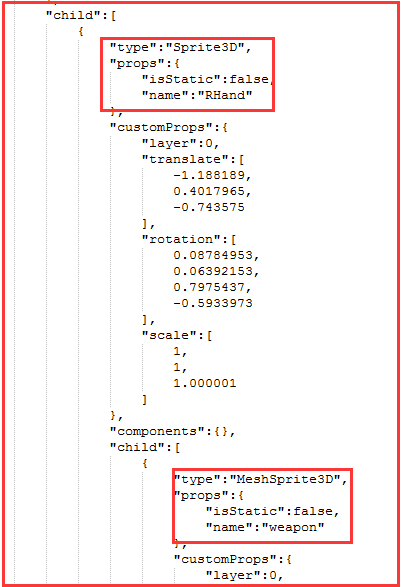

##Layaiar3D의 골격

###골격 개설

골격 단점 기술은 3D 게임에서 매우 보편적이며, 예를 들면 무기가 캐릭터의 손동작에 따라 변화하고, 우리는 무기와 손에 뼈를 묶어 묶고 무기를 손잡고, 무기는 손뼈의 층급으로 자연히 손의 동작과 변화할 수 있다.

물론 바인딩 후 3D 모형도 인코딩을 통해 납치하거나 다른 3D 모델을 바꿀 수 있다. 이런 방식으로 무기나 장비의 환장 기능을 실현할 수 있다.


###유닛 에 골격 을 설치 하다

골격이 유나이티에 설치가 매우 편리하여 장면의 자원 계급에서 직접 조작할 수 있다.다음 그림 (그림 1)

납치해야 할 대상은 3D 용기이며, 3D 모형일 수 있으며, 그 위치를 잘 조정한 뒤 지정 골격 아래로 끌어들이면 스트랩으로 묶어서 묶어 성공했다. 애니메이션 재생 시, 골격 애니메이션에 따라 변화하는 것을 발견할 수 있다.

때로는 우리가 처음 시작할 때 무기가 필요할 때도 있지만, 또 다른 3D 모델 또는 여러 모형을 추가할 수 있다.

< br > (그림 1)

**Tips: 골격 단점이 설치된 후 골격과 단점 대상은 자동으로 ls 나 lh 파일에서 우리는 getChildByName () 방법을 통해 그것들을 얻을 수 있습니다.그러나 특히 주의해야 한다: 뼈가 걸려 있을 때 빈 컨테이너 대상만 묶으면 나중에 동적 첨가 대상에 쓰일 때 GameObject Setting 중 Ignore Null Game Objects 에서 비어있는 노드 설정을 무시하고, 그렇지 않으면 빈 용기 연결 대상은 ls 나 lh 로 내보내지 않는다.**  


###코드 에서 골격 을 실현 하다

일반적인 상황에서 우리는 모두 유니티에서 골격을 첨가하러 간다.하지만 Layaiair 엔진도 코드의 단장 방식을 제공해 유연하게 첨가와 골격 단점을 제거할 수 있다.

애니메이터 애니메이션 구성 요소는 두 가지 실례 방법을 제공했다**linksprite3DToAvatarNode ()**과**unLinksprite3DToAvatarNode ()**연결점 추가 및 제거 가능 (그림 2, 그림 3).

Tips: 골격 애니메이션 첨가하기 전에 미술은 골격 노드를 필요로 하는 이름이다.

< br > (그림 2)

< br > (그림 3)

구체적으로 사용하는 코드 참고는 다음과 같습니다:

장면에서 뼈 애니메이션 모형을 획득한 애니메이션 구성 요소 — 단축점 대상 — 애니메이션 구성을 통해 뼈와 고리를 납치했다.


```typescript

  //从场景中获取动画模型
  var monkey:Sprite3D=scene.getChildByName("monkey") as Sprite3D;
  //获取动画模型中动画组件
  var monkeyAni:Animator=monkey.getComponentByType(Animator) as Animator;

  //需要挂点的3D对象
  var box:MeshSprite3D=new MeshSprite3D(new BoxMesh(1,1,1));
  //将3D对象加载到scene中（一定要加入到场景）
  scene.addChild(box);
  //将挂点物品添加到某个骨骼上（美术提供骨骼的名称）
  monkeyAni.linkSprite3DToAvatarNode("RHand",box);

  //将挂点物品从骨骼上移除（美术提供骨骼的名称）
  //monkeyAni.unLinkSprite3DToAvatarNode("RHand",box);
```


###골격 접점 운용 사례

다음은 마법 공격의 간단한 예로 골격 걸이의 운용 (도 4) 를 보여 드리겠습니다.

< br > (그림 4)

우선 1 중 유나이티에는 마법광권이 오른손 뼈의 노드 등급을 설치해 오른손 뼈 뼈를'RHand', 마법광권은'weapon'으로 바꾸며 ls 자원 파일로 내보내는 것이다.내보내면 수골격과 광권이 모형에 나타난 하위 파일 중 (도 5) 에 따라 수용할 수 있다.

< br > (그림 5)

그림 4 마법 공격 효과 에 따라 두 종류 를 통해 실현 할 수 있다. 하나 는 주류 La3Du Bonpoint.aint.as, 애니메이션 재생 및 생성 마법 무기를 실현하는 방안: 공격 애니메이션 에서 36 프레임 좌우로 방영될 때, 복제는 점과 같은 신마법무기를 추가하고 무기를 추가하여 비행, 원시에는 무기를 잠시 숨기고, 애니메이션 이 완료된 후다시 보기로 모의는 마법이 생기고 마법의 효과를 던진다.

무기 스크립트 Weaponscript.a가 마법 비행과 소각을 실현한다.모든 코드 다음과 같습니다:


```typescript

package
{
	import laya.d3.component.Animator;
	import laya.d3.component.Script;
	import laya.d3.core.MeshSprite3D;
	import laya.d3.core.Sprite3D;
	import laya.d3.core.scene.Scene;
	import laya.display.Sprite;
	import laya.display.Stage;
	import laya.events.Event;
	import laya.utils.Handler;
	import laya.utils.Stat;

	public class Laya3D_BonePoint
	{
		public var scene:Scene;		
		/**角色动画组件**/	
		public var monkeyAni:Animator;
		/**骨骼挂点绑定的武器**/		
		public var weapon:Sprite3D;
		/**武器克隆**/	
		public var weaponClone:Sprite3D;
		/**武器是否已克隆**/
		private var weaponIsClone:Boolean=false; 		
		
		public function Laya3D_BonePoint()
		{
			//初始化引擎
			Laya3D.init(1280, 720,true);			
			//适配模式
			Laya.stage.scaleMode = Stage.SCALE_FULL;
			Laya.stage.screenMode = Stage.SCREEN_NONE;			
			//开启统计信息
			Stat.show();
			
			//加载3D资源
			Laya.loader.create("LayaScene_monkey/monkey.ls",Handler.create(this,onComplete));
		}
		
		//资源加载完成回调
		private function onComplete():void
		{
			//创建场景
			scene=Laya.loader.getRes("LayaScene_monkey/monkey.ls");
			Laya.stage.addChild(scene);
			
			//从场景中获取动画模型
			var monkey:Sprite3D=scene.getChildByName("monkey") as Sprite3D;
			//获取动画模型中动画组件
			this.monkeyAni=monkey.getComponentByType(Animator) as Animator;
			
			//获取挂点骨骼(Unity中设置的挂点骨胳会被导出，可获取)
			var handBip:Sprite3D=monkey.getChildByName("RHand") as Sprite3D;
			//获取挂点的武器模型
			this.weapon=handBip.getChildByName("weapon") as Sprite3D;
		 
			//监听动画完成事件
			this.monkeyAni.on(Event.COMPLETE,this,onAniComplete);
			
            //帧循环，用于监控动画播放的当前帧
			Laya.timer.frameLoop(1,this,onFrame);
		}
		
		private function onAniComplete():void
		{
			//动画播放完成后武器激活显示
			this.weapon.active=true;
			//动画播放完成后，设置为未克隆，方便下次克隆新武器
			this.weaponIsClone=false;
		}		
			
		//在攻击动画播放到一定帧时，克隆一个新武器特效
		private function onFrame():void
		{
			//在动画35-37帧之间时克隆一个飞出的武器
			//（不能用==35帧方式，帧率不满时可能跳帧，导致克隆失败。后期版本将支持帧标签事件，可解决此问题）
			if(this.monkeyAni.currentFrameIndex>=35&&this.monkeyAni.currentFrameIndex<=37)
			{
				//确保在35-37帧之间只克隆一次
				if(this.weaponIsClone) return;
				//克隆新武器（模型、位置、矩阵等全被克隆）
				var weaponClone:Sprite3D=Sprite3D.instantiate(this.weapon);
				//为武器特效添加脚本
				weaponClone.addComponent(WeaponScript);
				//将克隆武器放入场景中
				scene.addChild(weaponClone);				
				//设置为已克隆
				this.weaponIsClone=true;				
				//隐藏原始武器
				this.weapon.active=false;
			}
		}		
	}
}
```


```typescript

package
{
	import laya.d3.component.Script;
	import laya.d3.core.ComponentNode;
	import laya.d3.core.Sprite3D;
	import laya.d3.core.render.RenderState;
	import laya.d3.math.Vector3;
	
	/**
	 * 武器脚本(飞行与销毁)
	 */	
	public class WeaponScript extends Script
	{
		/**被脚本绑定的武器**/
		public var weapon:Sprite3D;
		/**武器生命周期**/
		public var lifeTime:int=100;
		
		public function WeaponScript()
		{
			super();
		}
		
		//获取绑定对象
		override public function _load(owner:ComponentNode):void
		{
			this.weapon=owner as Sprite3D;
		}
		
		//覆盖组件更新方法，实现武器帧循环
		override public function _update(state:RenderState):void 
		{
			//武器旋转更新
			weapon.transform.rotate(new Vector3(2,2,0),true,false);
			//武器移动更新
			weapon.transform.translate(new Vector3(0,0,0.2),false);
			//生命周期递减
			lifeTime--;
			if(lifeTime<0)
			{
				lifeTime=100;
				//直接销毁脚本绑定对象会报错（对象销毁后脚本还会更新一次，报找不到绑定对象错误），
                //因此延迟一帧以销毁
				Laya.timer.frameOnce(1,this,function(){weapon.destroy();});
			}
		}		
	}
}
```
