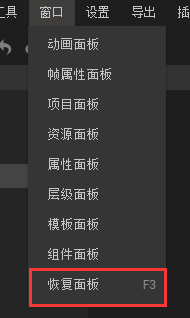
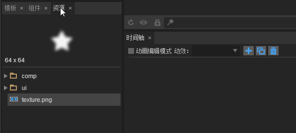

#사용자 정의 인터페이스 레이아웃과 복구

>LayairierIDE 1.7.3 bate 를 채용하면 최신 LayairIDE, 최신 버전 아이디를 기준으로 다운로드하십시오.

편집기 레이아웃은 레이아아이리드 패널의 위치와 크기와 레이아웃을 가리킨다.

##예설 및 복구 배치

###미리 설치하다

레이어의 디자인 모드에서 인터페이스의 각 기능 판자에 대한 위치 드래그와 크기 조정을 할 수 있으며 인터페이스 레이아웃이 수정된 후 자동으로 보존됩니다. 다음에는 열릴 때 마지막 포석에 따라 열립니다.

###복구

인터페이스 템플릿이 닫히거나 잘못되면 단축키를 사용할 수 있다`F3`빠르다**기본 인터페이스 레이아웃 복구**혹은`菜单栏`중 클릭 ->>[>`窗口`?]`恢复面板`?]

 

##사용자 정의 인터페이스

###패널 크기 조정:

마우스를 두 판넬 사이의 경계선에 떠서 마우스 포인터가 변화하는 것을 보고 마우스를 누르면 두 개의 패널의 크기를 수정할 수 있다.동도 1개.

​	< br >>

(동도 1)

###2, 이동 패널:

패널의 탭 표시줄을 누르고 끌어당기면 패널을 편집기 창의 임의 위치로 이동할 수 있습니다.동영상 2개대로 파란 지역은 판넬을 끌어당겨 방치한 목표 구역을 나타낸다.

​< br >>
(동도 2)

 

###셋, 레이어드 보드:

패널 위치를 이동하는 것 외에도 탭 표시줄을 끌 때 다른 패널을 이동할 수 있는 탭 표시줄 영역을 이동할 수 있으며, 목표 패널의 테두리에 짙은 파란색 테두리를 표시할 때 마우스를 풀어서 두 개의 패널을 겹쳐 연결할 수 있으며, 동도 3개의 표시를 할 수 있다.레이어드 패널은 데스크톱 해상도가 부족하거나 배포 사용률이 낮은 패널을 사용하면 매우 실용적이다.

​	< br >>
(동도 3)

