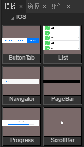
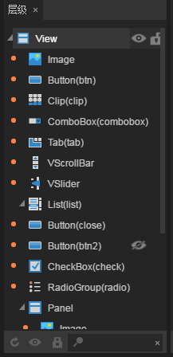
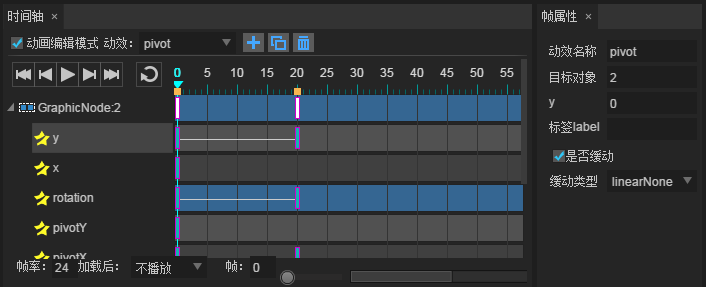

#디자인 모드 인터페이스 개요

>LayairierIDE 1.7.3 bate 를 채용하면 최신 LayairIDE, 최신 버전 아이디를 기준으로 다운로드하십시오.

레이어이더는 디자인 모드, 인코딩 등 여러 모듈로 구성되어 있다.이 장절 에는 디자인 모드 의 상용 레이아웃 및 기능 구역 을 빠르게 훑어 볼 수 있 는 패널 의 이름 과 역할 이다.

​< br >>
(그림 1)

###모드 내비게이지:

모드 전환 단추 기능은 인터페이스 모드 및 코드 편집 모드 사이 전환

​< br >>
(2)

###둘째 메뉴판:

메뉴 표시줄에는 프로그램 조작, 인터페이스 조작, 컨트롤 명령, 도구 집합 등이 포함되어 있으며 자세한 내용은 메뉴 표시줄 소개를 읽어 주십시오.

​	< br >>
(그림 3)

 

###도구 모음:

도구 모음에는 파일 조작, 컨트롤 동작, 장면 조작 단추가 포함되어 있습니다. 자세한 내용은 도구 모음 소개를 읽어 주십시오.
​< br >>
(그림 4)

###프로젝트 관리자:

프로젝트 관리자 중 모든 페이지 (Page) 를 나타냅니다. 이 항목 관리자에서 클릭을 통해 편집할 페이지를 열 수 있습니다. 자세한 내용은 항목 관리자 1절입니다.

​< br >>
(그림 5)

 

###5, 자원 관리자:

자원 관리자에 프로젝트 자원 폴더 (asets) 의 모든 자원을 보여 줍니다.여기에는 나무 구조로 폴더의 자원 내용을 표시합니다.오른쪽 단추를 사용하여 있는 폴더를 열 수 있습니다.자세한 내용은 자원 관리자 1절을 읽으십시오.

​< br >>
(그림 6)

 

###여섯, 템플릿 라이브러리:

템플릿에 IDE 템플릿 폴더 (template) 의 모든 템플릿이 표시되어 있습니다.폴더와 모듈의 줄임표를 나무로 표시하고, 자동으로 템플릿 자원 폴더에 대한 수정을 자동으로 표시합니다.외부 템플릿을 템플릿 폴더에 직접 추가할 수 있으며 View 보기를 통해 템플릿을 만들 수 있으며 자세한 내용은 템플릿 관리자를 읽으십시오.

​< br >>
(그림 7)

 

###일곱, 장면 편집기:

장면 편집기는 UI 나 애니메이션 장면을 보여주는 데 사용되는 작업 영역이다.기존 소득한 장면을 건설하는 작업은 모두 장면 편집기에 의존해 완성된다.자세한 내용은 장면 편집기 1절을 읽으십시오.

​< br >>
(그림 8)

  

###여덟, 속성 설정기:

속성 설정기는 현재 선택한 노드 및 구성 요소 속성을 편집하고, 이 패널은 가장 적합한 형식으로 전시와 편집 선택된 속성 데이터를 편집합니다.자세한 내용은 속성 설정기 1절을 읽으십시오.

​< br >>
(그림 9)

###9등급 관리자:

층급 관리자는 나무 모양의 형식으로 장면을 전시하는 모든 노드 와 그들의 계급 관계, 모든 장면에서 볼 수 있는 내용은 층급 관리자에게 대응하는 노드 항목을 찾을 수 있으며, 이 두 패널의 내용이 동시적으로 나타난다. 일반적으로 이 두 패널을 동시에 사용해 장면을 만들 수 있다.자세한 상황은 계층 관리자 1절을 읽으십시오.

​< br >>
(그림 10)

###시간 축 애니메이션 편집기:

시간축 애니메이션 편집기는 페이지에 시간축 애니메이션을 생성합니다.프레임 속성 패널은 시간 축에 있는 프레임 자세를 표시하는 데 사용합니다.자세한 용법은 시간축 애니메이션 편집기 1절을 읽으십시오.

​< br >>
(도 11)

###열하나, 입자 편집기:

입자 편집기는 페이지에 입자 애니메이션을 만드는 데 사용된다.입자 속성 패널은 입자의 속성 자세를 표시하는 데 사용된다.자세한 용법은 입자 편집기 1절을 읽으십시오.

​< br >>
(그림 12)