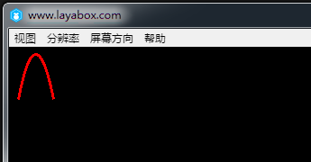

#곡선을 그리다


직선으로서는 곡선의 제작과 좌표관계는 더 이해하기 어렵다.레이아라 엔진이 베셀 곡선을 그렸기 때문에 본문 중 베셀 곡선을 바탕으로 설명한 뒤 엔진을 결합하는 API 해설을 진행했다.


### **베셀 곡선의 기초**

베셀 곡선은 홍콩 마카오 등지에서 베즈곡선으로 불리며 싱가포르 말레이시아 등에서 베제에에에의 곡선이라고 한다.일반적인 벡터 그래픽 소프트웨어는 이것을 통해 곡선을 정확하게 그려 줍니다. 베셀 곡선은 단락과 노드 구성으로 구성되어 있으며, 노랫부분은 줄임새가 신축할 수 있는 고무줄 같다. 그리기 도구에서 본 만년필도구는 바로 이러한 벡터 곡선을 만들어 줍니다.

베셀 곡선은 이차원 도형 응용 프로그램의 수학 곡선이다.곡선의 정의는 4가지 지점: 시작점, 종지점 (닻점) 과 상호 분리된 중간 지점.두 개의 중간 지점을 미끄러지면 베셀 곡선의 형상이 변화할 수 있다.

선성, 2차자, 3차자 등 공식에 기반된 바셀 곡선도 한 번, 두 번...5차 베셀 곡선, 어떤 글도 한 계단, 2계단...한 말이 다 그렇다.다음은 동영상을 통해 여러분이 직관적으로 이해하도록 하겠습니다:

#### **1.1회 베셀 곡선**

​< br >>
(그림 1)

설명: P0~P1 의 연속점으로 구성된 벨젤 곡선이다.선형 베셀 곡선 함수 중 t 는 P0~P1 의 B (t) 를 통해 그리는 곡선을 거친다.예를 들어 t = 0.25 시, B (t) 는 점0 ~ P1 경로의 4분의 1곳이다.0~1의 연속t, B(t)에서 P0~P1 의 직선을 그리는 것과 같다.

#### **1.2차 베셀 곡선**


​        < br >>
(2)

​< br >>
(그림 3)

설명: 2차 베셀 곡선을 구축하기 위해, 이 그림은 P0~P1 의 연속 점Q0, 선형 베셀 곡선을 묘사한다.P1 부터 P2 의 연속 점 Q1 로 선형 베셀 곡선을 묘사한다.Q0 에서 Q1 의 연속 점 B (t) 로 2차 베셀 곡선을 묘사한다.

#### **1.3회 베셀 곡선**

​< br >>
(그림 4)

​< br >>
(그림 5)

설명: 3차 곡선에 대해 선형 베셀 곡선으로 묘사할 수 있는 중개점 Q0, Q1, Q2, 2차 곡선으로 묘사한 지점 R0, R1 구성.

#### **1.4 고층 베셀 곡선**

**고계베셀 곡선은 흔하지 않기 때문에 본문은 더 이상 설명을 하지 않으며 베셀 곡선 원리에 대해 더 많은 이해할 수 있는 다른 글들을 볼 수 있다.****

​< br >>
(도6) 네 번 베셀 곡선

​< br >>
(도7) 5차 베셀 곡선


**###** **둘째, Layair 엔진 API 로 2차 베셀 곡선을 그립니다******

Layaiair 엔진의 곡선을 그립니다. 2차 베셀 곡선으로 개발자는 API 문서에서 laya.display.Graphics 종류를 검색할 수 있습니다. drawCurves (), 곡선을 그릴 수 있습니다.이 방법의 상세한 설명은 그림 아래에 제시한 것과 같다:

​< br >>
(그림 8)

다음은 Layair 엔진으로 벡터 곡선을 그립니다. 예시 코드:


```javascript

(function()
{
    var Sprite = Laya.Sprite;
    var Stage  = Laya.Stage;
    var WebGL  = Laya.WebGL;
    var sp;
 
    (function()
    {
        //初始化舞台，不支持WebGL时自动切换至Canvas
        Laya.init(500, 300, WebGL);
        drawSomething();
    })();
 
    function drawSomething()
    {
        sp = new Sprite();
        Laya.stage.addChild(sp);
        //画曲线
        sp.graphics.drawCurves(10, 58, [0, 0, 19, -100, 39, 0], "#ff0000", 3);
    }
})();
```


발표 후 하도처럼 우리는 성공적으로 간단한 곡선을 그렸다.


​        < br >>
(그림 9)

drawCurves 3위 points 포인트 집합을 통해 곡선을 더 복잡하게 하고 수정하는 사례 코드:


```javascript

//增加58, 100与78, 0坐标让曲线更复杂一些
   
sp.graphics.drawCurves(10, 58, [0, 0, 19, -100, 39, 0, 58, 100, 78, 0], "#ff0000", 3);
```


발표 후 그림 아래에 제시한 대로

​< br >>
(그림 10)
더 복잡한 곡선을 그리려면 drawCurves 인자를 스스로 조정하고 2차 베젤 곡선 원리를 결합시켜 이해할 수 있다.

마지막으로 접선을 그리는 것과 마찬가지로 세 번째 인자 중 모든 좌표는 상대좌표로 1위와 2위의 인자 인자가 되는 ‘10, 58’에 영향을 받는다.‘ 10, 58 ’ 이 바뀌면 전체 곡선이 영향을 받는다.


###3. 레이어이어이드 드래그 컨트롤로 2차 베셀 곡선을 그립니다.
****
​**절차 1**Google LayairIDE, 클릭 모드, View 페이지를 새로 만들기****

​< br >>
(도 11)
****
**절차 2**구성 요소 중 곡선 구성 요소를 View 페이지에 끌면 기본 곡선으로 자동으로 생성됩니다****

​< br >>
(그림 12)
****
**절차 3**: 수정 (더하기 / 감소) 구성 속성 중 point 수치, 곡선의 위치나 굽은 정도

​< br >>
(그림 13)

​< br >>
(그림 14)

여기에 LayairIDE의 구성 요소를 통해 곡선을 그립니다.