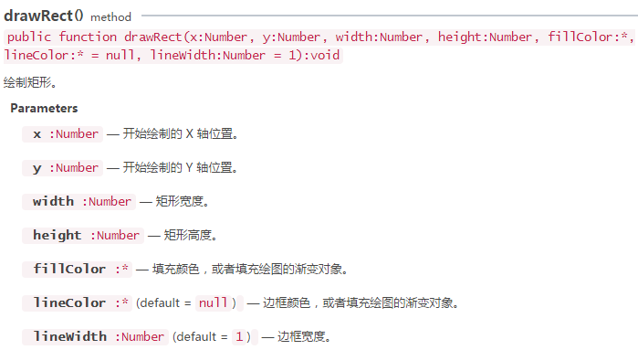
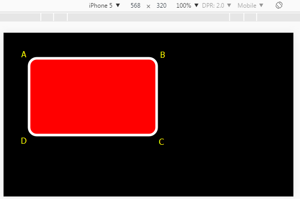
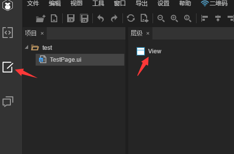

#사각형 과 원각 사각형 을 그리다


###하나, drawRect 방법으로 사각형을 그립니다

API 검색`laya.display.Graphics`API 의 각종 벡터 그리기 방법을 볼 수 있습니다.이 중 "drawRect () 는 벡터 사각형을 그릴 수 있습니다.이 방법의 상세한 설명은 그림 아래에 제시한 것과 같다:


​	< br >>
(그림 1)

다음은 Layair 엔진으로 벡터 사각형을 그리며 예시 코드:


```javascript

(function()
{
    var Sprite = Laya.Sprite;
    var Stage  = Laya.Stage;
  
    (function()
    {
        //初始化舞台
        Laya.init(500, 300);
        drawSomething();
    })();
  
    function drawSomething()
    {
        var sp = new Sprite();
        Laya.stage.addChild(sp);
        //画矩形
        sp.graphics.drawRect(20, 20, 100, 50, "#ffff00");
         
     }
})();
```


코드 실행 효과:

​< br >>
(2)

예시 중'20, 20'은 사각형 착시점 좌표이며 100은 오른쪽으로 가는 너비이다. 음수는 왼쪽으로 가는 너비다.50은 아래로 내려오는 높이이며, 음수라면 위로 올라가는 높이다.모두 편집 코드 중 자체 조정 인자를 체험할 수 있다.


###둘째, drawPath 로 사각형을 그립니다

레이어 엔진`laya.display.Graphics`종류의 경로를 그리는 방법 "drawPath () 는 경로에 근거하여 벡터 도형을 그릴 수 있으며, 물론 사각사각도 포함되어 있으며, 이 방법의 상세한 설명은 그림 아래에서 제시할 수 있습니다.
​< br >>
(그림 3)

drawPath 방법의 인자가 상대적으로 복잡하다.여러분들의 이해를 편리하게 하기 위해서 우리는 먼저 "drawPath () 를 사용해서 사각형을 그립니다. 경로의 부분의 인자를 이해합니다.

drawPath 사각형 표시 코드 다음과 같습니다:


```javascript

(function()
{
    var Sprite = Laya.Sprite;
    var Stage  = Laya.Stage;
  
    (function()
    {
        //初始化舞台
        Laya.init(500, 300);
        drawSomething();
    })();
  
    function drawSomething()
    {
        var sp = new Sprite();
        Laya.stage.addChild(sp);
        //自定义路径
        var path =  [
            ["moveTo", 0, 0], //画笔移到A点
            ["lineTo", 100, 0],//画到B点
            ["lineTo", 100, 50],//再画到C点
            ["lineTo", 0, 50], //继续画到D点
            ["closePath"] //闭合路径
        ];
            //绘制矩形
        sp.graphics.drawPath(20, 20, path, {fillStyle: "#ff0000"});
         
     }
})();
```


코드 실행 효과:

​< br >>
(그림 4)

drawPath 1위와 2위의 좌표점'20, 20'은 전체 위치의 시작 위치를 제어하는 위치이며 3위는 경로 변수.메시지'모베토'는 펜 이동 초기 위치를 그리지 못했습니다.'0, 0'은'20, 20'에 대한 시작의 위치이기 때문에 A 점은 시작된 위치의 원점이다.정보 'lineto' 를 묘사하는 것은 경로점 좌표로, 100, 0 '이 바로 B 점 위치의 좌표를 그리는 것이다.C 점과 D 점의 유추는 마지막으로 메시지'closePath'를 통해 모veTo의 기점 위치를 폐쇄시키지 않을 것이다.

스퀘어 모양으로 볼 때 drawPath 방법은 분명 drawRect 방법이 더 편리할 것이다.그러나 이를 통해 관련 인자 용법을 이해할 수 있다.다른 비원각의 도형에 대해서는 자행 인코딩을 통해 인자 체험을 할 수 있다.


###3, drawPath 원각사각형을 그립니다

####3.1 용법 설명

Layaiair 엔진에서 graphics drwaPath 방법으로 원각이나 호선을 그릴 수 있으며, 구체적인 조작은 3단계, 경로의 시작 지점을 지정합니다.`["moveTo", x, y]`수평 직선 그리기`["lineTo", x, y]`호선 그리기`["arcTo", p1.x, p1.y, p2.x, p2.y, r]`.

**인자 예제**：


```java

["moveTo", 50, 50],
["lineTo", 150, 50],
["arcTo", 200, 50, 200, 100, 50],
```


상술한 인자 실행 효과도 5-1의 제시:

< br / > (그림 5-1)

5-1 을 통해 우리는 알 수 있다.`["moveTo", 50, 50]`화필의 시작점을 지정하다`"50,50"`이 자리.`["lineTo", 150, 50]`시작 지점에서 현재 포트점 ()`150, 50`직선.`["arcTo", 200, 50, 200, 100, 50]`한 토막을 그렸다`r`반경`50`호선.

**호선 그리기 원리**：

이 단락의 호선을 만들 때, 이 아크는 사실 현재 단점을 이용하는 것이다`"150, 50"`단점`"200, 50"`단점 2`"200, 100"`이 세 개의 단점이 형성된 조끼는 반경은 50px, 그리고 양쪽과 접촉된 동그랗게 그려진 아크라인을 만든다.


우리가 이미 아크라인의 원리를 이해하게 된다면, 아크라인을 구성하는 핵심 요소는 두 갈래와 양쪽 사이를 형성하는 꼭대기 (상례의 단점 1), 그림 5-1의 단점 2, 단점 2, 단점 1 이 형성된 x 축 가장자리를 잘 이해할 수 있다. 그 단점과 단점 1 은 이미 y 축 가장으로 구성되어 있다. 현재의 단점과 같은 이축의 시작점이 아니다.떨어진다. 사실 안 된다. 화필의 시작점은 반드시 존재해야 한다. 그러나 직선을 그릴 리네토는 제거할 수 있다. 만약`["lineTo", 150, 50],`주석되어 떨어지면 아크토가 호선을 그릴 때 시작점을 현재 단점으로 볼 수 있으며, arctoo는 lineTo 가 그릴 직선을 찾을 수 없을 때 자동으로 시작점부터 호선까지 시작하는 직선을 추가할 수 있기 때문에 원각사각을 그리면 lineTo는 생략할 수 있습니다.


####3.2 원각사각을 그리는 예례

다음은 원각호선 반경은 30의 원각사각형, 예시 코드:


```javascript

(function()
{
    var Sprite = Laya.Sprite;
    var Stage  = Laya.Stage;
  
    (function()
    {
        //初始化舞台
        Laya.init(1136, 640);
        drawSomething();
    })();
  
    function drawSomething()
    {
        var sp = new Sprite();
        Laya.stage.addChild(sp);
        //自定义路径
        var path =  [
				["moveTo", 0, 0], //画笔的起始点，
				["arcTo", 500, 0, 500, 30, 30], //p1（500,0）为夹角B，（500,30）为端点p2
				["arcTo", 500, 300, 470, 300, 30],//p1（500,300）为夹角C，（470,300）为端点p2
				["arcTo", 0, 300, 0, 270, 30], //p1(0,300)为夹角D，（0,270）为端点p2
				["arcTo", 0, 0, 30, 0, 30],//p1(0,0)为夹角A，（30,0）为端点p2
			];
            //绘制圆角矩形
        sp.graphics.drawPath(100, 100, path, {fillStyle: "#ff0000"});
     }
})();
```


코드 실행 효과:

​< br >>
(사진 5-2)

위쪽 코드에서는 아무 문제가 없어 보이지만, 사실 모베토의 시작점은 원호 사이의 직선에서 필요합니다. 다음은 drawPath 에 그릴 때 경계선을 늘리면 오류를 알 수 있습니다.그리는 방법 graphics.drawPath 수정:


```java

//绘制圆角矩形
sp.graphics.drawPath(100, 100, path, {fillStyle: "#ff0000"},{"strokeStyle":"#ffffff","lineWidth":"10"});
```


수정 후 실행 효과는 그림 5-3의 보여, 선을 그릴 때, 화필의 시작부터`0,0`시작은 우리가 원하는 결과는 아니다.

< br / > (그림 5-3)

다음은 Google은 정확한 코드 수정:


```javascript

(function()
{
    var Sprite = Laya.Sprite;
    var Stage  = Laya.Stage;
  
    (function()
    {
        //初始化舞台
        Laya.init(1136, 640);
        drawSomething();
    })();
  
    function drawSomething()
    {
        var sp = new Sprite();
        Laya.stage.addChild(sp);
        //自定义路径
        var path =  [
				["moveTo", 30, 0], //画笔的起始点，
				["arcTo", 500, 0, 500, 30, 30], //p1（500,0）为夹角B，（500,30）为端点p2
				["arcTo", 500, 300, 470, 300, 30],//p1（500,300）为夹角C，（470,300）为端点p2
				["arcTo", 0, 300, 0, 270, 30], //p1(0,300)为夹角D，（0,270）为端点p2
				["arcTo", 0, 0, 30, 0, 30],//p1(0,0)为夹角A，（30,0）为端点p2
			];
            //绘制圆角矩形
       sp.graphics.drawPath(100, 100, path, {fillStyle: "#ff0000"},{"strokeStyle":"#ffffff","lineWidth":"10"});
})();
```


실행 효과는 그림 5-4의 제시:

 （图5-4）


###4, LayairierIDE 드래그 컨트롤로 사각형 그리기

​**절차 1**Google LayairIDE, 클릭 모드, View 페이지를 새로 만들기

​< br >>
(그림 6)

**절차 2**구성 요소 중 곡선 구성 요소를 View 페이지에 끌면 기본 곡선으로 자동으로 생성됩니다

​< br >>
(그림 7)

**절차 3**수정 (더하기 / 감소) Rect 구성 요소의 수치, 사각형 크기, 색, 회전 각도 등을 변경합니다.

​< br >>
(그림 8)

​< br >>
(그림 9)

여기에 LayairIDE 구성 요소를 통해 사각형을 그리면 완성됩니다.
