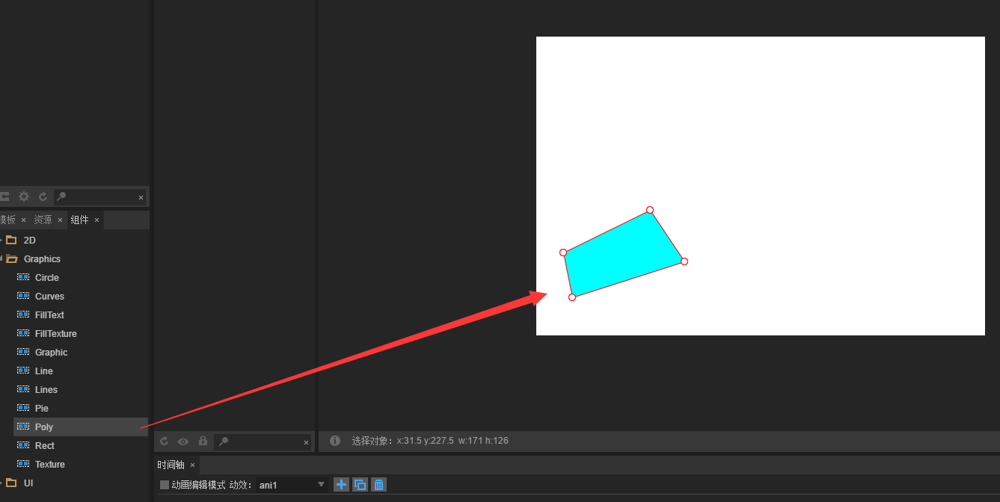

#삼각형, 다각형 및 데이터에 근거하여 도안을 그립니다


삼각형, 다각형, 지정한 경로 데이터를 그립니다. Layaiaiaia 엔진에서 laya.display.Graphics 종류의 'drawpholy ()' 방법을 그릴 수 있습니다.이 방법의 상세한 설명은 그림 아래에 제시한 것과 같다:

​< br >>
(그림 1)


###삼각형을 그리다

다음은 Layair 엔진을 사용하여 먼저 삼각형을 그립니다. 예를 들어 코드:


```javascript

(function()
{
    var Sprite = Laya.Sprite;
    var Stage  = Laya.Stage;
    var WebGL  = Laya.WebGL;
    var sp;
  
    (function()
    {
        //初始化舞台，不支持WebGL时自动切换至Canvas
        Laya.init(500, 300, WebGL);
        drawSomething();
    })();
  
    function drawSomething()
    {
        sp = new Sprite();
        Laya.stage.addChild(sp);
        //画三角形
        sp.graphics.drawPoly(30, 28, [0, 100, 50, 0, 100, 100], "#ffff00");
    }
})();
```


코드 실행 효과 아래 그림 표시:

​< br >>
(2)

코드 를 통해 drawpoly 3위 인자 를 알 수 있는'0, 100'은 A 점 좌표다.‘ 50, 0 ’ 은 B 점 좌표이다.‘ 100, 100 ’ 은 C 점 좌표로 세 개의 좌표점을 연결한 다음 4위 인자 색상 값을 채우고, 그림을 그리는 노란 삼각형을 그립니다.그러나 3위 인자 중 모든 좌표가 상대 좌표로 1위와 2위 좌표 변수'30, 28'의 영향을 받는다.일단 ‘ 30, 28 ’ 이 바뀌면 전체 형태의 위치가 영향을 받는다.


### **다각형 그리기**

Goowpoly 3위 변수의 좌표를 추가하여 다각형의 그림을 그립니다.


```javascript

//画多边形
sp.graphics.drawPoly(30, 28, [0, 100, 50, 0, 100, 100, 75, 150, 25, 150], "#ffff00");
```


코드 실행 효과 아래 그림 표시:

​< br >>
(그림 3)

수정된 코드에서 D 점 좌표 75, 150 "과 E 점 좌표 25, 150" "각 좌표점을 연결해서 색을 채우면 원하는 다각형을 그립니다.더 많은 변의 다각형을 그립니다. 상술한 방식에 따라 좌표점을 늘리면 됩니다.


### **3. 지정한 경로 데이터에 따라 도안을 그립니다.**

위의 삼각형과 다각형을 통해 우리는 이미 drawpoly의 그림 사용법을 파악하였으며, 다음은 예례를 통해 자세히 설명해 주어 오각별을 어떻게 그립니까?예시 코드 다음과 같습니다:


```javascript

(function()
{
    var Sprite = Laya.Sprite;
    var Stage  = Laya.Stage;
    var WebGL   = Laya.WebGL;
    var sp;
     
    (function()
    {
        //消除矢量绘制的锯齿，但会增加性能消耗
        Laya.Config.isAntialias=true;
         
        //初始化舞台
        Laya.init(500, 300, WebGL);
        drawSomething();
    })();
  
    function drawSomething()
    {
       var canvas = new Sprite();
        Laya.stage.addChild(canvas);
 
        var path = [];
        path.push(0, -130);//五角星A点
        path.push(33, -33);//五角星B点
        path.push(137, -30);//五角星C点
        path.push(55, 32);//五角星D点
        path.push(85, 130);//五角星E点
        path.push(0, 73);//五角星F点
        path.push(-85, 130);//五角星G点
        path.push(-55, 32);//五角星H点
        path.push(-137, -30);//五角星I点
        path.push(-33, -33);//五角星J点
 
        canvas.graphics.drawPoly(Laya.stage.width / 2, Laya.stage.height / 2, path, "#FF7F50");   
    }
})();
```


코드 실행 효과 아래 그림 표시:

​< br >>
(그림 4)

윗부분의 사례 코드를 통한 표현법은 감각 코드의 가독성이 증강되며, 여러분도 이전의 삼각형이나 다각형을 이런 방식으로 바꾸어 체험하고, 이러한 기초를 파악하고 유연한 용법을 익히며, 예를 들어 데이터가 서버 등이다.


###4, LayairirIDE 컨트롤을 통해 불규칙한 도형을 그리기 (삼각형, 다각형 포함)


**단계 1:**LayairIDE 열기, 설계 모드, 새 View 페이지 만들기

​< br >>
(그림 5)

**단계 2:**구성 요소의 곡선 구성 요소를 View 페이지에 끌면 자동으로 기본 다각형 생성

​< br >>
(그림 6)

**절차 3:**수정 (첨가 / 감소) Poly 구성 속성 중 수치, 다각형의 크기, 색상 등을 변경합니다.

​< br >>
(그림 7)

​< br >>
삼각형

​< br >>
(그림 9) 불규칙 다각형


여기에 LayairirIDE의 구성 요소를 통해 다각형을 그립니다.